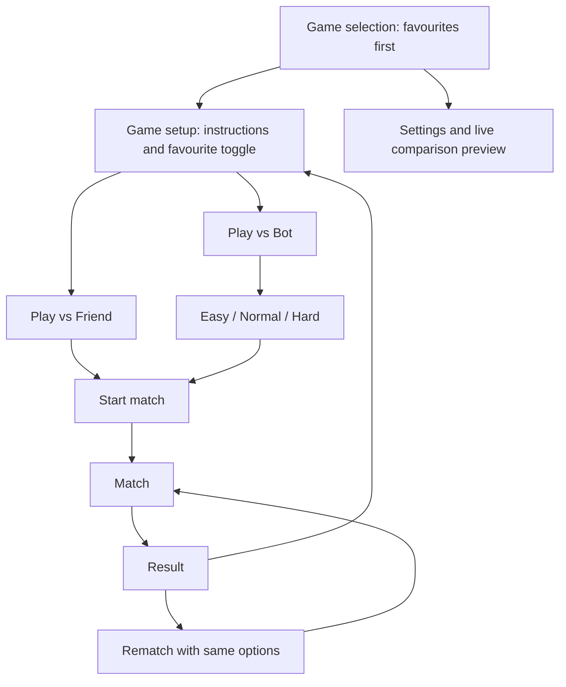

# TapTussle development plan

Last updated: 2026-09-24.

This is the working backlog for the next development phases. Only the original
foundation and Paddle Duel are implemented today. The features below are planned,
not completed. Update this file as each increment is implemented and verified.

## Product scope

- Offline mobile mini-games for two people sharing a device, plus solo play
  against a local bot. No accounts, servers, or online opponents.
- Flutter owns navigation, game setup, favourites, settings, and match overlays.
- Each game chooses Flame or pure Flutter according to its needs.
- Reach five playable games, then aim for approximately one new game per month.
  This is a release cadence goal, not a promise of fixed delivery dates.
- Deliver one reviewable increment at a time; keep Paddle Duel playable during
  architecture changes.

## Progress tracker

Use `Not started`, `In progress`, `Blocked`, or `Done`. Mark a milestone Done only
after its acceptance checklist passes. Record a blocker and next action if blocked.

| ID | Milestone | Depends on | Status | Completion evidence |
| --- | --- | --- | --- | --- |
| M0 | Foundation and Paddle Duel | — | Done | Existing implementation; initial 13 tests and web build passed; user confirmed first iPhone debug run |
| M1 | Game setup, favourites, and Paddle Duel bots | M0 | Done | User verified friend mode plus Easy, Normal, and Hard bots on iPhone; difficulties were distinct |
| M2 | UI automation and M1 usability follow-up | M1 | In progress | Native automation plan and user feedback recorded; implementation in progress |
| M3 | Settings, audio, vibration, and live graphics comparison | M1, M2 | Not started | — |
| M4 | Reaction Duel | M1, M2, M3 | Not started | — |
| M5 | Air Hockey | M4 | Not started | — |
| M6 | Lane Dash: simple racing/movement game | M5 | Not started | — |
| M7 | Tic-Tac-Toe: proposed fifth game | M6 | Not started | — |
| M8 | Five-game device validation and release preparation | M1–M7 | Not started | — |

M0 completion means a working foundation, not release certification. The iPhone
debug run was reported by the user; a complete iPhone acceptance pass and Android
device verification remain open. Game names and rules below are proposed defaults
for implementation planning; Lane Dash and Tic-Tac-Toe are not yet built.

## Target player flow

Game setup is the page immediately after selecting a game. Its favourite button
is available before starting either mode. Use the exact difficulty labels **Easy**,
**Normal**, and **Hard**. Proposed initial defaults: Play vs Friend, Normal bot
difficulty, and no favourite games. Remember the last selected mode and difficulty
per game locally; never auto-start a match when returning to setup.

## Architecture changes

Reuse the current structure instead of introducing a separate game framework:

| Current area | Planned extension |
| --- | --- |
| `lib/core/mini_game.dart` | Keep the widget-based entry point. Add supported modes and relevant graphics capabilities to game metadata. |
| `lib/core/match_session.dart` | Keep ready/playing/paused/finished and round resets. Add participant labels; add explicit draw results when a game first needs them. |
| `MiniGameBuilder(session, winningScore)` | Replace the positional score argument with immutable match options containing mode, optional bot difficulty, and game rules. Keep graphics/audio preferences separate from win rules. |
| `lib/core/app_settings.dart` | Extend local persistence with validated defaults, volume, vibration, graphics preferences, favourite game IDs, and remembered setup choices. Preserve the existing winning-score preference. |
| `lib/features/home/` | Observe favourites and display a stable sorted view of the catalog. |
| New `lib/features/game_setup/` | Shared mode choice, conditional difficulty choice, favourite toggle, and game-specific instructions. |
| `lib/features/match/` | Pass frozen match options into a fresh game instance; use correct friend/bot labels and retain pause/rematch behavior. |
| New `lib/features/settings/` | Full settings page and live graphics comparison, replacing the small settings sheet. |
| New shared services/adapters | Small audio, haptic, and game-rendering adapters used by both Flutter and Flame modules. No game-specific rules here. |
| `lib/games/<id>/` | Own the simulation/rules, input adapter, bot behavior, artwork, and game-specific tests. |

Only the composition root (`lib/app/game_catalog.dart`) imports individual game
modules. Shared screens and core types must remain independent of Flame and
specific games. A bot supplies legal player inputs to the same rules as a human;
it must not directly award points or change the simulation difficulty secretly.
Use game-specific bot policies with shared difficulty names, not one universal
bot implementation for every game.

Migrate Paddle Duel and the existing pure Flutter test fixture together so both
integration paths remain covered. Avoid introducing new state-management or
physics packages unless a concrete requirement justifies them. Verify any new
package's compatibility with the installed Flutter SDK before adding it.

## M1 — Game setup, favourites, and Paddle Duel bots

Deliver this in two increments: shared setup/favourites first, then working bot
play. Do not expose a working-looking bot start action before the bot is available.

- [x] M1.1 Add match options, participant information, and game capability metadata;
  migrate existing callers while preserving friend-mode behavior.
- [x] M1.2 Route game selection into the new setup page, with title, instructions,
  Play vs Friend, Play vs Bot, favourite toggle, and Start match.
- [x] M1.3 Show Easy / Normal / Hard only for bot mode. Validate difficulty before
  starting a bot match; do not pass an active bot into friend mode.
- [x] M1.4 Persist favourites using stable catalog IDs, independent of game titles.
  Sort favourites before other games and preserve catalog order within each group.
  Unfavouriting restores the game's normal position. Do not mutate the catalog.
- [x] M1.5 Refresh ordering when returning to the list, retaining usable scroll
  position and preventing duplicate cards. Ignore unknown saved IDs safely.
- [x] M1.6 Implement Paddle Duel bot controls: player at bottom, bot at top;
  ignore human touches on the bot side. Preserve two simultaneous touches in
  friend mode.
- [x] M1.7 Tune Easy using slower reactions, lower paddle speed, and larger aim
  error; Normal with moderate tracking; Hard with bounded prediction, quicker
  reactions, and smaller error. Hard should remain beatable in Paddle Duel.
- [x] M1.8 Make bot updates respect pause, backgrounding, result, rematch, and
  disposal. Clear delayed actions and pointer ownership on match transitions.
- [x] M1.9 Use Player 1 / Player 2 in friend mode and You / Bot in solo mode,
  including instructions, HUD, and result copy. Rematch retains the selected mode,
  difficulty, and win rules; Change options returns to setup.

Acceptance:

- [x] Favourite and unfavourite from setup, restart the app, and verify persistence
  and ordering. Test sorting with a multi-game fixture before more games ship.
- [x] Complete a Paddle Duel match in friend mode and all three bot difficulties.
- [x] Confirm bots cannot move while paused, act after disposal, or receive human
  touches. Confirm fresh rematches reset bot state.
- [x] Existing friend-mode input and scoring regression tests remain green.
- [x] Record human play feedback showing a meaningful Easy → Normal → Hard
  progression; use deterministic seeds for automated bot tests.

## M2 — UI automation and M1 usability follow-up

The user confirmed an iPhone play-through of friend mode and every bot difficulty,
with a clear Easy → Normal → Hard difference. The following feedback is part of
this milestone and must be verified on physical devices before continuing to M3.

- [x] M2.1 Replace the large selection cards with a compact two-column game grid.
  Each tile contains only game artwork, its name, and an unobtrusive favourite
  indicator. The grid keeps favourites first and avoids a growing vertical card list.
- [x] M2.2 Split setup into participant and difficulty pages. The participant page
  starts with How to play, then presents Play vs Friend and Play vs Bot. Friend
  mode starts directly; bot mode opens the difficulty page.
- [x] M2.3 Replace difficulty chips with a three-stop slider: Easy, Normal, Hard.
  Show a difficulty description and a Play button below the slider.
- [x] M2.4 Expand Paddle Duel touch capture to the complete available match area,
  including the space below the court. The bottom player can control the paddle
  from the bottom of the screen without covering the ball. Keep the court mapping
  correct when the court is letterboxed on larger devices.
- [x] M2.5 Opt into iOS Game Mode with `GCSupportsGameMode` in `Info.plist`.
  Game Mode is activated by iOS when the game launches; the app cannot force its
  notification or state. Verify the notification on an iPhone running iOS 18+.

### Native UI automation

Playwright does not automate a native Flutter application installed on iOS or
Android. Use Flutter's `integration_test` package as the required native UI
automation tool because it can drive app widgets and run on physical devices and
emulators. Playwright may be added later for optional web-build smoke tests, but
it is not evidence for iPhone/Android behavior.

- [ ] M2.6 Add `integration_test` as a development dependency and an iOS/Android
  runner path. Keep tests offline and deterministic; do not depend on a simulator
  or a network service.
- [ ] M2.7 Add stable semantic labels/keys only where needed for automation. Do not
  test rendering implementation details or brittle widget-tree positions.
- [ ] M2.8 Automate the critical M1 journey: grid → favourite → participant page →
  friend match; grid → bot → each slider position → match; pause/background →
  resume; result → rematch/change options; restart → saved favourites/options.
- [ ] M2.9 Run the suite on a physical iPhone and Android device. Record device,
  OS, build, command, result, and any platform-specific failures.
- [ ] M2.10 Add an optional Playwright web smoke-test proposal only after the native
  suite is stable. It must target the compiled web build and remain separate from
  mobile acceptance results.

Acceptance:

- [ ] Confirm the 2×2 grid works with 1, 2, 3, and 5 games; favourites stay first
  and no duplicate/missing tile appears after returning from setup.
- [ ] On iPhone and Android, use the bottom-most reachable part of the play area to
  move Paddle Duel's lower paddle while keeping the ball visible. Verify friend
  mode retains two independent touch zones.
- [ ] Confirm Game Mode notification/state on a supported iPhone after rebuilding
  with the new `Info.plist`; record if the OS chooses not to show a notification.
- [ ] Native integration tests pass on iPhone and Android. Playwright results, if
  added, are reported separately as web-only coverage.

## M3 — Settings and live graphics comparison

Promote settings to a dedicated scrollable page. Proposed defaults: volume 70%,
vibration On, High resolution, and target 60 FPS. Keep Paddle Duel's points-to-win
control. Store choices locally and handle missing, invalid, or failed writes.

### Sound, vibration, and version

- [ ] M3.1 Add a master volume slider from 0–100%, with 0 explicitly muted.
  Include a short sample action so its effect can be heard immediately.
- [ ] M3.2 Add bundled, licensed sound effects for meaningful actions such as
  collisions, scoring, start, and result. A slider with no audible game effects
  does not satisfy this feature. Background music is outside this increment.
- [ ] M3.3 Route sound through one service, respecting volume across all games,
  limiting overlapping sounds, and stopping/suspending playback on backgrounding.
- [ ] M3.4 Add vibration On / Off plus a test action. Use brief, rate-limited
  feedback on selected events, with no failure on unsupported hardware. For a
  shared phone, feedback is device-wide, not private feedback to one player.
- [ ] M3.5 Show the installed app's version and build number at the bottom, e.g.
  `Version 1.0.0 (1)`, using runtime package metadata rather than hard-coded text.

### Resolution and FPS

These are separate settings. Resolution controls game-scene image sharpness;
FPS controls the target rate of visible game animation. Neither should change
game speed, bot reaction time, collision accuracy, scoring, or tap timing.

Proposed options to validate before shipping:

| Setting | Option | Intended explanation in the UI |
| --- | --- | --- |
| Resolution | Low — 50% per dimension | Softer image; intended to reduce graphics workload |
| Resolution | Medium — 75% per dimension | A balance of sharpness and graphics workload |
| Resolution | High — 100% / native | Sharpest game image; potentially higher graphics workload |
| FPS | 30 | Less smooth motion; potentially lower power use |
| FPS | 60 | Smoother motion; potentially higher power use |

Percentages refer to the game rendering surface relative to its native physical
pixel size, not the phone's display mode or the game's logical arena dimensions.
Flutter menus, buttons, and HUD remain readable at native resolution. Keep the
current logical arena and touch mapping unchanged. Do not add 90/120 FPS until
the baseline settings work reliably on supported devices.

- [ ] M3.6 First run a bounded implementation/profiling investigation on the
  installed Flutter/Flame versions. Prove actual game rendering scale and frame
  pacing on iPhone and Android before wiring up production controls.
- [ ] M3.7 Implement a shared rendering adapter with supported capabilities and
  effective settings. Merely changing Flame's logical viewport size or skipping
  simulation updates does not implement resolution scaling or a rendering cap.
- [ ] M3.8 Keep simulation/timing independent of presentation. Use consistent
  elapsed-time or fixed-step rules; do not slow the game when choosing 30 FPS.
- [ ] M3.9 For simple pure Flutter games, maintain native UI and explain when game
  resolution does not apply; apply FPS to relevant animations where supported.
  Do not blur board labels or claim an unsupported setting changed the game.
- [ ] M3.10 Distinguish requested from effective settings, including display-rate
  limits and fallback. If the investigation cannot achieve real scaling or
  pacing, record the limitation and leave this task open instead of shipping
  controls that only change labels.

### Live comparison preview — confirmed user requirement

- [ ] M3.11 Add an animated preview inside settings using a looping scene with a
  moving ball, paddles, fine lines, and an image/texture detail. Use local assets.
- [ ] M3.12 Show two labelled panes: current saved settings and candidate settings.
  Both use the same deterministic scene, time origin, and animation path, with
  independent rendering settings so the comparison is fair.
- [ ] M3.13 Let the user vary resolution and FPS independently, comparing all six
  proposed combinations. Show selected resolution, actual render dimensions,
  target FPS, and measured scene frame rate for each pane.
- [ ] M3.14 Reuse the production rendering adapter in the preview; a prerecorded
  video or identical animations with different labels do not count.
- [ ] M3.15 Apply commits the candidate graphics settings; Cancel/Back restores
  the saved settings. Stop preview work when leaving or backgrounding the page.
  Use stacked panes if needed on small screens, with matching scene sizes.
- [ ] M3.16 Explain sharpness, smoothness, and potential battery tradeoffs without
  invented battery percentages. A two-pane preview adds workload, so its measured
  FPS is not a guarantee of match performance.

Acceptance:

- [ ] Volume, vibration, resolution, and FPS survive an app restart; failed saves
  are visible and do not falsely appear committed.
- [ ] Mute silences effects; vibration Off suppresses feedback in every game.
- [ ] Preview resolution changes are visibly real, and 30 versus 60 FPS produces
  different measured scene pacing on suitable hardware.
- [ ] Compare gameplay and bot behavior at both FPS targets: the same scripted
  inputs produce equivalent elapsed-time outcomes within documented tolerances.
- [ ] Profile a real match, separately from the preview, at all six combinations
  on iPhone and Android. Record device/OS, effective settings, frame timings,
  and limitations. Do not infer release performance from a debug run.
- [ ] Verify the footer version against the installed build and confirm layout
  remains usable with larger text and on small phones.

## M4 — Reaction Duel

Engine: pure Flutter. Proposed rules: wait through a random delay, then tap your
side when the signal appears. First legal tap wins a point; an early tap awards
the opponent a point. First to 5 wins. Use a monotonic clock, not rendered frames,
to timestamp taps; define a small simultaneous-tap tolerance and replay tied
rounds without awarding points.

- [ ] M4.1 Build a testable waiting/signal/result round state machine and seedable
  delay source, with clear visual instructions and large mirrored touch zones.
- [ ] M4.2 Implement friend mode, false starts, simultaneous taps, and score rules.
- [ ] M4.3 Implement bots using calibrated, variable reaction delays after the
  actual signal: Easy slower, Normal moderate, Hard faster but bounded. No bot
  access to a future signal time or input before the signal.
- [ ] M4.4 Cancel pending timers on pause/dispose; restart an interrupted waiting
  round with a fresh delay and no penalty on resume. Preserve match scores.
- [ ] M4.5 Register the game with setup, favourites, sound, vibration, and results.

Acceptance: false starts and ties are deterministic; two fingers work; no stale
timer scores after pause; reaction timing is independent of target FPS; complete
matches in friend mode and all bot difficulties on both mobile platforms.

## M5 — Air Hockey

Engine: Flame. Proposed rules: one mallet per half, one puck, first to 7 goals.
Use simple circle/rail collision rules initially; assess Forge2D only if collision
stability or contact requirements justify it. Do not inherit Paddle Duel rules.

- [ ] M5.1 Implement puck, mallets, rails, goal mouths, and deterministic reset.
- [ ] M5.2 Constrain mallets to their own halves; support simultaneous dragging
  and bounded mallet speed to avoid teleporting through the puck.
- [ ] M5.3 Handle fast contacts, corners, goal detection, and exactly-once scoring.
- [ ] M5.4 Build bot difficulty from reaction time, aim error, speed, and defensive
  versus attacking decisions; use the same mallet constraints as humans.
- [ ] M5.5 Integrate shared setup, favourites, effects, settings, and lifecycle.

Acceptance: no tunnelling or repeated goals during stress scenarios; equivalent
physics across FPS settings; complete friend/bot matches; no input ownership
changes when fingers cross or leave the court.

## M6 — Lane Dash (proposed movement/racing game)

Engine: Flame. Proposed design: two separate three-lane tracks sharing the phone.
Each player taps left/right on their side to avoid obstacles and reach a finish
distance. Collisions apply a brief slowdown rather than immediate elimination.
Use the same obstacle sequence and travel distance for both players. Settle a
finish within the same simulation step as a draw, rather than by update order.

- [ ] M6.1 Finalize mirrored controls, track layout, race length, slowdown, and a
  maximum race duration with a defined distance-based result if nobody finishes.
- [ ] M6.2 Build seedable obstacle generation that always leaves a possible path.
- [ ] M6.3 Add movement, collisions, countdown, progress, and finish resolution.
- [ ] M6.4 Extend shared match results explicitly for draws and non-point-based
  results; keep Paddle Duel scoring compatible. Do not show FIRST TO 7 here.
- [ ] M6.5 Add bots with bounded obstacle lookahead, reaction delay, and mistake
  probability; no knowledge of obstacles outside the visible/allowed horizon.
- [ ] M6.6 Integrate shared features and pause/resume without advancing obstacles
  or granting one participant extra movement while paused.

Acceptance: seeded races are fair, controls stay responsive, finish/draw rules are
independent of update order, and races complete in both modes at 30 and 60 FPS.

## M7 — Tic-Tac-Toe (proposed fifth simple game)

Engine: pure Flutter. Proposed rules: a 3×3 board, X/O alternate turns, three in a
row wins, full board without a winner draws. One board is one match; rematch
alternates the starting player. This validates turn-based games in the architecture.

- [ ] M7.1 Implement pure board rules, legal moves, turn ownership, win detection,
  and draw results using the shared result support introduced in M6.
- [ ] M7.2 Build a readable board with clear current-player and occupied-cell states.
- [ ] M7.3 Easy picks random legal moves; Normal takes immediate wins/blocks with
  occasional weaker choices; Hard uses optimal search. Hard may be unbeatable
  here, but must still permit a draw and must never make an illegal move.
- [ ] M7.4 Block human moves during the bot turn; cancel pending bot turns on
  pause/dispose and resume safely without a duplicate move.
- [ ] M7.5 Integrate setup, favourites, effects, and rematch. Mark game resolution
  as not applicable to the native Flutter board; retain readable controls.

Acceptance: cover all winning lines, draws, invalid input, alternating starters,
and bot legality. Exhaustive rule/search tests demonstrate Hard never loses from
an initially empty board. Complete friend/bot matches on mobile devices.

## M8 — Device validation and release preparation

- [ ] Run analysis and relevant rule/widget tests for every completed milestone.
- [ ] Complete the matrix below on a physical iPhone and Android device. Record
  the actual model, OS version, app build, result, and any defects.
- [ ] Test fully offline launches and matches, setting/favourite persistence,
  interruptions, audio focus, safe areas, and long sessions for heat/input issues.
- [ ] Check that new storage keys preserve existing points-to-win preferences and
  old installations load sane defaults for new settings.
- [ ] Add app icons, bundled asset attribution, and release signing/build setup
  before distribution. Local device testing does not require store publication.
- [ ] Close release-blocking defects and attach build/test evidence to the tracker.

| Game | Friend | Easy bot | Normal bot | Hard bot | iPhone | Android |
| --- | --- | --- | --- | --- | --- | --- |
| Paddle Duel | Existing; regression pending | Pending | Pending | Pending | Initial debug run reported; full pass pending | Pending |
| Reaction Duel | Pending | Pending | Pending | Pending | Pending | Pending |
| Air Hockey | Pending | Pending | Pending | Pending | Pending | Pending |
| Lane Dash | Pending | Pending | Pending | Pending | Pending | Pending |
| Tic-Tac-Toe | Pending | Pending | Pending | Pending | Pending | Pending |

Each full game acceptance pass includes start, pause, background/resume, win or
draw where relevant, rematch, change options, exit, effects, supported graphics
settings, and favourites. The table is a summary; keep device evidence separately
in milestone completion notes rather than marking an untested platform Done.

## Monthly additions after the initial five

For each new game: specify rules and fair bot behavior → build the independent
module → register it once in the catalog → integrate supported shared features →
test both modes and three difficulties → profile on devices → release. Limit
work in progress to one new game; maintenance and bug fixes may replace a monthly
addition when necessary.

## Decisions and completion notes

Confirmed: offline operation, shared-device friend mode, bot mode with Easy /
Normal / Hard, favourites on setup with favourites-first ordering, volume,
resolution, FPS, vibration, version footer, and a **live comparison preview**.

Proposed defaults: game choices/rules for Lane Dash and Tic-Tac-Toe, 30/60 FPS,
50/75/100% rendering scales, volume 70%, vibration On, and remembered setup choices.
Validate performance presets in M3 before treating them as shipping guarantees.
These decisions do not block starting M1.

For each increment append: date, task IDs, short change description, tests/device
evidence, unresolved issues, and next task. Implementation starts with M1.1.

2026-09-24 — M1.1–M1.9 implemented. `flutter analyze` passed and 32 automated
tests passed, covering setup, favourite persistence/order, all bot difficulties,
friend-mode input regression, lifecycle, rematch, and navigation. The player
confirmed Friend mode and each bot difficulty on an iPhone, so M1 is complete.

2026-09-24 — M2.1–M2.5 implemented from iPhone feedback: compact two-column
game grid, participant-first setup, a separate slider-based bot difficulty page,
bottom-screen Paddle Duel control, and the iOS Game Mode opt-in. Native UI
automation remains the next M2 task.

## Technical references

- [Flame game lifecycle](https://docs.flame-engine.org/latest/flame/game.html):
  consult the API matching the installed Flame version when extending its loop.
- [Flutter performance profiling](https://docs.flutter.dev/perf/ui-performance):
  measure performance on physical devices in profile mode; debug results are not
  representative of release behavior.
- [Flutter haptic feedback](https://api.flutter.dev/flutter/services/HapticFeedback-class.html):
  platform feedback primitives for the shared vibration adapter.
- [Flutter integration tests](https://docs.flutter.dev/testing/integration-tests):
  native iOS and Android UI automation for the M2 test suite.
- [Apple Game Mode](https://developer.apple.com/documentation/bundleresources/information-property-list/lssupportsgamemode):
  the platform-controlled Game Mode opt-in behavior.
