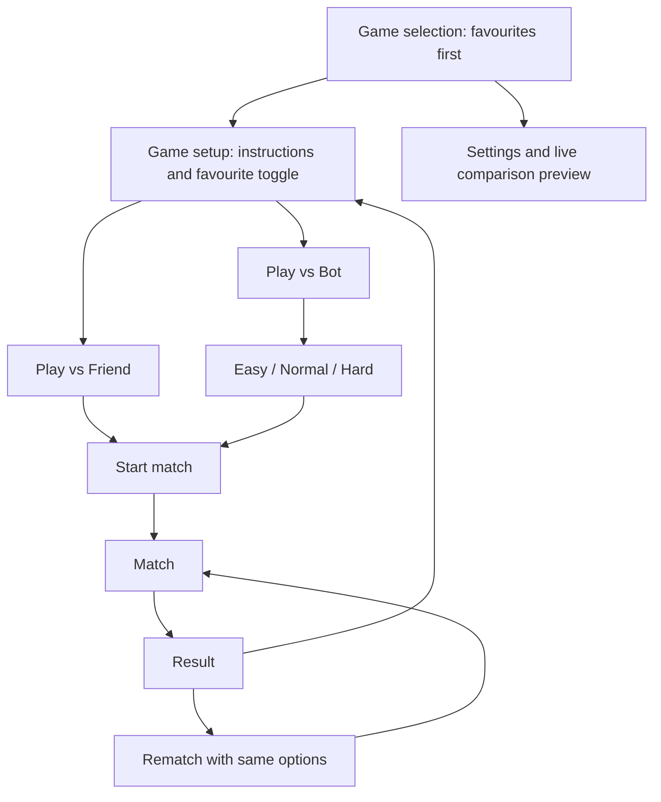

# TapTussle development plan

Last updated: 2026-09-25.

This is the working backlog for the next development phases. Paddle Duel,
Reaction Duel, Air Hockey, Lane Dash, and Tic-Tac-Toe are implemented and have
completed their milestone device passes. M8 records the completed branding and
automated-regression checkpoint. Physical-device release validation is consolidated
in M23 after all 18 currently selected games are implemented.
Update this file as each increment is implemented and verified.

## Product scope

- Offline mobile mini-games for two people sharing a device, plus solo play
  against a local bot. No accounts, servers, or online opponents.
- Flutter owns navigation, game setup, favourites, settings, and match overlays.
- Each game chooses Flame or pure Flutter according to its needs.
- Reach five playable games, then aim for approximately one new game per month.
  This is a release cadence goal, not a promise of fixed delivery dates.
- Deliver one reviewable increment at a time; keep Paddle Duel playable during
  architecture changes.

## Progress tracker

Use `Not started`, `In progress`, `Blocked`, or `Done`. Mark a milestone Done only
after its acceptance checklist passes. Record a blocker and next action if blocked.

| ID | Milestone | Depends on | Status | Completion evidence |
| --- | --- | --- | --- | --- |
| M0 | Foundation and Paddle Duel | — | Done | Existing implementation; initial 13 tests and web build passed; user confirmed first iPhone debug run |
| M1 | Game setup, favourites, and Paddle Duel bots | M0 | Done | User verified friend mode plus Easy, Normal, and Hard bots on iPhone; difficulties were distinct |
| M2 | UI automation and M1 usability follow-up | M1 | Blocked | Native iPhone integration-test transport cannot attach; retry when the Flutter/iPhone debug transport issue is resolved |
| M3 | Settings, audio, vibration, and live graphics comparison | M1, M2 | Done | User confirmed M3 works on iPhone and Android, including graphics settings after the preview capture fix |
| M4 | Reaction Duel | M1, M2, M3 | Done | User confirmed M3–M6 working on iPhone and Android |
| M5 | Air Hockey | M4 | Done | User confirmed M3–M6 working on iPhone and Android |
| M6 | Lane Dash: simple racing/movement game | M5 | Done | User confirmed latest independent-course bot changes and M3–M6 working on iPhone and Android |
| M7 | Tic-Tac-Toe: fifth game | M6 | Done | M7.1–M7.5 implemented; 32 focused tests pass; user confirmed Friend and all three bot difficulties on physical iPhone and Android devices |
| M8 | Branding and automated foundation checkpoint | M1–M7 | Done | Final app icon and attribution complete; all 82 tests and analysis passed; early iPad profile connection evidence is retained for the final M23 validation |
| M9 | Player-count foundation and local records | M8 | In progress | M9.1–M9.4 add typed capabilities, player-count catalog tabs, immutable participant lists, and shared solo or 2–4-player setup |
| M10 | Memory Match | M9 | Not started | First game supporting both solo records and two-player turns |
| M11 | Rock Paper Scissors | M9 | Not started | Small two-player/bot addition that validates reusable simultaneous hidden choices |
| M12 | Snakes & Ladders | M9 | Not started | First 2–4-player game and first shared multi-token turn flow |
| M13 | Sudoku | M9 | Not started | Dedicated solo game with difficulty, completion time, mistakes, and local records |
| M14 | Checkers | M9 | Not started | Two-player strategy game with legal-move and bot-search coverage |
| M15 | Mancala | M14 | Not started | Two-player sowing strategy with friend and delayed bot modes |
| M16 | Slither-style Snakes | M15 | Not started | First solo real-time game with score records |
| M17 | Water Sort Puzzle | M16 | Not started | Solo level puzzle with move/time records |
| M18 | Ludo | M17 | Not started | Full 2–4-player board game with optional bots and standings |
| M19 | Nuts and Bolts | M18 | Not started | Solo spatial puzzle with difficulty and records |
| M20 | Solitaire | M19 | Not started | Offline Klondike card game with saved progress and records |
| M21 | Cangkulan | M20 | Not started | Confirmed 2–4-player Indonesian follow-suit game with seven-card deal and draw-until-match rules |
| M22 | Chess | M21 | Not started | Complete two-player rules with friend and bounded bot modes |
| M23 | Eighteen-game release validation and store preparation | M10–M22 | Not started | Full device matrix, signing, release builds, store assets, version decision, and release evidence for the first public version |

Milestone completion records functional implementation and the device evidence
listed in the tracker; it is not release certification. M3–M6 have been confirmed
on iPhone and Android. M7 is also confirmed on both physical platforms. M2 native
automation remains blocked. Full physical-device and release validation now runs
once in M23 after the complete catalog is implemented.

## Target player flow



Game setup is the page immediately after selecting a game. Its favourite button
is available before starting either mode. Use the exact difficulty labels **Easy**,
**Normal**, and **Hard**. Proposed initial defaults: Play vs Friend, Normal bot
difficulty, and no favourite games. Remember the last selected mode and difficulty
per game locally; never auto-start a match when returning to setup.

## Architecture changes

Reuse the current structure instead of introducing a separate game framework:

| Current area | Planned extension |
| --- | --- |
| `lib/core/mini_game.dart` | Keep the widget-based entry point. Add supported modes and relevant graphics capabilities to game metadata. |
| `lib/core/match_session.dart` | Keep ready/playing/paused/finished and round resets. Add participant labels; add explicit draw results when a game first needs them. |
| `MiniGameBuilder(session, winningScore)` | Replace the positional score argument with immutable match options containing mode, optional bot difficulty, and game rules. Keep graphics/audio preferences separate from win rules. |
| `lib/core/app_settings.dart` | Extend local persistence with validated defaults, volume, vibration, graphics preferences, favourite game IDs, and remembered setup choices. Preserve the existing winning-score preference. |
| `lib/features/home/` | Observe favourites and display a stable sorted view of the catalog. |
| New `lib/features/game_setup/` | Shared mode choice, conditional difficulty choice, favourite toggle, and game-specific instructions. |
| `lib/features/match/` | Pass frozen match options into a fresh game instance; use correct friend/bot labels and retain pause/rematch behavior. |
| New `lib/features/settings/` | Full settings page and live graphics comparison, replacing the small settings sheet. |
| New shared services/adapters | Small audio, haptic, and game-rendering adapters used by both Flutter and Flame modules. No game-specific rules here. |
| `lib/games/<id>/` | Own the simulation/rules, input adapter, bot behavior, artwork, and game-specific tests. |

Only the composition root (`lib/app/game_catalog.dart`) imports individual game
modules. Shared screens and core types must remain independent of Flame and
specific games. A bot supplies legal player inputs to the same rules as a human;
it must not directly award points or change the simulation difficulty secretly.
Use game-specific bot policies with shared difficulty names, not one universal
bot implementation for every game.

Bots must feel human rather than responding instantly. Turn-based games schedule
a visible, bounded thinking delay before submitting a move; every difficulty
retains some delay, with harder profiles generally reacting sooner. Real-time
games use bounded observation and reaction intervals instead of perfect
frame-by-frame knowledge. Pending bot actions must be cancelled on pause, match
end, option changes, and disposal, then safely rescheduled after resume when it
is still the bot's turn. Apply this rule to every future game with a bot mode.

### Standard mini-game module pattern

Use responsibility boundaries consistently, while allowing each game to omit
files it does not need:

```text
lib/games/<game_id>/
  <game_id>_model.dart       Pure rules and mutable game state; no Flutter/Flame
  <game_id>_bot.dart         Optional bot policy that submits legal player input
  <game_id>_game.dart        Flame loop, rendering, effects, and match reporting
  <game_id>_controller.dart  Pure Flutter/timer orchestration instead of Flame
  <game_id>_view.dart        Flutter layout, input mapping, and lifecycle wiring
  <game_id>_preview.dart     Optional catalog or graphics-preview artwork
```

A Flame game normally uses `model`, optional `bot`, `game`, and `view`. A pure
Flutter game normally uses `model`, optional `bot`, optional `controller`, and
`view`; it must not add a Flame adapter solely for structural symmetry. Keep rule
tests focused on the model, bot tests deterministic through injected randomness,
and widget tests focused on input, lifecycle, and shared-shell integration.

The model owns legal state transitions and outcomes. A bot observes allowed
state and calls the same legal input methods as a person. The Flame game or
Flutter controller advances time and publishes scores/results to `MatchSession`.
The view maps device input and owns widget listeners, without embedding rules,
bot decisions, or rendering loops. Register the module only in
`lib/app/game_catalog.dart`; games must not import one another.

Migrate Paddle Duel and the existing pure Flutter test fixture together so both
integration paths remain covered. Avoid introducing new state-management or
physics packages unless a concrete requirement justifies them. Verify any new
package's compatibility with the installed Flutter SDK before adding it.

## M1 — Game setup, favourites, and Paddle Duel bots

Deliver this in two increments: shared setup/favourites first, then working bot
play. Do not expose a working-looking bot start action before the bot is available.

- [x] M1.1 Add match options, participant information, and game capability metadata;
  migrate existing callers while preserving friend-mode behavior.
- [x] M1.2 Route game selection into the new setup page, with title, instructions,
  Play vs Friend, Play vs Bot, favourite toggle, and Start match.
- [x] M1.3 Show Easy / Normal / Hard only for bot mode. Validate difficulty before
  starting a bot match; do not pass an active bot into friend mode.
- [x] M1.4 Persist favourites using stable catalog IDs, independent of game titles.
  Sort favourites before other games and preserve catalog order within each group.
  Unfavouriting restores the game's normal position. Do not mutate the catalog.
- [x] M1.5 Refresh ordering when returning to the list, retaining usable scroll
  position and preventing duplicate cards. Ignore unknown saved IDs safely.
- [x] M1.6 Implement Paddle Duel bot controls: player at bottom, bot at top;
  ignore human touches on the bot side. Preserve two simultaneous touches in
  friend mode.
- [x] M1.7 Tune Easy using slower reactions, lower paddle speed, and larger aim
  error; Normal with moderate tracking; Hard with bounded prediction, quicker
  reactions, and smaller error. Hard should remain beatable in Paddle Duel.
- [x] M1.8 Make bot updates respect pause, backgrounding, result, rematch, and
  disposal. Clear delayed actions and pointer ownership on match transitions.
- [x] M1.9 Use Player 1 / Player 2 in friend mode and You / Bot in solo mode,
  including instructions, HUD, and result copy. Rematch retains the selected mode,
  difficulty, and win rules; Change options returns to setup.

Acceptance:

- [x] Favourite and unfavourite from setup, restart the app, and verify persistence
  and ordering. Test sorting with a multi-game fixture before more games ship.
- [x] Complete a Paddle Duel match in friend mode and all three bot difficulties.
- [x] Confirm bots cannot move while paused, act after disposal, or receive human
  touches. Confirm fresh rematches reset bot state.
- [x] Existing friend-mode input and scoring regression tests remain green.
- [x] Record human play feedback showing a meaningful Easy → Normal → Hard
  progression; use deterministic seeds for automated bot tests.

## M2 — UI automation and M1 usability follow-up

The user confirmed an iPhone play-through of friend mode and every bot difficulty,
with a clear Easy → Normal → Hard difference. The following feedback is part of
this milestone and must be verified on physical devices before continuing to M3.

- [x] M2.1 Replace the large selection cards with a compact two-column game grid.
  Each tile contains only game artwork, its name, and an unobtrusive favourite
  indicator. The grid keeps favourites first and avoids a growing vertical card list.
- [x] M2.2 Split setup into participant and difficulty pages. The participant page
  starts with How to play, then presents Play vs Friend and Play vs Bot. Friend
  mode starts directly; bot mode opens the difficulty page.
- [x] M2.3 Replace difficulty chips with a three-stop slider: Easy, Normal, Hard.
  Show a difficulty description and a Play button below the slider.
- [x] M2.4 Expand Paddle Duel touch capture to the complete available match area,
  including the space below the court. The bottom player can control the paddle
  from the bottom of the screen without covering the ball. Keep the court mapping
  correct when the court is letterboxed on larger devices.
- [x] M2.5 Opt into iOS Game Mode with `GCSupportsGameMode` in `Info.plist`.
  Game Mode is activated by iOS when the game launches; the app cannot force its
  notification or state. Verify the notification on an iPhone running iOS 18+.

### Native UI automation

Playwright does not automate a native Flutter application installed on iOS or
Android. Use Flutter's `integration_test` package as the required native UI
automation tool because it can drive app widgets and run on physical devices and
emulators. Playwright may be added later for optional web-build smoke tests, but
it is not evidence for iPhone/Android behavior.

- [x] M2.6 Add `integration_test` as a development dependency and an iOS/Android
  runner path. Keep tests offline and deterministic; do not depend on a simulator
  or a network service.
- [x] M2.7 Add stable semantic labels/keys only where needed for automation. Do not
  test rendering implementation details or brittle widget-tree positions.
- [x] M2.8 Automate the critical M1 journey: grid → favourite → participant page →
  friend match; grid → bot → each slider position → match; pause/background →
  resume; result → rematch/change options; restart → saved favourites/options.
- [ ] M2.9 Run the suite on a physical iPhone and Android device. Record device,
  OS, build, command, result, and any platform-specific failures.
- [ ] M2.10 Add an optional Playwright web smoke-test proposal only after the native
  suite is stable. It must target the compiled web build and remain separate from
  mobile acceptance results.

Acceptance:

- [ ] Confirm the 2×2 grid works with 1, 2, 3, and 5 games; favourites stay first
  and no duplicate/missing tile appears after returning from setup.
- [ ] On iPhone and Android, use the bottom-most reachable part of the play area to
  move Paddle Duel's lower paddle while keeping the ball visible. Verify friend
  mode retains two independent touch zones.
- [ ] Confirm Game Mode notification/state on a supported iPhone after rebuilding
  with the new `Info.plist`; record if the OS chooses not to show a notification.
- [ ] Native integration tests pass on iPhone and Android. Playwright results, if
  added, are reported separately as web-only coverage.

### Running the native suite

The suite is [integration_test/app_test.dart](../integration_test/app_test.dart).
With a USB-attached, unlocked device that has accepted this Mac's development
certificate, run:

```sh
flutter devices
flutter test integration_test/app_test.dart -d <device-id>
```

It clears TapTussle's local preferences before each journey so the result is
deterministic. Do not use it on an installation whose local preferences you need
to retain. The suite has no network dependency. Record the device model, OS,
Flutter version, build number, command, and result under M2.9.

**Parked 2026-09-24 at the user's request.** The iPhone installs and launches
the integration-test app over USB, but Flutter does not attach its Dart test
runner. Resume M2.9 after resolving that iPhone/Flutter debug transport issue
and when an Android device is available.

## M3 — Settings and live graphics comparison

Promote settings to a dedicated scrollable page. Proposed defaults: volume 70%,
vibration On, High resolution, and target 60 FPS. Keep one shared points-to-win
control for every score-based game, including Paddle Duel, Reaction Duel, and Air
Hockey. Store choices locally and handle missing, invalid, or failed writes.

### Sound, vibration, and version

- [x] M3.1 Add a master volume slider from 0–100%, with 0 explicitly muted.
  Include a short sample action so its effect can be heard immediately.
- [x] M3.2 Add bundled, licensed sound effects for meaningful actions such as
  collisions, scoring, start, and result. A slider with no audible game effects
  does not satisfy this feature. Background music is outside this increment.
- [x] M3.3 Route sound through one service, respecting volume across all games,
  limiting overlapping sounds, and stopping/suspending playback on backgrounding.
- [x] M3.4 Add vibration On / Off plus a test action. Use brief, rate-limited
  feedback on selected events, with no failure on unsupported hardware. For a
  shared phone, feedback is device-wide, not private feedback to one player.
- [x] M3.5 Show the installed app's version and build number at the bottom, e.g.
  `Version 1.0.0 (1)`, using runtime package metadata rather than hard-coded text.

### Resolution and FPS

These are separate settings. Resolution controls game-scene image sharpness;
FPS controls the target rate of visible game animation. Neither should change
game speed, bot reaction time, collision accuracy, scoring, or tap timing.

Proposed options to validate before shipping:

| Setting | Option | Intended explanation in the UI |
| --- | --- | --- |
| Resolution | Low — 50% per dimension | Softer image; intended to reduce graphics workload |
| Resolution | Medium — 75% per dimension | A balance of sharpness and graphics workload |
| Resolution | High — 100% / native | Sharpest game image; potentially higher graphics workload |
| FPS | 30 | Less smooth motion; potentially lower power use |
| FPS | 60 | Smoother motion; potentially higher power use |

Percentages refer to the game rendering surface relative to its native physical
pixel size, not the phone's display mode or the game's logical arena dimensions.
Flutter menus, buttons, and HUD remain readable at native resolution. Keep the
current logical arena and touch mapping unchanged. Do not add 90/120 FPS until
the baseline settings work reliably on supported devices.

- [x] M3.6 First run a bounded implementation/profiling investigation on the
  installed Flutter/Flame versions. Prove actual game rendering scale and frame
  pacing on iPhone and Android before wiring up production controls.

  Source investigation is recorded in
  [Graphics rendering investigation](GRAPHICS_RENDERING_INVESTIGATION.md).
  It confirms that Flame viewport settings are not physical resolution scaling
  and that `GameWidget` has no public FPS cap. User confirmed the graphics
  settings work on iPhone and Android; broader release profiling remains in M23.
- [x] M3.7 Implement a shared rendering adapter with supported capabilities and
  effective settings. Merely changing Flame's logical viewport size or skipping
  simulation updates does not implement resolution scaling or a rendering cap.
- [x] M3.8 Keep simulation/timing independent of presentation. Use consistent
  elapsed-time or fixed-step rules; do not slow the game when choosing 30 FPS.

  Paddle Duel now uses a presentation adapter that advances its existing
  elapsed-time simulation at display cadence, then rasterizes a snapshot at
  the selected 50%, 75%, or 100% physical pixel scale and publishes it at 30
  or 60 FPS. The settings are saved locally. User confirmed graphics settings
  work on iPhone and Android; broader release profiling remains in M23.
- [x] M3.9 For simple pure Flutter games, maintain native UI and explain when game
  resolution does not apply; apply FPS to relevant animations where supported.
  Do not blur board labels or claim an unsupported setting changed the game.
- [x] M3.10 Distinguish requested from effective settings, including display-rate
  limits and fallback. If the investigation cannot achieve real scaling or
  pacing, record the limitation and leave this task open instead of shipping
  controls that only change labels.

### Live comparison preview — confirmed user requirement

- [x] M3.11 Add an animated preview inside settings using a looping scene with a
  moving ball, paddles, fine lines, and an image/texture detail. Use local assets.
- [x] M3.12 Show two labelled panes: current saved settings and candidate settings.
  Both use the same deterministic scene, time origin, and animation path, with
  independent rendering settings so the comparison is fair.
- [x] M3.13 Let the user vary resolution and FPS independently, comparing all six
  proposed combinations. Show selected resolution, actual render dimensions,
  target FPS, and measured scene frame rate for each pane.
- [x] M3.14 Reuse the production rendering adapter in the preview; a prerecorded
  video or identical animations with different labels do not count.
- [x] M3.15 Apply commits the candidate graphics settings; Cancel/Back restores
  the saved settings. Stop preview work when leaving or backgrounding the page.
  Use stacked panes if needed on small screens, with matching scene sizes.
- [x] M3.16 Explain sharpness, smoothness, and potential battery tradeoffs without
  invented battery percentages. A two-pane preview adds workload, so its measured
  FPS is not a guarantee of match performance.

  Implemented as a dedicated Settings route. It shows a saved and candidate
  Paddle Duel rally through the production physical-raster adapter, lets the
  candidate select each resolution/FPS combination independently, and reports
  target pixel dimensions, requested FPS, and the adapter's measured published
  frame rate. Apply is the only action that persists a candidate; Back and
  Cancel discard it, and app backgrounding pauses both previews.

Acceptance:

- [x] Volume, vibration, resolution, and FPS survive an app restart; failed saves
  are visible and do not falsely appear committed.
- [x] Mute silences effects; vibration Off suppresses feedback in every game.
- [x] Preview resolution changes are visibly real, and 30 versus 60 FPS produces
  different measured scene pacing on suitable hardware.
- [x] Compare gameplay and bot behavior at both FPS targets: the same scripted
  inputs produce equivalent elapsed-time outcomes within documented tolerances.
- [x] Complete functional real-match checks for graphics settings on iPhone and
  Android. Detailed profile-mode frame timings for all six combinations remain
  part of M23 release validation; debug results are not release evidence.
- [x] Verify the runtime footer and settings layout during the M3 device checks.
  Larger-text accessibility coverage remains part of M23 release validation.

## M4 — Reaction Duel

Engine: pure Flutter. Proposed rules: wait through a random delay, then tap your
side when the signal appears. First legal tap wins a point; an early tap awards
the opponent a point. First to 5 wins. Use a monotonic clock, not rendered frames,
to timestamp taps; define a small simultaneous-tap tolerance and replay tied
rounds without awarding points.

- [x] M4.1 Build a testable waiting/signal/result round state machine and seedable
  delay source, with clear visual instructions and large mirrored touch zones.
- [x] M4.2 Implement friend mode, false starts, simultaneous taps, and score rules.
- [x] M4.3 Implement bots using calibrated, variable reaction delays after the
  actual signal: Easy slower, Normal moderate, Hard faster but bounded. No bot
  access to a future signal time or input before the signal.
- [x] M4.4 Cancel pending timers on pause/dispose; restart an interrupted waiting
  round with a fresh delay and no penalty on resume. Preserve match scores.
- [x] M4.5 Register the game with setup, favourites, sound, vibration, and results.

Reaction Duel is implemented as a pure Flutter game. It uses a timer/state
machine rather than render frames, replays legal taps within a 75 ms tie window,
and gives a false starter's opponent the point. Bot delays begin only after the
signal, vary by difficulty, and use the shared configured winning score.

Acceptance: false starts and ties are deterministic; two fingers work; no stale
timer scores after pause; reaction timing is independent of target FPS; complete
matches in friend mode and all bot difficulties on both mobile platforms.

Validation: user confirmed M3–M6 working on both iPhone and Android.

## M5 — Air Hockey

Engine: Flame. Proposed rules: one mallet per half, one puck, first to 7 goals.
Use simple circle/rail collision rules initially; assess Forge2D only if collision
stability or contact requirements justify it. Do not inherit Paddle Duel rules.

Implementation note: goal mouths are visible openings at both ends of the rink.
The puck passes through an opening to score; it bounces from the end rail outside
the opening. This is intentionally separate from Paddle Duel's scoring rules.
The bot meets an incoming puck below and offset from its path, rather than
centering against its back rail, so a defensive return gains a horizontal angle.
Every new shared match round resets the puck, mallets, scores, and match-local
collision state, while preserving the configured points-to-win value.
The fixed-step simulation stops as soon as a winning goal is recorded, preventing
multiple score increments from one puck crossing.

- [x] M5.1 Implement puck, mallets, rails, goal mouths, and deterministic reset.
- [x] M5.2 Constrain mallets to their own halves; support simultaneous dragging
  and bounded mallet speed to avoid teleporting through the puck.
- [x] M5.3 Handle fast contacts, corners, goal detection, and exactly-once scoring.
- [x] M5.4 Build bot difficulty from reaction time, aim error, speed, and defensive
  versus attacking decisions; use the same mallet constraints as humans.
- [x] M5.5 Integrate shared setup, favourites, effects, settings, and lifecycle.

Acceptance: no tunnelling or repeated goals during stress scenarios; equivalent
physics across FPS settings; complete friend/bot matches; no input ownership
changes when fingers cross or leave the court.

Validation: user confirmed M3–M6 working on both iPhone and Android. Earlier
iPhone checks also covered replay behavior, visible goal mouths, and exact scores.
The Air Hockey bot policy was subsequently separated from the Flame view and now
uses explicit difficulty profiles for reaction delay, movement reach, aim error,
and positioning. Device confirmation of the revised profiles remains pending;
its Flame adapter and renderer now live in `air_hockey_game.dart`, leaving the
view responsible for Flutter input and layout. Release-level physics stress
validation remains in M23.

## M6 — Lane Dash (proposed movement/racing game)

Engine: Flame. Proposed design: two separate three-lane tracks sharing the phone.
Each player swipes left/right on their side to avoid obstacles and reach a finish
distance. Show two distinct track panels: bottom player's obstacles move down
toward the bottom runner; top player's obstacles move up toward the top runner.
Render a single visible obstacle per course row as a cone sprite, show each
player's distance/progress and collision slowdown clearly. Collisions apply a
brief slowdown rather than immediate elimination.
Give each player an independently generated obstacle sequence with a randomized
starting offset; keep course pressure comparable at a given difficulty. Settle a
finish within the same simulation step as a draw, rather than by update order.

- [x] M6.1 Finalize mirrored controls, track layout, race length, slowdown, and a
  maximum race duration with a defined distance-based result if nobody finishes.
- [x] M6.2 Build seedable obstacle generation that always leaves a possible path.
- [x] M6.3 Add movement, collisions, countdown, progress, and finish resolution;
  use swipe controls on each player's half and a mirrored swipe for the top runner.
  Revised after user testing found the initial shared obstacle renderer unreadable
  and race progress unclear. The two mirrored track panels, cone obstacles,
  independent scrolling, distance meters, and hit feedback are now implemented;
  swipe controls replaced arrows. Runner speed is shared across all difficulties;
  each side now gets an independent, offset obstacle course, with spacing and
  blocked-lane patterns increasing course pressure by difficulty. Bot reaction
  delay and mistake rates are tuned per difficulty. User confirmed the latest bot
  changes and the complete M3–M6 set on iPhone and Android. The Flame adapter,
  renderer, effects, and match reporting now live in `lane_dash_game.dart`,
  separate from the Flutter input view.
- [x] M6.4 Extend shared match results explicitly for draws and non-point-based
  results; keep Paddle Duel scoring compatible. Do not show FIRST TO 7 here.
- [x] M6.5 Add bots with bounded obstacle lookahead, reaction delay, and mistake
  probability; no knowledge of obstacles outside the visible/allowed horizon.
- [x] M6.6 Integrate shared features and pause/resume without advancing obstacles
  or granting one participant extra movement while paused.

Acceptance: seeded races have independent but difficulty-matched courses, controls
stay responsive, each separate track has its own mirrored obstacle flow, obstacle
sprites and hit feedback are clear, distance progress is visible, swipe controls
move each runner in the intended direction, difficulty changes obstacle pressure
and bot decision quality while keeping runner speed equal, finish/draw rules are
independent of update order, and races complete in both modes at 30 and 60 FPS.

## M7 — Tic-Tac-Toe (fifth simple game)

Engine: pure Flutter. Proposed rules: a 3×3 board, X/O alternate turns, three in a
row wins, full board without a winner draws. One board is one match; rematch
alternates the starting player. This validates turn-based games in the architecture.

- [x] M7.1 Implement pure board rules, legal moves, turn ownership, win detection,
  and draw results that the Flutter controller can publish through the shared
  result support introduced in M6. Player 1 owns X and Player 2 owns O; rematches
  alternate the starting participant without changing mark ownership.
- [x] M7.2 Build a readable board with clear current-player and occupied-cell
  states, winning-line emphasis, a distinct full-board draw state, accessible
  cell labels, and a compact portrait layout.
- [x] M7.3 Easy picks random legal moves; Normal takes immediate wins/blocks with
  occasional weaker choices; Hard uses optimal search. Hard may be unbeatable
  here, but must still permit a draw and must never make an illegal move.
- [x] M7.4 Block human moves during the bot turn; cancel pending bot turns on
  pause/dispose and resume safely without a duplicate move.
- [x] M7.5 Integrate setup, favourites, effects, and rematch. Mark game resolution
  as not applicable to the native Flutter board; retain readable controls.

Acceptance: cover all winning lines, draws, invalid input, alternating starters,
and bot legality. Exhaustive rule/search tests demonstrate Hard never loses from
an initially empty board. Complete friend/bot matches on mobile devices.

## M8 — Branding and automated foundation checkpoint

- [x] M8.1 Add the final app icon for iOS and Android, verify every required icon
  size, and record attribution or original-asset ownership.
- [x] M8.2 Run analysis and relevant rule/widget tests for every completed
  milestone; expand regression and persistence coverage where release-critical
  behavior is not yet protected.

Physical-device profiling, the complete game/mode matrix, offline and interruption
checks, accessibility, persistence migration, long-session behavior, signing, and
release builds are intentionally consolidated in M23. The early iPhone/iPad profile
attempts remain useful evidence but do not complete any M23 release check.

## Expansion review and product decisions

The first ten games form an intermediate catalog checkpoint, while the first store
release is planned after all 18 currently selected games. Game count alone is not
the acceptance criterion. Each addition must have complete rules, lifecycle,
device testing, and an appropriate bot or score system. Limit implementation to
one game milestone at a time so unfinished games do not weaken completed games.

The recommended next five are:

1. **Memory Match** — supports one player and two local players. Solo records can
   rank fewer moves first, then faster completion time. Two-player mode awards
   matched pairs and gives another turn after a successful match.
2. **Rock Paper Scissors** — supports friend and bot play. Same-device friend mode
   must conceal each choice until both players lock in; a simple open button per
   player would reveal choices and make the game unfair.
3. **Snakes & Ladders** — supports two, three, or four local players, with optional
   bots added only after the human turn flow is stable. Its setup validates player
   count, names/colors, turn order, token movement, and multi-player results.
4. **Sudoku** — solo only. Easy, Normal, and Hard describe puzzle difficulty rather
   than bot strength. Record completion time and mistakes separately per difficulty.
5. **Checkers** — supports friend and bot play. Implement mandatory captures,
   multi-jumps, kings, win/stalemate rules, and bounded, delayed bot search.

The other proposed games are tracked in the post-release backlog below rather
than left as unnamed future ideas. Chess, Ludo, and Solitaire have substantially
larger rule and UX surfaces. Slither-style Snakes is distinct from the board game
Snakes & Ladders and would use a Flame real-time architecture.

## M9 — Player-count foundation and local records

- [x] M9.1 Replace the two-player-only catalog assumption with immutable game
  capabilities: supported player counts, solo/friend/bot modes, whether difficulty
  represents a bot or a puzzle, and an optional record definition. Existing five
  games remain `2 players` and retain their current setup and results.
- [x] M9.2 Add catalog tabs before the grid: **1 Player**, **2 Players**, and
  **Up to 4 Players**. A game may appear in more than one tab when it supports
  multiple counts. Favourites stay first within the active filtered list, followed
  by stable catalog order. Persist the last selected tab and provide an intentional
  empty state.
- [x] M9.3 Generalize match participants from the current fixed friend/bot pair to
  an ordered list of one to four immutable participant descriptors: local human or
  bot, display name, color/token, and optional bot difficulty. Do not infer game
  rules from participant count.
- [x] M9.4 Add a shared participant setup flow that asks only for options supported
  by the selected game. Two-player games keep the current fast Friend/Bot path;
  multi-player games choose count first and configure each seat. Prevent duplicate
  colors and require at least one human for offline play.
- [ ] M9.5 Extend shared match outcomes beyond player indexes 0 and 1 so they can
  represent a winner among four participants, a draw, completion without a winner,
  and optional ordered standings. Preserve all existing score-based behavior.
- [ ] M9.6 Add an offline record repository keyed by stable game ID, record type,
  difficulty/rules variant, and local completion timestamp. Define whether higher
  or lower values are better and support a secondary tie-breaker such as time or
  moves. Keep record logic out of individual screens.
- [ ] M9.7 Show **Daily Best**, **Weekly Best**, and **Overall Best** for supported
  solo games. Daily means the current local calendar day; weekly means the current
  local Monday–Sunday week. Recompute buckets from saved timestamped results so
  rollover requires no scheduled job. Records remain local and device-clock based.
- [ ] M9.8 Add migration and regression tests for existing favourites, remembered
  two-player setup, points-to-win, and results. Add focused tests for overlapping
  filters, 1–4 participants, standings, record ranking/ties, day/week rollover,
  malformed saved data, and bounded history retention.
- [ ] M9.9 Replace the mini-game catalog artwork with the 18 supplied game logos.
  The original PNGs are staged under `assets/game_logos/` with normalized filenames
  and a source manifest. Optimize their delivery variants, map each image to its
  stable game ID, and use the same reusable image treatment for current and future
  catalog cards. Include Paddle Duel, Reaction Duel, Air Hockey, Lane Dash,
  Tic-Tac-Toe, Memory Match, Rock Paper Scissors, Snakes & Ladders, Sudoku,
  Checkers, Mancala, Slither-style Snakes, Water Sort Puzzle, Ludo, Nuts & Bolts,
  Solitaire, Cangkulan, and Chess. Preserve readable cropping at supported phone
  and tablet sizes, provide a safe fallback for a missing asset, record the source
  attribution, and add an asset/catalog test covering all 18 mappings.

Acceptance: all existing games behave unchanged; each catalog tab contains only
compatible games; a fixture game can complete with one through four participants;
records survive restart and roll into the correct local day/week; all 18 catalog
entries resolve to their supplied logo without clipping key artwork; no network
or account is introduced.

## M10 — Memory Match

Confirmed difficulty design:

- **Easy:** 3×4 grid (6 pairs) with a three-second opening preview.
- **Normal:** 4×4 grid (8 pairs) with a short 1.5-second opening preview.
- **Hard:** 4×6 grid (12 pairs) without an opening preview.

Memory Match uses a fresh shuffled board on every attempt rather than fixed
numbered levels, because replaying a known arrangement would undermine the memory
challenge. Solo records rank fewer turns first and completion time second. Friend
mode uses the selected grid size without an opening preview for either player.

- [ ] M10.1 Implement deterministic deck generation, pair matching, turn rules,
  move counting, completion, and rematch reshuffling in a pure Dart model.
- [ ] M10.2 Build a responsive pure Flutter card grid with a short mismatch reveal
  delay, input locking during animations, pause/resume safety, and accessibility
  labels that do not expose hidden cards.
- [ ] M10.3 Add solo play with Easy/Normal/Hard board sizes and local move/time
  records; add two-player play with pair scores and alternating turns.
- [ ] M10.4 Integrate sounds, haptics, favourites, player-count filters, results,
  records, and physical-device verification.

## M11 — Rock Paper Scissors

- [ ] M11.1 Implement round rules, draws, configured points-to-win, and deterministic
  tests for every choice pairing.
- [ ] M11.2 Create a fair pass-and-hide flow for two friends and delayed Easy,
  Normal, and Hard bot policies without reading future human input.
- [ ] M11.3 Integrate setup, effects, rematch, favourites, filters, lifecycle, and
  physical-device verification.

## M12 — Snakes & Ladders

Confirmed board: 8×8 with squares 1–64 and square 64 as the finish. An **extra
turn** would mean rolling again after a configured event such as rolling a six.
A **token collision** rule decides whether landing on another token shares the
square, sends that token back, or blocks the move. Confirmed TapTussle rules are:
no extra turns, multiple tokens may share a square without capture, and reaching
64 requires an exact roll; an oversized roll leaves the token in place.

- [ ] M12.1 Freeze snake/ladder positions and confirm exact-roll finish, no extra
  turns, and shared squares without collision. Implement the 1–64 path,
  deterministic dice injection, transitions, and movement tests before UI work.
- [ ] M12.2 Build a readable board and animated token path for two to four local
  players, including clear current-turn and final-standings states.
- [ ] M12.3 Add optional bots with visible roll delays and no dice advantage; bot
  difficulty is not shown unless meaningful decisions exist in the chosen rules.
- [ ] M12.4 Verify participant setup, interruption, rematch, favourites, filters,
  effects, and physical devices.

## M13 — Sudoku

Confirmed design: standard 9×9 Sudoku with 60 uniquely solvable puzzles per
difficulty. Easy puzzles use singles and straightforward scanning; Normal adds
locked candidates and pairs; Hard may require advanced techniques. Clue count is
supporting metadata rather than the sole difficulty measure. Every puzzle must be
validated by a solver that proves exactly one solution and records the techniques
needed for its rating.

Players have unlimited notes and erase actions. Incorrect final entries highlight
conflicts and increment a mistake counter but do not end the game. Allow up to
three hints; using a hint marks the result as assisted. Records rank highest level,
then unassisted completion, fewer mistakes, and faster time within each difficulty.
These rules and the 60-level count are confirmed.

- [ ] M13.1 Implement board validation, candidates, completion, mistake policy,
  deterministic puzzle loading/generation, and uniqueness verification.
- [ ] M13.2 Build touch-first number entry, notes, erase, conflict highlighting,
  pause-hidden timer, and resumable in-progress games.
- [ ] M13.3 Provide Easy, Normal, and Hard puzzle difficulty and record completion
  time plus mistakes per difficulty. Puzzle difficulty replaces bot difficulty.
- [ ] M13.4 Verify persistence, records, accessibility, favourites, filters,
  lifecycle, and physical devices.

## M14 — Checkers

American/English checkers uses an 8×8 board with 12 pieces each; regular pieces
move and capture diagonally forward, kings move one square diagonally both ways,
captures are mandatory, and kings do not fly across multiple empty squares.
International draughts uses a 10×10 board with 20 pieces each, regular pieces may
capture backward, kings are flying pieces, and the maximum available capture
sequence is mandatory. TapTussle will use American/English checkers because it is
more compact and easier to read on phones.

- [ ] M14.1 Implement American/English legal moves, mandatory capture,
  multi-jump continuation, promotion, win, stalemate, and draw protection in pure
  Dart with rule tests.
- [ ] M14.2 Build a readable Flutter board with legal-target, selected-piece,
  capture-chain, king, current-player, and result states.
- [ ] M14.3 Add delayed Easy, Normal, and Hard bots with bounded search and
  difficulty-specific evaluation/search depth; cancel safely across lifecycle and
  rematch events.
- [ ] M14.4 Integrate effects, favourites, filters, setup/results, and exhaustive
  device-sized widget plus physical-device checks.

## M15 — Mancala

Confirmed rules: standard two-player Kalah with six small pits and one store per
player. Every small pit starts with four stones, for 48 stones total. A player owns
the six pits on their side and the store to their right. Sowing moves one stone at
a time counterclockwise, includes the active player's store, and skips the opposing
store. Landing in the active player's store grants an extra turn. Landing in an
empty owned pit captures that last stone plus every stone in the directly opposite
pit, but only when the opposite pit is non-empty. The game ends as soon as either
side's six pits are empty; the other side moves all remaining stones to its store.
The larger store wins, and equal stores produce a draw.

- [ ] M15.1 Implement the confirmed board setup, counterclockwise sowing,
  opponent-store skipping, capture condition, extra turns, immediate side-empty
  detection, final collection, winner, and draw in a deterministic pure Dart model.
- [ ] M15.2 Build an accessible Flutter board with clear pit ownership, stone counts,
  legal-pit emphasis, sowing animation, current-player state, and final stores.
- [ ] M15.3 Add friend mode plus delayed Easy, Normal, and Hard bots. Use legal moves
  through the model; vary search depth/evaluation and keep bounded thinking time.
- [ ] M15.4 Integrate setup, results, rematch, effects, favourites, player filters,
  pause/resume, and compact/large-screen layouts.
- [ ] M15.5 Test sowing invariants, captures, extra turns, terminal collection, bot
  legality/lifecycle, and complete every mode on physical iOS and Android devices.

## M16 — Slither-style Snakes

This is a solo real-time survival game, separate from Snakes & Ladders.

Confirmed design: a bounded arena larger than the screen with a camera following the
player. The snake moves continuously; dragging anywhere in the lower half steers
toward the finger without arrow buttons. Eating food grows the snake and increases
score. Hitting the arena wall or another snake ends the run. Touching or crossing
the player's own body has no penalty. AI snakes also collect food; when one hits a
body it becomes food. The first version omits speed boost to keep touch controls
predictable.

Easy uses two slower, less aggressive AI snakes and generous food; Normal uses four
balanced AI snakes; Hard uses six quicker, more assertive AI snakes with scarcer
food. Player steering and base speed remain consistent across difficulty. Grant a
short spawn-protection period, then score food plus defeated AI bonuses. Daily,
weekly, and overall records rank score first and survival time second. These arena,
control, collision, and difficulty rules are confirmed.

- [ ] M16.1 Define arena boundaries, steering, growth, food spawning, collision,
  score, speed progression, and game-over rules; implement deterministic simulation
  and seeded spawning independently from rendering.
- [ ] M16.2 Build the Flame game with natural touch steering, camera/arena feedback,
  readable snake and food artwork, pause safety, and stable fixed-step movement.
- [ ] M16.3 Add Easy, Normal, and Hard challenge profiles through arena pressure,
  speed progression, and obstacle/food balance without changing input semantics.
- [ ] M16.4 Store daily, weekly, and overall high score with survival time as the
  tie-breaker; show current score, personal best, and game-over comparison.
- [ ] M16.5 Integrate effects, haptics, favourites, solo filter, lifecycle, rematch,
  deterministic simulation tests, performance profiling, and physical devices.

## M17 — Water Sort Puzzle

Confirmed launch content: 60 levels per difficulty, for 180 Water Sort levels.
Progress is independent within Easy, Normal, and Hard. Completing level `n` unlocks level
`n + 1` in that difficulty; players may replay any completed level. Store compact,
deterministic level definitions and solver metadata so later level packs do not
require a persistence migration.

Within each difficulty, levels 1–10 teach the rules, 11–30 establish the core
patterns, 31–50 combine patterns, and 51–60 are mastery levels for that band.

Difficulty targets:

- **Easy:** 3–5 colors, two empty helper tubes, short solutions, low branching,
  and an onboarding ramp across levels 1–10.
- **Normal:** 5–8 colors, two empty helper tubes, longer solutions, fewer obvious
  moves, and more temporary ungrouping.
- **Hard:** 8–12 colors, one empty helper tube, long solutions, higher branching,
  and moves that require temporarily breaking apparently useful groups.

Level number increases complexity inside its difficulty band using color count,
minimum verified solution length, and decision branching. A late Easy level must
remain easier than a typical Normal level. Do not classify difficulty using only
the number of colors.

- [ ] M17.1 Define tube capacity, legal pours, completion, move counting, undo, and
  restart; implement an immutable/testable puzzle model.
- [ ] M17.2 Choose a curated or generated level source and prove every shipped level
  is solvable. Ship 60 levels in each difficulty and record solver-verified minimum
  solution length plus branching metadata used to validate the classification. A
  catalog-wide automated test must solve every level, replay the returned move path
  through the production model, and report the exact level ID on failure.
- [ ] M17.3 Build a responsive Flutter tube interface with selected/source states,
  pour animation, color/pattern accessibility, undo, restart, and optional hints.
- [ ] M17.4 Persist unlocked/completed levels and the active puzzle. Daily, weekly,
  and overall best rank the highest completed level per difficulty, then fewer moves
  and faster completion on that level. Retain per-level personal bests for replay.
- [ ] M17.5 Integrate effects, favourites, solo filter, lifecycle, model/solver and
  persistence tests, then verify all difficulties on physical devices.

## M18 — Ludo

Confirmed rules: a six is required to move a token out of its starting box. Rolling
a six or moving a token out of the box grants a bonus roll. Capturing an opposing
token returns it to its box and grants the capturing player a bonus roll. Tokens on
safe squares cannot be captured. Consecutive sixes are allowed without a three-six
forfeit. Same-color tokens do not form blockades; opposing tokens may pass their
square and normal landing/capture rules still apply. A token must roll the exact
required number to reach its final home position; an oversized roll cannot move
that token. When more than one token has a legal move, the player must choose which
token to move rather than having the game select automatically.

- [ ] M18.1 Implement six-to-enter, capture return, safe-square immunity, no
  blockades, bonus rolls, unrestricted consecutive sixes, home movement, exact
  finish, and win standings with deterministic dice injection and rule tests.
- [ ] M18.2 Build an animated, readable Flutter board for two to four participants
  with current-turn, selectable legal tokens, dice, home-path, and standings states.
- [ ] M18.3 Support any valid mixture of local humans and bots with at least one
  human. Require a human to choose among multiple legal tokens. Bots use the same
  legal-move list with visible roll/move delays and never influence dice outcomes.
- [ ] M18.4 If rule choices create meaningful decisions, differentiate Easy,
  Normal, and Hard move selection; otherwise expose one honest bot profile rather
  than artificial difficulty labels.
- [ ] M18.5 Integrate participant setup, pause/resume, saved match restoration,
  results, rematch, effects, favourites, filters, tests, and physical-device passes.

## M19 — Nuts and Bolts

Confirmed concept: separate mixed colored nuts from their bolts and move them so
each completed bolt contains nuts of one color. Only the top nut on a bolt can
move. It may move to an empty bolt or onto a top nut of the same color, provided
the destination has capacity. Easy and Normal levels provide two empty helper
bolts; Hard provides one. Difficulty also scales color count and solution length,
and every shipped level must be solver-verified. A puzzle is complete when every
non-empty bolt is full and contains only one color.

Confirmed launch content: 60 levels per difficulty, for 180 Nuts and Bolts levels.
Progress and replay follow the same independent per-difficulty unlock model as Water Sort.
Use the same 1–10 onboarding, 11–30 core, 31–50 combined, and 51–60 mastery
progression inside each difficulty.

Difficulty targets:

- **Easy:** 3–5 colors, three or four nuts per bolt, two empty helper bolts, short
  solutions, and an onboarding ramp across levels 1–10.
- **Normal:** 5–8 colors, four nuts per bolt, two empty helper bolts, longer
  solutions, and more interleaved starting stacks.
- **Hard:** 8–12 colors, four or five nuts per bolt, one empty helper bolt, long
  solutions, and higher branching with more necessary temporary moves.

Level number increases color count, minimum verified solution length, interleaving,
and decision branching inside the selected difficulty band. Generation must begin
from or prove reachability to a solved state, and a solver must reject impossible,
duplicate, already-solved, or incorrectly classified levels.

- [ ] M19.1 Implement bolt capacity, top-nut-only moves, empty/same-color
  destinations, completion, undo, hint, and restart in a pure Dart puzzle model.
- [ ] M19.2 Ship 60 solver-verified levels in each difficulty with deterministic IDs
  and metadata. Reject duplicate, impossible, already-solved, or incorrectly
  classified levels in automated validation. A catalog-wide automated test must
  solve every level, replay the returned move path through the production model,
  and report the exact level ID on failure.
- [ ] M19.3 Build a touch-friendly Flutter interface with clear depth/order,
  selection, legal targets, movement animation, color/pattern accessibility, undo,
  restart, and hints.
- [ ] M19.4 Persist unlocked/completed levels and the active puzzle. Daily, weekly,
  and overall best rank the highest completed level per difficulty, then fewer moves
  and faster completion on that level. Retain per-level personal bests for replay.
- [ ] M19.5 Integrate solo filtering, favourites, effects, lifecycle, tests, and
  physical-device validation across compact and tablet layouts.

## M20 — Solitaire

Confirmed variant: Klondike. Easy and Normal use draw-one; Hard uses draw-three.
All difficulties allow unlimited stock recycling. The milestone must keep saved
games and records separate by difficulty because draw count changes the game rules.

- [ ] M20.1 Implement deck creation/shuffle injection, tableau, stock/waste,
  foundations, draw-one/draw-three stock behavior, legal moves, flips, completion,
  move count, and scoring in pure Dart.
- [ ] M20.2 Add undo and a deterministic hint engine; test multi-card moves, kings,
  aces, unlimited stock recycling, invalid moves, win detection, and no-move states.
- [ ] M20.3 Build a responsive Flutter card table with drag/tap alternatives,
  readable suits/ranks, animations, pause-safe timer, and accessibility semantics.
- [ ] M20.4 Persist the active deal and track wins, fastest completion, and fewest
  moves for daily, weekly, and overall views.
- [ ] M20.5 Integrate effects, favourites, solo filter, lifecycle, restoration,
  device-sized widget tests, and physical-device validation.

## M21 — Cangkulan

Confirmed core rules: use a standard 52-card deck without Jokers. The first card
of each trick establishes the required suit. A player holding that suit may play
any card of it. If they do not hold that suit, they repeatedly draw from the center
pile until they draw a matching card, then play it. Cards rank
`2 < 3 < 4 < 5 < 6 < 7 < 8 < 9 < 10 < J < Q < K < A`; only cards in the required
suit compete, and the highest wins the trick and leads the next one. There are no
special cards. The first player with an empty hand wins immediately; there is no
end-game point calculation. The game supports two, three, or four players and play
moves clockwise. Every player receives seven cards initially, regardless of player
count, and the undealt cards form the center draw pile. If the draw pile is empty
and a player cannot follow the required suit, that player is skipped for the
current trick. Cangkulan appears in both the **2 Players** and **Up to 4 Players**
catalog tabs.

- [ ] M21.1 Turn the confirmed 2–4-player, seven-card deal, clockwise, follow-suit,
  repeated-draw, exhausted-pile skip, Ace-high trick winner, next-leader, and
  immediate empty-hand win examples into pure Dart rule tests.
- [ ] M21.2 Implement deterministic deck/deal injection, hands, pile state, legal
  actions, turn progression, round completion, and match results in a pure model.
- [ ] M21.3 Build a privacy-aware same-device card UI with pass-device/hidden-hand
  transitions so another participant cannot see a player's cards.
- [ ] M21.4 Add optional bots with human-like delays and Easy, Normal, and Hard
  policies only where the agreed rules permit meaningful decisions.
- [ ] M21.5 Integrate 2–4 participant setup, restoration, results, rematch, effects,
  favourites, filters, lifecycle tests, and physical-device validation.

## M22 — Chess

Use standard over-the-board rules without clocks, an online engine, or a network
service in the first version.

- [ ] M22.1 Implement board state, legal movement, check filtering, checkmate,
  stalemate, castling, en passant, promotion, insufficient material, repetition,
  and fifty-move draw state in a pure Dart model with notation-ready move history.
- [ ] M22.2 Add exhaustive focused tests for special moves, illegal self-check,
  checkmate/stalemate positions, draw state, undo/copy integrity, and perft-style
  move-generation counts for selected depths.
- [ ] M22.3 Build an accessible Flutter board with orientation, selection, legal
  targets, last move, check, captured pieces, promotion choice, history, and result.
- [ ] M22.4 Add friend mode and delayed Easy, Normal, and Hard bots using bounded
  local search. Enforce time/node limits so Hard remains responsive on older phones.
- [ ] M22.5 Integrate pause/resume, rematch, effects, favourites, filters,
  lifecycle, performance profiling, and device passes. Do not include chess clocks
  in the first version.

## M23 — Eighteen-game release validation and store preparation

- [ ] M23.1 Run analysis and the complete automated suite. Release requires the
  catalog-wide solver tests to prove every shipped Water Sort, Nuts and Bolts, and
  Sudoku level valid; no unverified level may enter a release build.
- [ ] M23.2 Complete a physical iPhone/iPad/Android matrix for all 18 games, every
  supported player count, friend/bot mode, bot or puzzle difficulty, result type,
  rematch, change-options flow, favourites, records, and saved progress. Record the
  actual device model, OS, app build, result, and linked defect for every pass.
- [ ] M23.3 Profile every resolution/FPS combination on representative iOS and
  Android hardware. Include Paddle Duel and the real-time Slither game, record frame
  timings and stability, and close release-blocking performance, memory, battery,
  or thermal defects. Reuse the retained early profile procedure and evidence.
- [ ] M23.4 Test fully offline install/launch and matches, audio focus, vibration,
  background/resume, calls/interruptions, persistence and migration from existing
  installs, malformed saved data, safe defaults, and long sessions.
- [ ] M23.5 Audit player-tab discoverability, setup consistency, record accuracy,
  enlarged text, screen-reader labels, contrast, safe areas, compact/tablet layouts,
  and privacy between same-device card players.
- [ ] M23.6 Produce signed local iOS and Android release builds and resolve toolchain
  or signing blockers. Finalize privacy and terms content, store text/screenshots,
  age/content declarations, attributions, support links, and game instructions.
- [ ] M23.7 Choose the release semantic version, increment the build number in
  `pubspec.yaml`, produce final store artifacts, and attach automated, build,
  profile, and device evidence. Do not complete M23 while any game has a known
  release-blocking defect.

Existing five-game device evidence carried into M23:

| Game | Friend | Easy bot | Normal bot | Hard bot | iPhone | Android |
| --- | --- | --- | --- | --- | --- | --- |
| Paddle Duel | Existing; regression pending | Pending | Pending | Pending | Initial debug run reported; full pass pending | Pending |
| Reaction Duel | User-confirmed | User-confirmed | User-confirmed | User-confirmed | Functional pass confirmed | Functional pass confirmed |
| Air Hockey | User-confirmed | User-confirmed | User-confirmed | User-confirmed | Functional pass confirmed | Functional pass confirmed |
| Lane Dash | User-confirmed | User-confirmed | User-confirmed | User-confirmed | Functional pass confirmed | Functional pass confirmed |
| Tic-Tac-Toe | User-confirmed | User-confirmed | User-confirmed | User-confirmed | Functional pass confirmed | Functional pass confirmed |

Each full game acceptance pass includes start, pause, background/resume, win or
draw where relevant, rematch, change options, exit, effects, supported graphics
settings, and favourites. Historical functional passes are regression context, not
a substitute for the final build's M23 device matrix.

## Ongoing additions after the first release

For each later game: specify rules and any bot, puzzle-difficulty, or record
behavior → build the independent module → register it once in the catalog →
integrate its supported shared features → test every declared player count and
mode → profile on devices → release. Limit work in progress to one game;
maintenance and bug fixes may replace a monthly addition when necessary.

## Decisions and completion notes

Confirmed: offline operation, shared-device friend mode, bot mode with Easy /
Normal / Hard, favourites on setup with favourites-first ordering, volume,
resolution, FPS, vibration, version footer, and a **live comparison preview**.

Proposed defaults: game choices/rules for Lane Dash and Tic-Tac-Toe, 30/60 FPS,
50/75/100% rendering scales, volume 70%, vibration On, and remembered setup choices.
Validate performance presets in M3 before treating them as shipping guarantees.
These decisions do not block starting M1.

Versioning decision: retain the current `1.0.0+1` during local development.
Before the first App Store or Play Store upload, choose the release semantic
version and update `pubspec.yaml`; increment the build number for every uploaded
build thereafter.

For each increment append: date, task IDs, short change description, tests/device
evidence, unresolved issues, and next task. Implementation starts with M1.1.

2026-09-26 — Completed M9.1. `MiniGame` now declares enum-backed supported player
counts, solo/friend/bot modes, bot/puzzle/challenge difficulty purpose, and an
optional ordered record definition with a required primary metric and tie-breakers.
All five existing games explicitly remain two-player friend/bot games with bot
difficulty and no records. Defaults preserve existing friend-only two-player test
fixtures. Three focused metadata tests, the complete 85-test suite, and
`flutter analyze` pass. M9.2 catalog tabs are next.

2026-09-26 — Completed M9.2. The arcade catalog now opens on the backward-compatible
2 Players tab and persists selection among 1 Player, 2 Players, and Up to 4 Players.
Games supporting two plus three/four players appear in both compatible tabs. The
home screen filters before applying favourites-first stable ordering, reports the
visible count, derives player badges from metadata, and shows an intentional empty
state. Invalid saved filters safely fall back to 2 Players. The complete 88-test
suite and compact enlarged-text coverage pass; `flutter analyze` is clean. M9.3 is
next.

2026-09-26 — Completed M9.3. `MatchOptions` now owns an immutable ordered list of
one to four participant descriptors. Each participant records a display name,
human or bot ownership, a unique color and token, and bot difficulty only when it
is a bot. Validated friend, bot, solo, and custom factories require at least one
local human and preserve the existing two-player labels, result text, configured
winning score, and bot-difficulty access used by all five current games. Focused
coverage verifies ordering, defensive list copying, immutability, solo identity,
legacy adapters, and invalid configurations. The complete 92-test suite passes and
`flutter analyze` is clean. M9.4 shared participant setup is next.

2026-09-26 — Completed M9.4. Games that support three or four players now open a
shared count-and-seat setup screen. Each seat has a name, unique color and token,
human or bot ownership where the game supports both, and a difficulty selector
only when bot difficulty applies. The first seat remains a local human, preventing
bot-only offline matches. Solo games receive a direct supported action, while the
existing five two-player games retain their fast Friend/Bot flow and separate bot
difficulty page. The match HUD safely presents one through four configured names;
multi-player scoring and results remain M9.5. New widget coverage verifies a
three-seat mixed match, unique identity choices, remembered bot difficulty, and a
solo-only launch. The complete 94-test suite and `flutter analyze` pass. M9.5
shared match outcomes are next.

2026-09-26 — Consolidated the unfinished physical-device and release-validation
work into M23 so it runs once against the complete 18-game release candidate after
M22. M8 is Done as the branding and automated foundation checkpoint: final icons
and attribution are complete, and all 82 tests plus analysis passed. The early
iPhone/iPad profile attempts and procedure are retained in
`M23_GRAPHICS_PROFILE_RESULTS.md`, but final measurements must be refreshed for the
release candidate. M9 is now the next implementation milestone.

2026-09-26 — Confirmed future-game rules for M15 and M19–M22. Mancala uses
standard two-player Kalah with 6 pits, 4 stones per pit, store/skip, extra-turn,
capture, side-empty collection, and draw rules. Nuts and Bolts groups nuts by
color on matching bolts, with exact move/capacity rules still pending. Klondike
Solitaire uses draw-one for Easy/Normal and draw-three for Hard. Cangkulan uses a
52-card deck without Jokers, follow-suit tricks, repeated drawing until the suit
is found, Ace-high ranking, trick-winner lead, and immediate empty-hand victory;
deal and exhausted-pile behavior remain pending. Chess ships without clocks.

2026-09-26 — Confirmed additional M19–M21 rules. Nuts and Bolts moves only a top
nut onto an empty bolt or the same color, with two helper bolts on Easy/Normal and
one on Hard. Klondike permits unlimited stock recycling. Cangkulan supports 2–4
clockwise players, deals seven cards to each player, appears in both compatible
catalog tabs, and skips a player for the trick when the draw pile is empty and they
cannot follow suit. The Cangkulan rules needed for M21 are now fully specified.

2026-09-26 — Approved the proposed Memory Match grids, 8×8 Snakes & Ladders rules,
60-level Sudoku design, and American/English Checkers. Approved the proposed
Slither arena, controls, AI difficulty, and scoring with one change: touching the
player's own body is harmless. Confirmed Ludo six-to-enter, safe-square immunity,
capture return and bonus roll, exit bonus roll, and unrestricted consecutive sixes;
blockades and exact home-finish wording remain open.

2026-09-26 — Finalized the remaining Ludo movement rules: same-color tokens do not
create blockades, exact rolls are required to reach the final home position, and a
player explicitly chooses which token moves whenever multiple tokens have legal
moves. Bots choose from the same legal-move list after a visible delay.

2026-09-24 — M1.1–M1.9 implemented. `flutter analyze` passed and 32 automated
tests passed, covering setup, favourite persistence/order, all bot difficulties,
friend-mode input regression, lifecycle, rematch, and navigation. The player
confirmed Friend mode and each bot difficulty on an iPhone, so M1 is complete.

2026-09-24 — M2.1–M2.5 implemented from iPhone feedback: compact two-column
game grid, participant-first setup, a separate slider-based bot difficulty page,
bottom-screen Paddle Duel control, and the iOS Game Mode opt-in. Native UI
automation remains the next M2 task.

2026-09-24 — M2.6–M2.8 implemented. Added Flutter `integration_test` coverage
for the persisted favourite, Friend match, background/resume, result/rematch,
change-options flow, and Easy/Normal/Hard bot selections. `flutter analyze` and
the 32 unit/widget tests pass. An iPhone build completed, but its current wireless
tethering connection cannot launch Flutter integration tests because the tool
requests an unavailable `--publish-port` option. M2.9 remains open for a USB
iPhone run and an Android-device run; M2.10 remains intentionally deferred.

2026-09-24 — M2 parked by request after iPhone integration-test installation
and launch succeeded but Flutter could not attach its test runner. Began M3:
replaced the temporary settings sheet with a dedicated settings page, added a
persisted 0–100% effects-volume slider and preview, and added original bundled
PCM WAV click, score, and result tones generated by `tool/generate_sounds.dart`.
Effects are routed through a three-player offline mixer, respect the app volume,
and stop on backgrounding.

2026-09-24 — User confirmed M3–M6 working on both iPhone and Android. Closed the
remaining device evidence for graphics settings and Lane Dash's independent
courses/bot difficulty behavior; M3–M6 are Done. M2 remains blocked on iPhone
integration-test transport. The final release-validation matrix is consolidated
in M23.

2026-09-24 — M7.1 implemented as a pure Dart Tic-Tac-Toe model with nine-cell
state, player-indexed legal moves, explicit invalid-move results, all eight win
lines, draws, terminal-state locking, and alternating rematch starters. All 14
focused model tests and `flutter analyze` pass. M7.2 board UI is next.

2026-09-24 — M7.2 implemented as a reusable pure Flutter board with participant
badges, current-turn and mark labels, disabled occupied cells, highlighted win
lines, a distinct draw treatment, cell semantics, and compact-phone coverage.
All 19 Tic-Tac-Toe model/widget tests and `flutter analyze` pass. The board stays
out of the catalog until bot behavior and lifecycle integration are complete.

2026-09-24 — M7.3 implemented as a pure bot policy. Easy selects random legal
cells; Normal takes immediate wins and blocks except for a bounded mistake chance;
Hard uses full minimax with deterministic move ordering. Exhaustive tests branch
through every human reply with Hard moving first and second and confirm it never
loses or selects an illegal move. All 27 Tic-Tac-Toe tests and `flutter analyze`
pass. M7.4 bot-turn lifecycle handling is next.

2026-09-24 — M7.4 implemented with a session-aware pure Flutter controller.
Every bot difficulty waits for a randomized human-like thinking interval, with
Easy longest and Hard quickest while still visibly delayed. Human moves are
blocked during bot turns; pause and disposal cancel pending timers; resume starts
one fresh delay; rematches alternate the starter and schedule the bot when needed.
All 32 Tic-Tac-Toe tests and `flutter analyze` pass. Natural, cancellable reaction
time is now a documented requirement for every future bot game.

2026-09-24 — M7.5 connected the controller to the board and registered
Tic-Tac-Toe in the shared catalog for Friend and Easy/Normal/Hard bot setup.
The board uses the shared participant labels and match result/rematch flow,
plays move/result audio and haptic effects, visibly blocks input while the bot
thinks, and participates in persisted favourites ordering. It remains a native
Flutter board, so resolution scaling is not applicable. All 32 focused
Tic-Tac-Toe tests plus shared setup/favourites coverage pass (45 tests in the
focused run), `flutter analyze` reports no issues, and `git diff --check` passes.
The user subsequently confirmed Friend and Easy, Normal, and Hard bot modes on
physical iPhone and Android devices, completing M7.

2026-09-24 — M8.1 replaced the Flutter placeholder launcher icons with the final
red/blue `TT` artwork supplied by the project owner. The 1254×1254 RGB source is
preserved under `assets/branding`, with its ChatGPT-generation attribution. All
15 required iOS icon slots and five Android density icons have the expected pixel
dimensions and no alpha channel. `flutter analyze`, an Android debug APK build,
an iOS simulator debug build, and `git diff --check` pass. M8.2 automated release
regression and persistence coverage is next.

2026-09-24 — Added the selected candidate 5 launch artwork as the branded native
splash screen. iOS displays it edge-to-edge with aspect-fill constraints; Android
launch screens display the 9:16 artwork, while Android 12 and newer use the TT
launcher icon on the matching dark-blue system splash background. The original
941×1672 RGB source and its ChatGPT-generation attribution are preserved under
`assets/branding`. `flutter analyze`, the Android debug APK build, the iOS
simulator debug build, and `git diff --check` pass.

2026-09-24 — Extended the launch experience with an in-app branded loading
screen instead of artificially holding the native operating-system splash. It
initializes saved preferences, audio, and haptics while displaying an animated,
accessible progress bar, keeps the transition visible for a minimum of two
seconds on fast devices, and offers Retry if initialization fails. A focused
startup widget test, `flutter analyze`, Android debug APK build, iOS simulator
debug build, and `git diff --check` pass.

2026-09-24 — Began the post-M7 visual polish in the agreed sequence by bundling
Lilita One for display headings and actions and Fredoka for readable interface
and body text. Both fonts remain fully offline, their SIL Open Font License texts
are bundled and registered with Flutter's license registry, and attribution is
recorded under `assets/branding`. Focused theme/startup tests, `flutter analyze`,
Android debug APK build, iOS simulator debug build, and `git diff --check` pass.
The shared branded background and arcade game-picker redesign are next.

2026-09-24 — Added the shared visual foundation for the menu redesign: a deep
navy palette with electric-blue, rival-red, and gold accents; transparent app bars;
coordinated buttons, cards, and sliders; a reusable low-contrast arena backdrop;
and a translucent `ArcadePanel`. The backdrop uses static painted glows, beams,
and sparks so it adds visual energy without a continuous animation cost. Focused
theme/startup tests, `flutter analyze`, and `git diff --check` pass. Applying this
foundation to the arcade game picker is next.

2026-09-24 — Redesigned the game picker as an arcade lobby using the shared
visual foundation. It now has a TT brand badge, local-arcade header, two-rivals
banner, branded battle heading, illuminated two-column game panels, 2P/BOT mode
badges, gold favourite stars and borders, and press-scale feedback. The settings
action now uses the requested cogwheel icon. Existing game keys, original title
labels, favourites-first ordering, and navigation remain intact. Responsive
layouts pass at 320 px with enlarged text. All 11 focused home/setup/theme tests,
`flutter analyze`, and `git diff --check` pass. Applying the branded background
and panel treatment to participant and difficulty setup screens is next.

2026-09-25 — Applied the shared arcade backdrop and panel treatment to game
setup. How-to-play content now sits in an illuminated instruction panel with a
compact rule badge; favourites use the shared gold-star language; Friend and Bot
choices are distinct red/blue arcade cards. The difficulty screen now presents
Easy, Normal, and Hard with matching blue, gold, and red feedback, animated bot
emblems, a themed slider, and coordinated Play button. Existing labels, keys,
saved choices, and match navigation remain compatible. All nine focused setup
and navigation tests, including 320 px with enlarged text, `flutter analyze`, and
`git diff --check` pass. Shared match, pause, and result overlays are next.

2026-09-25 — Restyled the shared match shell while leaving each active game arena
and its input surface unchanged. The score HUD now uses a compact arcade panel
with blue/red rivals and a gold rule badge. Ready, pause, draw, win, and rematch
states use a responsive illuminated panel with phase-specific iconography and
color, branded action buttons, bot-difficulty badge, and preserved navigation
actions. All existing automation keys and visible action labels remain stable.
All 18 focused lifecycle, setup, scoring, rematch, draw, and Tic-Tac-Toe tests,
`flutter analyze`, and `git diff --check` pass. Applying the shared theme to the
settings screens is next.

2026-09-25 — Applied the shared arcade backdrop and illuminated panel treatment
to Settings, the live graphics comparison, Terms of Use, and Privacy Policy.
Sound, graphics, vibration, match rules, legal navigation, runtime version text,
graphics measurement, and apply/cancel behavior remain unchanged. The settings
page now groups each control area with a clear icon and accent, while the legal
pages use readable constrained panels. Focused settings, graphics, persistence,
and navigation tests, `flutter analyze`, and `git diff --check` pass. Responsive
and accessibility review across the complete visual refresh is next.

2026-09-25 — Completed M8.2 and the responsive review of the refreshed shared
UI. Automated coverage now exercises the arcade lobby, participant and bot setup,
Settings, legal content, live graphics comparison, and ready/result match
overlays at 320×568 with 150% text. Enlarged content remains reachable through
the intended scroll surfaces without layout exceptions. The stale startup label
assertion was aligned with the redesigned lobby. All 82 unit and widget tests,
`flutter analyze`, and `git diff --check` pass. Physical-device graphics profiling
is deferred to the consolidated M23 release pass.

2026-09-25 — Began an early physical-profile investigation, now retained as M23
evidence, with a signed profile build for the connected physical
iPhone on app version `1.0.0+1` at revision `5c5bb4e`. Xcode built, signed, and
installed the profile app, but Flutter lost its device connection immediately
after launch, so no DevTools timing sample is claimed. No Android device was
connected. Added `M23_GRAPHICS_PROFILE_RESULTS.md` with the repeatable warm-up,
real-match timing procedure and separate six-combination result matrices for
iPhone and Android. Final measurements are deferred until the M23 release build.

2026-09-25 — Retried the early M23 profile procedure on the physical iPad named
Qpad running iPadOS 26.7
(23H24). The signed profile build completed, installed, and launched, and the
Dart VM Service and DevTools connection remained available throughout the smoke
run. Added an iPad matrix to the profile record for optional large-screen iOS
coverage. Per-setting frame measurements still require the six interactive
Paddle Duel samples, and the required Android profile pass remains pending.

2026-09-24 — Added a distinct Paddle Duel paddle-hit effect and changed the
effects-volume slider to 20% intervals (0%, 20%, 40%, 60%, 80%, 100%).

2026-09-24 — M3.4–M3.5 implemented: added a persisted vibration setting, test
action, and rate-limited Paddle Duel paddle-hit feedback. Added a runtime
`Version <version> (<build number>)` footer and the runtime package build
signature. Settings now also contains local Terms of Use and Privacy Policy
pages describing the current offline/no-data-collection app.
`flutter analyze`, 32 unit/widget tests, and an unsigned iOS build passed.

## Technical references

- [Flame game lifecycle](https://docs.flame-engine.org/latest/flame/game.html):
  consult the API matching the installed Flame version when extending its loop.
- [Flutter performance profiling](https://docs.flutter.dev/perf/ui-performance):
  measure performance on physical devices in profile mode; debug results are not
  representative of release behavior.
- [Flutter haptic feedback](https://api.flutter.dev/flutter/services/HapticFeedback-class.html):
  platform feedback primitives for the shared vibration adapter.
- [Flutter integration tests](https://docs.flutter.dev/testing/integration-tests):
  native iOS and Android UI automation for the M2 test suite.
- [Apple Game Mode](https://developer.apple.com/documentation/bundleresources/information-property-list/lssupportsgamemode):
  the platform-controlled Game Mode opt-in behavior.
