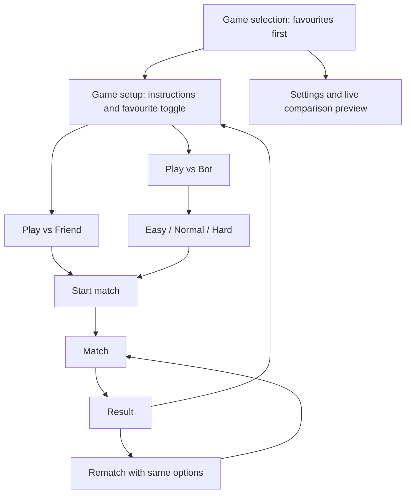

# TapTussle development plan

Last updated: 2026-09-25.

This is the working backlog for the next development phases. Paddle Duel,
Reaction Duel, Air Hockey, Lane Dash, and Tic-Tac-Toe are implemented and have
completed their milestone device passes. M8 records the completed branding and
automated-regression checkpoint. Physical-device release validation is consolidated
in M23 after all 18 currently selected games are implemented.
Update this file as each increment is implemented and verified.

## Product scope

- Offline mobile mini-games for two people sharing a device, plus solo play
  against a local bot. No accounts, servers, or online opponents.
- Flutter owns navigation, game setup, favourites, settings, and match overlays.
- Each game chooses Flame or pure Flutter according to its needs.
- Reach five playable games, then aim for approximately one new game per month.
  This is a release cadence goal, not a promise of fixed delivery dates.
- Deliver one reviewable increment at a time; keep Paddle Duel playable during
  architecture changes.

## Progress tracker

Use `Not started`, `In progress`, `Blocked`, or `Done`. Mark a milestone Done only
after its acceptance checklist passes. Record a blocker and next action if blocked.

| ID | Milestone | Depends on | Status | Completion evidence |
| --- | --- | --- | --- | --- |
| M0 | Foundation and Paddle Duel | — | Done | Existing implementation; initial 13 tests and web build passed; user confirmed first iPhone debug run |
| M1 | Game setup, favourites, and Paddle Duel bots | M0 | Done | User verified friend mode plus Easy, Normal, and Hard bots on iPhone; difficulties were distinct |
| M2 | UI automation and M1 usability follow-up | M1 | Blocked | Native iPhone integration-test transport cannot attach; retry when the Flutter/iPhone debug transport issue is resolved |
| M3 | Settings, audio, vibration, and live graphics comparison | M1, M2 | Done | User confirmed M3 works on iPhone and Android, including graphics settings after the preview capture fix |
| M4 | Reaction Duel | M1, M2, M3 | Done | User confirmed M3–M6 working on iPhone and Android |
| M5 | Air Hockey | M4 | Done | User confirmed M3–M6 working on iPhone and Android |
| M6 | Lane Dash: simple racing/movement game | M5 | Done | User confirmed latest independent-course bot changes and M3–M6 working on iPhone and Android |
| M7 | Tic-Tac-Toe: fifth game | M6 | Done | M7.1–M7.5 implemented; 32 focused tests pass; user confirmed Friend and all three bot difficulties on physical iPhone and Android devices |
| M8 | Branding and automated foundation checkpoint | M1–M7 | Done | Final app icon and attribution complete; all 82 tests and analysis passed; early iPad profile connection evidence is retained for the final M23 validation |
| M9 | Player-count foundation and local records | M8 | Done | M9.1–M9.10 complete the shared 1–4-player, records, catalog artwork, and branded sound foundations; all 113 tests and analysis pass; user confirmed new logos and sounds on device |
| M10 | Memory Match | M9 | Done | M10.1–M10.6 complete; user verified solo, friend, and all three bot difficulties on physical iPhone and Android devices |
| M11 | Rock Paper Scissors | M9 | Done | M11.1–M11.3 complete; friend mode and all three bot difficulties verified on physical iPhone and Android devices |
| M12 | Snakes & Ladders | M9 | Done | M12.1–M12.4 complete; user verified all functionality on physical iPhone and Android devices |
| M13 | Sudoku | M9 | Done | M13.1–M13.4 complete; user verified Sudoku on physical iPhone and Android devices |
| M14 | Checkers | M9 | Done | M14.1–M14.4 complete; 34 focused tests and 268 host tests passed; user confirmed the game on a physical device |
| M15 | Mancala | M14 | Done | M15.1–M15.5 complete; 36 focused tests and 304 host tests passed; user confirmed physical-device functionality |
| M16 | Slither-style Snakes | M15 | Done | M16.1-M16.5 complete; automated coverage and physical-device verification confirmed |
| M17 | Water Sort Puzzle | M16 | Done | M17.1-M17.5 complete; all 361 host tests passed and user confirmed physical-device verification |
| M18 | Ludo | M17 | Done | M18.1-M18.5 complete with 50 focused Ludo tests and all 411 host tests passing; user confirmed the final rules and physical-device verification |
| M19 | Nuts and Bolts | M18 | Done | M19.1-M19.5 complete; 33 focused tests and all 445 host tests pass; user confirmed physical-device functionality |
| M20 | Solitaire | M19 | Done | M20.1-M20.5 complete; 45 focused and all 491 host tests pass, and the user confirmed physical-device verification |
| M21 | Cangkulan | M20 | Done | M21.1-M21.5 complete; 44 focused/all 536 host tests pass and the user confirmed physical-device functionality |
| M22 | Chess | M21 | Done | M22.1-M22.5 complete; 56 focused and all 592 host tests pass; user confirmed physical-device verification |
| M23 | Eighteen-game release validation and store preparation | M10–M22 | Not started | Full device matrix, signing, release builds, store assets, version decision, and release evidence for the first public version |

Milestone completion records functional implementation and the device evidence
listed in the tracker; it is not release certification. M3–M6 have been confirmed
on iPhone and Android. M7 is also confirmed on both physical platforms. M2 native
automation remains blocked. Full physical-device and release validation now runs
once in M23 after the complete catalog is implemented.

## Target player flow


```mermaid
flowchart TD
  Home[Game selection: favourites first] --> Setup[Game setup: instructions and favourite toggle]
  Setup --> Friend[Play vs Friend]
  Setup --> Bot[Play vs Bot]
  Bot --> Difficulty[Easy / Normal / Hard]
  Friend --> Start[Start match]
  Difficulty --> Start
  Start --> Match[Match]
  Match --> Result[Result]
  Result --> Rematch[Rematch with same options]
  Rematch --> Match
  Result --> Setup
  Home --> Settings[Settings and live comparison preview]
```

Game setup is the page immediately after selecting a game. Its favourite button
is available before starting either mode. Use the exact difficulty labels **Easy**,
**Normal**, and **Hard**. Proposed initial defaults: Play vs Friend, Normal bot
difficulty, and no favourite games. Remember the last selected mode and difficulty
per game locally; never auto-start a match when returning to setup.

## Architecture changes

Reuse the current structure instead of introducing a separate game framework:

| Current area | Planned extension |
| --- | --- |
| `lib/core/mini_game.dart` | Keep the widget-based entry point. Add supported modes and relevant graphics capabilities to game metadata. |
| `lib/core/match_session.dart` | Keep ready/playing/paused/finished and round resets. Add participant labels; add explicit draw results when a game first needs them. |
| `MiniGameBuilder(session, winningScore)` | Replace the positional score argument with immutable match options containing mode, optional bot difficulty, and game rules. Keep graphics/audio preferences separate from win rules. |
| `lib/core/app_settings.dart` | Extend local persistence with validated defaults, volume, vibration, graphics preferences, favourite game IDs, and remembered setup choices. Preserve the existing winning-score preference. |
| `lib/features/home/` | Observe favourites and display a stable sorted view of the catalog. |
| New `lib/features/game_setup/` | Shared mode choice, conditional difficulty choice, favourite toggle, and game-specific instructions. |
| `lib/features/match/` | Pass frozen match options into a fresh game instance; use correct friend/bot labels and retain pause/rematch behavior. |
| New `lib/features/settings/` | Full settings page and live graphics comparison, replacing the small settings sheet. |
| New shared services/adapters | Small audio, haptic, and game-rendering adapters used by both Flutter and Flame modules. No game-specific rules here. |
| `lib/games/<id>/` | Own the simulation/rules, input adapter, bot behavior, artwork, and game-specific tests. |

Only the composition root (`lib/app/game_catalog.dart`) imports individual game
modules. Shared screens and core types must remain independent of Flame and
specific games. A bot supplies legal player inputs to the same rules as a human;
it must not directly award points or change the simulation difficulty secretly.
Use game-specific bot policies with shared difficulty names, not one universal
bot implementation for every game.

Bots must feel human rather than responding instantly. Turn-based games schedule
a visible, bounded thinking delay before submitting a move; every difficulty
retains some delay, with harder profiles generally reacting sooner. Real-time
games use bounded observation and reaction intervals instead of perfect
frame-by-frame knowledge. Pending bot actions must be cancelled on pause, match
end, option changes, and disposal, then safely rescheduled after resume when it
is still the bot's turn. Apply this rule to every future game with a bot mode.

### Standard mini-game module pattern

Use responsibility boundaries consistently, while allowing each game to omit
files it does not need:

```text
lib/games/<game_id>/
  <game_id>_model.dart       Pure rules and mutable game state; no Flutter/Flame
  <game_id>_bot.dart         Optional bot policy that submits legal player input
  <game_id>_game.dart        Flame loop, rendering, effects, and match reporting
  <game_id>_controller.dart  Pure Flutter/timer orchestration instead of Flame
  <game_id>_view.dart        Flutter layout, input mapping, and lifecycle wiring
  <game_id>_preview.dart     Optional catalog or graphics-preview artwork
```

A Flame game normally uses `model`, optional `bot`, `game`, and `view`. A pure
Flutter game normally uses `model`, optional `bot`, optional `controller`, and
`view`; it must not add a Flame adapter solely for structural symmetry. Keep rule
tests focused on the model, bot tests deterministic through injected randomness,
and widget tests focused on input, lifecycle, and shared-shell integration.

The model owns legal state transitions and outcomes. A bot observes allowed
state and calls the same legal input methods as a person. The Flame game or
Flutter controller advances time and publishes scores/results to `MatchSession`.
Solo games publish immutable record metrics with their completed match result;
the shared match shell validates and persists those metrics using the catalog's
record definition and selected difficulty variant. Game views do not write to
local storage directly.
The view maps device input and owns widget listeners, without embedding rules,
bot decisions, or rendering loops. Register the module only in
`lib/app/game_catalog.dart`; games must not import one another.

Migrate Paddle Duel and the existing pure Flutter test fixture together so both
integration paths remain covered. Avoid introducing new state-management or
physics packages unless a concrete requirement justifies them. Verify any new
package's compatibility with the installed Flutter SDK before adding it.

## M1 — Game setup, favourites, and Paddle Duel bots

Deliver this in two increments: shared setup/favourites first, then working bot
play. Do not expose a working-looking bot start action before the bot is available.

- [x] M1.1 Add match options, participant information, and game capability metadata;
  migrate existing callers while preserving friend-mode behavior.
- [x] M1.2 Route game selection into the new setup page, with title, instructions,
  Play vs Friend, Play vs Bot, favourite toggle, and Start match.
- [x] M1.3 Show Easy / Normal / Hard only for bot mode. Validate difficulty before
  starting a bot match; do not pass an active bot into friend mode.
- [x] M1.4 Persist favourites using stable catalog IDs, independent of game titles.
  Sort favourites before other games and preserve catalog order within each group.
  Unfavouriting restores the game's normal position. Do not mutate the catalog.
- [x] M1.5 Refresh ordering when returning to the list, retaining usable scroll
  position and preventing duplicate cards. Ignore unknown saved IDs safely.
- [x] M1.6 Implement Paddle Duel bot controls: player at bottom, bot at top;
  ignore human touches on the bot side. Preserve two simultaneous touches in
  friend mode.
- [x] M1.7 Tune Easy using slower reactions, lower paddle speed, and larger aim
  error; Normal with moderate tracking; Hard with bounded prediction, quicker
  reactions, and smaller error. Hard should remain beatable in Paddle Duel.
- [x] M1.8 Make bot updates respect pause, backgrounding, result, rematch, and
  disposal. Clear delayed actions and pointer ownership on match transitions.
- [x] M1.9 Use Player 1 / Player 2 in friend mode and You / Bot in solo mode,
  including instructions, HUD, and result copy. Rematch retains the selected mode,
  difficulty, and win rules; Change options returns to setup.

Acceptance:

- [x] Favourite and unfavourite from setup, restart the app, and verify persistence
  and ordering. Test sorting with a multi-game fixture before more games ship.
- [x] Complete a Paddle Duel match in friend mode and all three bot difficulties.
- [x] Confirm bots cannot move while paused, act after disposal, or receive human
  touches. Confirm fresh rematches reset bot state.
- [x] Existing friend-mode input and scoring regression tests remain green.
- [x] Record human play feedback showing a meaningful Easy → Normal → Hard
  progression; use deterministic seeds for automated bot tests.

## M2 — UI automation and M1 usability follow-up

The user confirmed an iPhone play-through of friend mode and every bot difficulty,
with a clear Easy → Normal → Hard difference. The following feedback is part of
this milestone and must be verified on physical devices before continuing to M3.

- [x] M2.1 Replace the large selection cards with a compact two-column game grid.
  Each tile contains only game artwork, its name, and an unobtrusive favourite
  indicator. The grid keeps favourites first and avoids a growing vertical card list.
- [x] M2.2 Split setup into participant and difficulty pages. The participant page
  starts with How to play, then presents Play vs Friend and Play vs Bot. Friend
  mode starts directly; bot mode opens the difficulty page.
- [x] M2.3 Replace difficulty chips with a three-stop slider: Easy, Normal, Hard.
  Show a difficulty description and a Play button below the slider.
- [x] M2.4 Expand Paddle Duel touch capture to the complete available match area,
  including the space below the court. The bottom player can control the paddle
  from the bottom of the screen without covering the ball. Keep the court mapping
  correct when the court is letterboxed on larger devices.
- [x] M2.5 Opt into iOS Game Mode with `GCSupportsGameMode` in `Info.plist`.
  Game Mode is activated by iOS when the game launches; the app cannot force its
  notification or state. Verify the notification on an iPhone running iOS 18+.

### Native UI automation

Playwright does not automate a native Flutter application installed on iOS or
Android. Use Flutter's `integration_test` package as the required native UI
automation tool because it can drive app widgets and run on physical devices and
emulators. Playwright may be added later for optional web-build smoke tests, but
it is not evidence for iPhone/Android behavior.

- [x] M2.6 Add `integration_test` as a development dependency and an iOS/Android
  runner path. Keep tests offline and deterministic; do not depend on a simulator
  or a network service.
- [x] M2.7 Add stable semantic labels/keys only where needed for automation. Do not
  test rendering implementation details or brittle widget-tree positions.
- [x] M2.8 Automate the critical M1 journey: grid → favourite → participant page →
  friend match; grid → bot → each slider position → match; pause/background →
  resume; result → rematch/change options; restart → saved favourites/options.
- [ ] M2.9 Run the suite on a physical iPhone and Android device. Record device,
  OS, build, command, result, and any platform-specific failures.
- [ ] M2.10 Add an optional Playwright web smoke-test proposal only after the native
  suite is stable. It must target the compiled web build and remain separate from
  mobile acceptance results.

Acceptance:

- [ ] Confirm the 2×2 grid works with 1, 2, 3, and 5 games; favourites stay first
  and no duplicate/missing tile appears after returning from setup.
- [ ] On iPhone and Android, use the bottom-most reachable part of the play area to
  move Paddle Duel's lower paddle while keeping the ball visible. Verify friend
  mode retains two independent touch zones.
- [ ] Confirm Game Mode notification/state on a supported iPhone after rebuilding
  with the new `Info.plist`; record if the OS chooses not to show a notification.
- [ ] Native integration tests pass on iPhone and Android. Playwright results, if
  added, are reported separately as web-only coverage.

### Running the native suite

The suite is [integration_test/app_test.dart](../integration_test/app_test.dart).
With a USB-attached, unlocked device that has accepted this Mac's development
certificate, run:

```sh
flutter devices
flutter test integration_test/app_test.dart -d <device-id>
```

It clears TapTussle's local preferences before each journey so the result is
deterministic. Do not use it on an installation whose local preferences you need
to retain. The suite has no network dependency. Record the device model, OS,
Flutter version, build number, command, and result under M2.9.

**Parked 2026-09-24 at the user's request.** The iPhone installs and launches
the integration-test app over USB, but Flutter does not attach its Dart test
runner. Resume M2.9 after resolving that iPhone/Flutter debug transport issue
and when an Android device is available.

## M3 — Settings and live graphics comparison

Promote settings to a dedicated scrollable page. Proposed defaults: volume 70%,
vibration On, High resolution, and target 60 FPS. Keep one shared points-to-win
control for every score-based game, including Paddle Duel, Reaction Duel, and Air
Hockey. Store choices locally and handle missing, invalid, or failed writes.

### Sound, vibration, and version

- [x] M3.1 Add a master volume slider from 0–100%, with 0 explicitly muted.
  Include a short sample action so its effect can be heard immediately.
- [x] M3.2 Add bundled, licensed sound effects for meaningful actions such as
  collisions, scoring, start, and result. A slider with no audible game effects
  does not satisfy this feature. Background music is outside this increment.
- [x] M3.3 Route sound through one service, respecting volume across all games,
  limiting overlapping sounds, and stopping/suspending playback on backgrounding.
- [x] M3.4 Add vibration On / Off plus a test action. Use brief, rate-limited
  feedback on selected events, with no failure on unsupported hardware. For a
  shared phone, feedback is device-wide, not private feedback to one player.
- [x] M3.5 Show the installed app's version and build number at the bottom, e.g.
  `Version 1.0.0 (1)`, using runtime package metadata rather than hard-coded text.

### Resolution and FPS

These are separate settings. Resolution controls game-scene image sharpness;
FPS controls the target rate of visible game animation. Neither should change
game speed, bot reaction time, collision accuracy, scoring, or tap timing.

Proposed options to validate before shipping:

| Setting | Option | Intended explanation in the UI |
| --- | --- | --- |
| Resolution | Low — 50% per dimension | Softer image; intended to reduce graphics workload |
| Resolution | Medium — 75% per dimension | A balance of sharpness and graphics workload |
| Resolution | High — 100% / native | Sharpest game image; potentially higher graphics workload |
| FPS | 30 | Less smooth motion; potentially lower power use |
| FPS | 60 | Smoother motion; potentially higher power use |

Percentages refer to the game rendering surface relative to its native physical
pixel size, not the phone's display mode or the game's logical arena dimensions.
Flutter menus, buttons, and HUD remain readable at native resolution. Keep the
current logical arena and touch mapping unchanged. Do not add 90/120 FPS until
the baseline settings work reliably on supported devices.

- [x] M3.6 First run a bounded implementation/profiling investigation on the
  installed Flutter/Flame versions. Prove actual game rendering scale and frame
  pacing on iPhone and Android before wiring up production controls.

  Source investigation is recorded in
  [Graphics rendering investigation](GRAPHICS_RENDERING_INVESTIGATION.md).
  It confirms that Flame viewport settings are not physical resolution scaling
  and that `GameWidget` has no public FPS cap. User confirmed the graphics
  settings work on iPhone and Android; broader release profiling remains in M23.
- [x] M3.7 Implement a shared rendering adapter with supported capabilities and
  effective settings. Merely changing Flame's logical viewport size or skipping
  simulation updates does not implement resolution scaling or a rendering cap.
- [x] M3.8 Keep simulation/timing independent of presentation. Use consistent
  elapsed-time or fixed-step rules; do not slow the game when choosing 30 FPS.

  Paddle Duel now uses a presentation adapter that advances its existing
  elapsed-time simulation at display cadence, then rasterizes a snapshot at
  the selected 50%, 75%, or 100% physical pixel scale and publishes it at 30
  or 60 FPS. The settings are saved locally. User confirmed graphics settings
  work on iPhone and Android; broader release profiling remains in M23.
- [x] M3.9 For simple pure Flutter games, maintain native UI and explain when game
  resolution does not apply; apply FPS to relevant animations where supported.
  Do not blur board labels or claim an unsupported setting changed the game.
- [x] M3.10 Distinguish requested from effective settings, including display-rate
  limits and fallback. If the investigation cannot achieve real scaling or
  pacing, record the limitation and leave this task open instead of shipping
  controls that only change labels.

### Live comparison preview — confirmed user requirement

- [x] M3.11 Add an animated preview inside settings using a looping scene with a
  moving ball, paddles, fine lines, and an image/texture detail. Use local assets.
- [x] M3.12 Show two labelled panes: current saved settings and candidate settings.
  Both use the same deterministic scene, time origin, and animation path, with
  independent rendering settings so the comparison is fair.
- [x] M3.13 Let the user vary resolution and FPS independently, comparing all six
  proposed combinations. Show selected resolution, actual render dimensions,
  target FPS, and measured scene frame rate for each pane.
- [x] M3.14 Reuse the production rendering adapter in the preview; a prerecorded
  video or identical animations with different labels do not count.
- [x] M3.15 Apply commits the candidate graphics settings; Cancel/Back restores
  the saved settings. Stop preview work when leaving or backgrounding the page.
  Use stacked panes if needed on small screens, with matching scene sizes.
- [x] M3.16 Explain sharpness, smoothness, and potential battery tradeoffs without
  invented battery percentages. A two-pane preview adds workload, so its measured
  FPS is not a guarantee of match performance.

  Implemented as a dedicated Settings route. It shows a saved and candidate
  Paddle Duel rally through the production physical-raster adapter, lets the
  candidate select each resolution/FPS combination independently, and reports
  target pixel dimensions, requested FPS, and the adapter's measured published
  frame rate. Apply is the only action that persists a candidate; Back and
  Cancel discard it, and app backgrounding pauses both previews.

Acceptance:

- [x] Volume, vibration, resolution, and FPS survive an app restart; failed saves
  are visible and do not falsely appear committed.
- [x] Mute silences effects; vibration Off suppresses feedback in every game.
- [x] Preview resolution changes are visibly real, and 30 versus 60 FPS produces
  different measured scene pacing on suitable hardware.
- [x] Compare gameplay and bot behavior at both FPS targets: the same scripted
  inputs produce equivalent elapsed-time outcomes within documented tolerances.
- [x] Complete functional real-match checks for graphics settings on iPhone and
  Android. Detailed profile-mode frame timings for all six combinations remain
  part of M23 release validation; debug results are not release evidence.
- [x] Verify the runtime footer and settings layout during the M3 device checks.
  Larger-text accessibility coverage remains part of M23 release validation.

## M4 — Reaction Duel

Engine: pure Flutter. Proposed rules: wait through a random delay, then tap your
side when the signal appears. First legal tap wins a point; an early tap awards
the opponent a point. First to 5 wins. Use a monotonic clock, not rendered frames,
to timestamp taps; define a small simultaneous-tap tolerance and replay tied
rounds without awarding points.

- [x] M4.1 Build a testable waiting/signal/result round state machine and seedable
  delay source, with clear visual instructions and large mirrored touch zones.
- [x] M4.2 Implement friend mode, false starts, simultaneous taps, and score rules.
- [x] M4.3 Implement bots using calibrated, variable reaction delays after the
  actual signal: Easy slower, Normal moderate, Hard faster but bounded. No bot
  access to a future signal time or input before the signal.
- [x] M4.4 Cancel pending timers on pause/dispose; restart an interrupted waiting
  round with a fresh delay and no penalty on resume. Preserve match scores.
- [x] M4.5 Register the game with setup, favourites, sound, vibration, and results.

Reaction Duel is implemented as a pure Flutter game. It uses a timer/state
machine rather than render frames, replays legal taps within a 75 ms tie window,
and gives a false starter's opponent the point. Bot delays begin only after the
signal, vary by difficulty, and use the shared configured winning score.

Acceptance: false starts and ties are deterministic; two fingers work; no stale
timer scores after pause; reaction timing is independent of target FPS; complete
matches in friend mode and all bot difficulties on both mobile platforms.

Validation: user confirmed M3–M6 working on both iPhone and Android.

## M5 — Air Hockey

Engine: Flame. Proposed rules: one mallet per half, one puck, first to 7 goals.
Use simple circle/rail collision rules initially; assess Forge2D only if collision
stability or contact requirements justify it. Do not inherit Paddle Duel rules.

Implementation note: goal mouths are visible openings at both ends of the rink.
The puck passes through an opening to score; it bounces from the end rail outside
the opening. This is intentionally separate from Paddle Duel's scoring rules.
The bot meets an incoming puck below and offset from its path, rather than
centering against its back rail, so a defensive return gains a horizontal angle.
Every new shared match round resets the puck, mallets, scores, and match-local
collision state, while preserving the configured points-to-win value.
The fixed-step simulation stops as soon as a winning goal is recorded, preventing
multiple score increments from one puck crossing.

- [x] M5.1 Implement puck, mallets, rails, goal mouths, and deterministic reset.
- [x] M5.2 Constrain mallets to their own halves; support simultaneous dragging
  and bounded mallet speed to avoid teleporting through the puck.
- [x] M5.3 Handle fast contacts, corners, goal detection, and exactly-once scoring.
- [x] M5.4 Build bot difficulty from reaction time, aim error, speed, and defensive
  versus attacking decisions; use the same mallet constraints as humans.
- [x] M5.5 Integrate shared setup, favourites, effects, settings, and lifecycle.

Acceptance: no tunnelling or repeated goals during stress scenarios; equivalent
physics across FPS settings; complete friend/bot matches; no input ownership
changes when fingers cross or leave the court.

Validation: user confirmed M3–M6 working on both iPhone and Android. Earlier
iPhone checks also covered replay behavior, visible goal mouths, and exact scores.
The Air Hockey bot policy was subsequently separated from the Flame view and now
uses explicit difficulty profiles for reaction delay, movement reach, aim error,
and positioning. Device confirmation of the revised profiles remains pending;
its Flame adapter and renderer now live in `air_hockey_game.dart`, leaving the
view responsible for Flutter input and layout. Release-level physics stress
validation remains in M23.

## M6 — Lane Dash (proposed movement/racing game)

Engine: Flame. Proposed design: two separate three-lane tracks sharing the phone.
Each player swipes left/right on their side to avoid obstacles and reach a finish
distance. Show two distinct track panels: bottom player's obstacles move down
toward the bottom runner; top player's obstacles move up toward the top runner.
Render a single visible obstacle per course row as a cone sprite, show each
player's distance/progress and collision slowdown clearly. Collisions apply a
brief slowdown rather than immediate elimination.
Give each player an independently generated obstacle sequence with a randomized
starting offset; keep course pressure comparable at a given difficulty. Settle a
finish within the same simulation step as a draw, rather than by update order.

- [x] M6.1 Finalize mirrored controls, track layout, race length, slowdown, and a
  maximum race duration with a defined distance-based result if nobody finishes.
- [x] M6.2 Build seedable obstacle generation that always leaves a possible path.
- [x] M6.3 Add movement, collisions, countdown, progress, and finish resolution;
  use swipe controls on each player's half and a mirrored swipe for the top runner.
  Revised after user testing found the initial shared obstacle renderer unreadable
  and race progress unclear. The two mirrored track panels, cone obstacles,
  independent scrolling, distance meters, and hit feedback are now implemented;
  swipe controls replaced arrows. Runner speed is shared across all difficulties;
  each side now gets an independent, offset obstacle course, with spacing and
  blocked-lane patterns increasing course pressure by difficulty. Bot reaction
  delay and mistake rates are tuned per difficulty. User confirmed the latest bot
  changes and the complete M3–M6 set on iPhone and Android. The Flame adapter,
  renderer, effects, and match reporting now live in `lane_dash_game.dart`,
  separate from the Flutter input view.
- [x] M6.4 Extend shared match results explicitly for draws and non-point-based
  results; keep Paddle Duel scoring compatible. Do not show FIRST TO 7 here.
- [x] M6.5 Add bots with bounded obstacle lookahead, reaction delay, and mistake
  probability; no knowledge of obstacles outside the visible/allowed horizon.
- [x] M6.6 Integrate shared features and pause/resume without advancing obstacles
  or granting one participant extra movement while paused.

Acceptance: seeded races have independent but difficulty-matched courses, controls
stay responsive, each separate track has its own mirrored obstacle flow, obstacle
sprites and hit feedback are clear, distance progress is visible, swipe controls
move each runner in the intended direction, difficulty changes obstacle pressure
and bot decision quality while keeping runner speed equal, finish/draw rules are
independent of update order, and races complete in both modes at 30 and 60 FPS.

## M7 — Tic-Tac-Toe (fifth simple game)

Engine: pure Flutter. Proposed rules: a 3×3 board, X/O alternate turns, three in a
row wins, full board without a winner draws. One board is one match; rematch
alternates the starting player. This validates turn-based games in the architecture.

- [x] M7.1 Implement pure board rules, legal moves, turn ownership, win detection,
  and draw results that the Flutter controller can publish through the shared
  result support introduced in M6. Player 1 owns X and Player 2 owns O; rematches
  alternate the starting participant without changing mark ownership.
- [x] M7.2 Build a readable board with clear current-player and occupied-cell
  states, winning-line emphasis, a distinct full-board draw state, accessible
  cell labels, and a compact portrait layout.
- [x] M7.3 Easy picks random legal moves; Normal takes immediate wins/blocks with
  occasional weaker choices; Hard uses optimal search. Hard may be unbeatable
  here, but must still permit a draw and must never make an illegal move.
- [x] M7.4 Block human moves during the bot turn; cancel pending bot turns on
  pause/dispose and resume safely without a duplicate move.
- [x] M7.5 Integrate setup, favourites, effects, and rematch. Mark game resolution
  as not applicable to the native Flutter board; retain readable controls.

Acceptance: cover all winning lines, draws, invalid input, alternating starters,
and bot legality. Exhaustive rule/search tests demonstrate Hard never loses from
an initially empty board. Complete friend/bot matches on mobile devices.

## M8 — Branding and automated foundation checkpoint

- [x] M8.1 Add the final app icon for iOS and Android, verify every required icon
  size, and record attribution or original-asset ownership.
- [x] M8.2 Run analysis and relevant rule/widget tests for every completed
  milestone; expand regression and persistence coverage where release-critical
  behavior is not yet protected.

Physical-device profiling, the complete game/mode matrix, offline and interruption
checks, accessibility, persistence migration, long-session behavior, signing, and
release builds are intentionally consolidated in M23. The early iPhone/iPad profile
attempts remain useful evidence but do not complete any M23 release check.

## Expansion review and product decisions

The first ten games form an intermediate catalog checkpoint, while the first store
release is planned after all 18 currently selected games. Game count alone is not
the acceptance criterion. Each addition must have complete rules, lifecycle,
device testing, and an appropriate bot or score system. Limit implementation to
one game milestone at a time so unfinished games do not weaken completed games.

For M10–M22, every game supporting two or more participants must include a bot
option as well as same-device friend play. Bots must use only information legally
available to a human, act after a visible human-like delay, submit moves through
the same rule model, and cancel pending actions across pause, result, rematch, and
disposal. Show Easy, Normal, and Hard only when the game contains meaningful
decisions that can produce honest difficulty differences; chance-only games use
one transparent bot profile. This requirement does not apply to solo-only games:
Sudoku, Slither-style Snakes, Water Sort Puzzle, Nuts and Bolts, and Solitaire.

The recommended next five are:

1. **Memory Match** — supports one player and two local players. Solo records can
   rank fewer moves first, then faster completion time. Two-player mode awards
   matched pairs and gives another turn after a successful match.
2. **Rock Paper Scissors** — supports friend and bot play. Same-device friend mode
   must conceal each choice until both players lock in; a simple open button per
   player would reveal choices and make the game unfair.
3. **Snakes & Ladders** — supports two, three, or four participants and requires
   bots after the human turn flow is stable. Its setup validates player count,
   names/colors, turn order, token movement, and multi-player results. The bot uses
   one honest profile because the confirmed rules provide no strategic move choice.
4. **Sudoku** — solo only. Easy, Normal, and Hard describe puzzle difficulty rather
   than bot strength. Record completion time and mistakes separately per difficulty.
5. **Checkers** — supports friend and bot play. Implement mandatory captures,
   multi-jumps, kings, win/stalemate rules, and bounded, delayed bot search.

The other proposed games are tracked in the post-release backlog below rather
than left as unnamed future ideas. Chess, Ludo, and Solitaire have substantially
larger rule and UX surfaces. Slither-style Snakes is distinct from the board game
Snakes & Ladders and would use a Flame real-time architecture.

## M9 — Player-count foundation and local records

- [x] M9.1 Replace the two-player-only catalog assumption with immutable game
  capabilities: supported player counts, solo/friend/bot modes, whether difficulty
  represents a bot or a puzzle, and an optional record definition. Existing five
  games remain `2 players` and retain their current setup and results.
- [x] M9.2 Add catalog tabs before the grid: **1 Player**, **2 Players**, and
  **Up to 4 Players**. A game may appear in more than one tab when it supports
  multiple counts. Favourites stay first within the active filtered list, followed
  by stable catalog order. Persist the last selected tab and provide an intentional
  empty state.
- [x] M9.3 Generalize match participants from the current fixed friend/bot pair to
  an ordered list of one to four immutable participant descriptors: local human or
  bot, display name, color/token, and optional bot difficulty. Do not infer game
  rules from participant count.
- [x] M9.4 Add a shared participant setup flow that asks only for options supported
  by the selected game. Two-player games keep the current fast Friend/Bot path;
  multi-player games choose count first and configure each seat. Prevent duplicate
  colors and require at least one human for offline play.
- [x] M9.5 Extend shared match outcomes beyond player indexes 0 and 1 so they can
  represent a winner among four participants, a draw, completion without a winner,
  and optional ordered standings. Preserve all existing score-based behavior.
- [x] M9.6 Add an offline record repository keyed by stable game ID, record type,
  difficulty/rules variant, and local completion timestamp. Define whether higher
  or lower values are better and support a secondary tie-breaker such as time or
  moves. Keep record logic out of individual screens.
- [x] M9.7 Show **Daily Best**, **Weekly Best**, and **Overall Best** for supported
  solo games. Daily means the current local calendar day; weekly means the current
  local Monday–Sunday week. Recompute buckets from saved timestamped results so
  rollover requires no scheduled job. Records remain local and device-clock based.
- [x] M9.8 Add migration and regression tests for existing favourites, remembered
  two-player setup, points-to-win, and results. Add focused tests for overlapping
  filters, 1–4 participants, standings, record ranking/ties, day/week rollover,
  malformed saved data, and bounded history retention.
- [x] M9.9 Replace the mini-game catalog artwork with the 18 supplied game logos.
  The original PNGs are staged under `assets/game_logos/` with normalized filenames
  and a source manifest. Optimize their delivery variants, map each image to its
  stable game ID, and use the same reusable image treatment for current and future
  catalog cards. Include Paddle Duel, Reaction Duel, Air Hockey, Lane Dash,
  Tic-Tac-Toe, Memory Match, Rock Paper Scissors, Snakes & Ladders, Sudoku,
  Checkers, Mancala, Slither-style Snakes, Water Sort Puzzle, Ludo, Nuts & Bolts,
  Solitaire, Cangkulan, and Chess. Preserve readable cropping at supported phone
  and tablet sizes, provide a safe fallback for a missing asset, record the source
  attribution, and add an asset/catalog test covering all 18 mappings.
- [x] M9.10 Replace the current shared UI and gameplay sounds with the supplied
  TapTussle Shared Sound Pack v1, staged under `assets/audio/shared/`. Follow its
  included README and manifest: distinct tap/confirm/back/invalid cues, countdown
  and round-start cues, warm/cool scoring, light/heavy impacts, movement and
  collection, card/dice/puzzle sounds, and separate win/draw/lose results. Keep
  volume and lifecycle behavior compatible, avoid overlapping duplicate cues, map
  each sound through the shared audio service, and add focused mapping/playback
  tests before removing superseded files from `assets/sounds/`.

Acceptance: all existing games behave unchanged; each catalog tab contains only
compatible games; a fixture game can complete with one through four participants;
records survive restart and roll into the correct local day/week; all 18 catalog
entries resolve to their supplied logo without clipping key artwork; no network
or account is introduced.

## M10 — Memory Match

Confirmed difficulty design:

- **Easy:** 3×4 grid (6 pairs) with a three-second opening preview.
- **Normal:** 4×4 grid (8 pairs) with a short 1.5-second opening preview.
- **Hard:** 4×6 grid (12 pairs) without an opening preview.

Memory Match uses a fresh shuffled board on every attempt rather than fixed
numbered levels, because replaying a known arrangement would undermine the memory
challenge. Solo records rank fewer turns first and completion time second. Friend
mode uses the selected grid size without an opening preview for either player.

- [x] M10.1 Implement deterministic deck generation, pair matching, turn rules,
  move counting, completion, and rematch reshuffling in a pure Dart model.
- [x] M10.2 Build a responsive pure Flutter card grid with a short mismatch reveal
  delay, input locking during animations, pause/resume safety, and accessibility
  labels that do not expose hidden cards.
- [x] M10.3 Add solo play with Easy/Normal/Hard board sizes and local move/time
  records; add two-player play with pair scores and alternating turns.
- [x] M10.4 Integrate sounds, haptics, favourites, player-count filters, results,
  records, rematch, and automated end-to-end coverage.
- [x] M10.5 Add Play vs Bot with human-like delays and fair Easy, Normal, and
  Hard memory policies. Bots may remember only cards they have legitimately seen:
  Easy retains a small, fallible recent memory; Normal retains more observations
  with occasional forgetting; Hard retains every revealed card but never reads
  hidden identities. Cancel pending bot selections safely on pause, result,
  rematch, change-options, and disposal, and test that every chosen move is legal.
- [x] M10.6 Verify solo, friend, and all three bot difficulties on physical iPhone
  and Android devices, including previews, turn changes, results, rematch,
  favourites, records, sounds, vibration-on/off, and lifecycle interruption.

## M11 — Rock Paper Scissors

- [x] M11.1 Implement round rules, draws, configured points-to-win, and deterministic
  tests for every choice pairing.
- [x] M11.2 Create a fair pass-and-hide flow for two friends and delayed Easy,
  Normal, and Hard bot policies without reading future human input.
- [x] M11.3 Integrate setup, effects, rematch, favourites, filters, lifecycle, and
  physical-device verification.

## M12 — Snakes & Ladders

Confirmed board: 8×8 with squares 1–64 and square 64 as the finish. An **extra
turn** would mean rolling again after a configured event such as rolling a six.
A **token collision** rule decides whether landing on another token shares the
square, sends that token back, or blocks the move. Confirmed TapTussle rules are:
no extra turns, multiple tokens may share a square without capture, and reaching
64 requires an exact roll; an oversized roll leaves the token in place.

- [x] M12.1 Freeze snake/ladder positions and confirm exact-roll finish, no extra
  turns, and shared squares without collision. Implement the 1–64 path,
  deterministic dice injection, transitions, and movement tests before UI work.
- [x] M12.2 Build a readable board and animated token path for two to four local
  players, including clear current-turn and final-standings states.
- [x] M12.3 Add required bot support with visible roll delays and no dice
  advantage. Because the confirmed rules contain no move decision beyond rolling,
  expose one honest bot profile rather than artificial Easy/Normal/Hard choices.
- [x] M12.4 Verify participant setup, interruption, rematch, favourites, filters,
  effects, and physical devices. Automated coverage and the focused physical
  iPhone journey pass; the user manually confirmed all functionality on Android.

## M13 — Sudoku

Confirmed design: standard 9×9 Sudoku with 60 uniquely solvable puzzles per
difficulty. Easy puzzles use singles and straightforward scanning; Normal adds
locked candidates and pairs; Hard may require advanced techniques. Clue count is
supporting metadata rather than the sole difficulty measure. Every puzzle must be
validated by a solver that proves exactly one solution and records the techniques
needed for its rating.

Players have unlimited notes and erase actions. Incorrect final entries highlight
conflicts and increment a mistake counter but do not end the game. Allow up to
three hints; using a hint marks the result as assisted. Records rank highest level,
then unassisted completion, fewer mistakes, and faster time within each difficulty.
These rules and the 60-level count are confirmed.

- [x] M13.1 Implement board validation, candidates, completion, mistake policy,
  deterministic puzzle loading/generation, and uniqueness verification.
- [x] M13.2 Build touch-first number entry, notes, erase, conflict highlighting,
  pause-hidden timer, and resumable in-progress games.
- [x] M13.3 Provide Easy, Normal, and Hard puzzle difficulty and record completion
  time plus mistakes per difficulty. Puzzle difficulty replaces bot difficulty.
- [x] M13.4 Verify persistence, records, accessibility, favourites, filters,
  lifecycle, and physical devices. The user confirmed the completed game on
  physical iPhone and Android devices.

## M14 — Checkers

American/English checkers uses an 8×8 board with 12 pieces each; regular pieces
move and capture diagonally forward, kings move one square diagonally both ways,
captures are mandatory, and kings do not fly across multiple empty squares.
International draughts uses a 10×10 board with 20 pieces each, regular pieces may
capture backward, kings are flying pieces, and the maximum available capture
sequence is mandatory. TapTussle will use American/English checkers because it is
more compact and easier to read on phones.

- [x] M14.1 Implement American/English legal moves, mandatory capture,
  multi-jump continuation, promotion, win, stalemate, and draw protection in pure
  Dart with rule tests.
- [x] M14.2 Build a readable Flutter board with legal-target, selected-piece,
  capture-chain, king, current-player, and result states.
- [x] M14.3 Add delayed Easy, Normal, and Hard bots with bounded search and
  difficulty-specific evaluation/search depth; cancel safely across lifecycle and
  rematch events.
- [x] M14.4 Integrate effects, favourites, filters, setup/results, and exhaustive
  device-sized widget plus physical-device checks.

## M15 — Mancala

Confirmed rules: standard two-player Kalah with six small pits and one store per
player. Every small pit starts with four stones, for 48 stones total. A player owns
the six pits on their side and the store to their right. Sowing moves one stone at
a time counterclockwise, includes the active player's store, and skips the opposing
store. Landing in the active player's store grants an extra turn. Landing in an
empty owned pit captures that last stone plus every stone in the directly opposite
pit, but only when the opposite pit is non-empty. The game ends as soon as either
side's six pits are empty; the other side moves all remaining stones to its store.
The larger store wins, and equal stores produce a draw.

- [x] M15.1 Implement the confirmed board setup, counterclockwise sowing,
  opponent-store skipping, capture condition, extra turns, immediate side-empty
  detection, final collection, winner, and draw in a deterministic pure Dart model.
- [x] M15.2 Build an accessible Flutter board with clear pit ownership, stone counts,
  legal-pit emphasis, sowing animation, current-player state, and final stores.
- [x] M15.3 Add friend mode plus delayed Easy, Normal, and Hard bots. Use legal moves
  through the model; vary search depth/evaluation and keep bounded thinking time.
- [x] M15.4 Integrate setup, results, rematch, effects, favourites, player filters,
  pause/resume, and compact/large-screen layouts.
- [x] M15.5 Test sowing invariants, captures, extra turns, terminal collection, bot
  legality/lifecycle, and complete every mode on physical iOS and Android devices.

## M16 — Slither-style Snakes

This is a solo real-time survival game, separate from Snakes & Ladders.

Confirmed design: a bounded arena larger than the screen with a camera following the
player. The snake moves continuously; dragging anywhere in the lower half steers
toward the finger without arrow buttons. Eating food grows the snake and increases
score. Hitting the arena wall or another snake ends the run. Touching or crossing
the player's own body has no penalty. AI snakes also collect food; when one hits a
body it becomes food. The first version omits speed boost to keep touch controls
predictable.

Easy uses two slower, less aggressive AI snakes and generous food; Normal uses four
balanced AI snakes; Hard uses six quicker, more assertive AI snakes with scarcer
food. Player steering and base speed remain consistent across difficulty. Grant a
short spawn-protection period, then score food plus defeated AI bonuses. Daily,
weekly, and overall records rank score first and survival time second. These arena,
control, collision, and difficulty rules are confirmed.

- [x] M16.1 Define arena boundaries, steering, growth, food spawning, collision,
  score, speed progression, and game-over rules; implement deterministic simulation
  and seeded spawning independently from rendering.
- [x] M16.2 Build the Flame game with natural touch steering, camera/arena feedback,
  readable snake and food artwork, pause safety, and stable fixed-step movement.
- [x] M16.3 Add Easy, Normal, and Hard challenge profiles through arena pressure,
  speed progression, and obstacle/food balance without changing input semantics.
- [x] M16.4 Store daily, weekly, and overall high score with survival time as the
  tie-breaker; show current score, personal best, and game-over comparison.
- [x] M16.5 Integrate effects, haptics, favourites, solo filter, lifecycle, rematch,
  deterministic simulation tests, performance profiling, and physical devices.
  Implementation, automated coverage, and physical-device verification are complete.

## M17 — Water Sort Puzzle

Confirmed launch content: 60 levels per difficulty, for 180 Water Sort levels.
Progress is independent within Easy, Normal, and Hard. Completing level `n` unlocks level
`n + 1` in that difficulty; players may replay any completed level. Store compact,
deterministic level definitions and solver metadata so later level packs do not
require a persistence migration.

Within each difficulty, levels 1–10 teach the rules, 11–30 establish the core
patterns, 31–50 combine patterns, and 51–60 are mastery levels for that band.

Difficulty targets:

- **Easy:** 3–5 colors, two empty helper tubes, short solutions, low branching,
  and an onboarding ramp across levels 1–10.
- **Normal:** 5–8 colors, two empty helper tubes, longer solutions, fewer obvious
  moves, and more temporary ungrouping.
- **Hard:** 8–12 colors, one empty helper tube, long solutions, higher branching,
  and moves that require temporarily breaking apparently useful groups.

Level number increases complexity inside its difficulty band using color count,
minimum verified solution length, and decision branching. A late Easy level must
remain easier than a typical Normal level. Do not classify difficulty using only
the number of colors.

- [x] M17.1 Define tube capacity, legal pours, completion, move counting, undo, and
  restart; implement an immutable/testable puzzle model.
- [x] M17.2 Choose a curated or generated level source and prove every shipped level
  is solvable. Ship 60 levels in each difficulty and record solver-verified minimum
  solution length plus branching metadata used to validate the classification. A
  catalog-wide automated test must solve every level, replay the returned move path
  through the production model, and report the exact level ID on failure.
- [x] M17.3 Build a responsive Flutter tube interface with selected/source states,
  pour animation, color/pattern accessibility, undo, restart, and optional hints.
- [x] M17.4 Persist unlocked/completed levels and the active puzzle. Daily, weekly,
  and overall best rank the highest completed level per difficulty, then fewer moves
  and faster completion on that level. Retain per-level personal bests for replay.
- [x] M17.5 Integrate effects, favourites, solo filter, lifecycle, model/solver and
  persistence tests, then verify all difficulties on physical devices.

M17.5 implementation, host verification, and physical-device verification are
complete.

## M18 — Ludo

Confirmed rules: a six is required to move a token out of its starting box. Rolling
a six, moving a token out of the box, capturing, or moving a token into the final
goal grants a bonus roll while that player still has active tokens. Capturing an
opposing token returns it to its box. Tokens on safe squares cannot be captured.
Consecutive sixes are allowed without a three-six forfeit. Same-color tokens do not
form blockades; opposing tokens may pass their square and normal landing/capture
rules still apply. After completing the shared circuit, a token turns directly
into its colored home column without revisiting the square before its starting
square. A token must roll the exact required number to reach its final home
position; an oversized roll cannot move that token. When more than one token has a
legal move, the player must choose which token to move rather than having the game
select automatically.

Bot difficulty changes legal token selection, never dice outcomes:

- **Easy:** chooses randomly from the legal tokens.
- **Normal:** prioritizes immediate gains such as finishing, capturing, entering
  the board, and reaching the home path.
- **Hard:** adds safe-square, opponent threat, exposed-token, and home-progress
  evaluation while retaining the same legal moves and fair dice source.

- [x] M18.1 Implement six-to-enter, capture return, safe-square immunity, no
  blockades, bonus rolls, unrestricted consecutive sixes, home movement, exact
  finish, and win standings with deterministic dice injection and rule tests.
- [x] M18.2 Build an animated, readable Flutter board for two to four participants
  with current-turn, selectable legal tokens, dice, home-path, and standings states.
- [x] M18.3 Support any valid mixture of local humans and bots with at least one
  human. Require a human to choose among multiple legal tokens. Bots use the same
  legal-move list with visible roll/move delays and never influence dice outcomes.
- [x] M18.4 If rule choices create meaningful decisions, differentiate Easy,
  Normal, and Hard move selection; otherwise expose one honest bot profile rather
  than artificial difficulty labels.
- [x] M18.5 Integrate participant setup, pause/resume, saved match restoration,
  results, rematch, effects, favourites, filters, tests, and physical-device passes.

M18.5 implementation and host verification are complete. Ludo is registered in
the shared catalog for two to four participants, supports mixed human and bot
seat setup, persists and restores active matches (including a pending rolled-die
choice), pauses timers and input safely, publishes ordered results, resets on
rematch, and uses the shared sound and haptic effects. Non-selectable overlapping
tokens ignore pointer input so a legal human token remains tappable underneath
other participants' tokens. The user confirmed the corrected goal bonus rule,
direct home-column entry, and final physical-device pass. M18 is complete.

## M19 — Nuts and Bolts

Confirmed concept: separate mixed colored nuts from their bolts and move them so
each completed bolt contains nuts of one color. Only the top nut on a bolt can
move. It may move to an empty bolt or onto a top nut of the same color, provided
the destination has capacity. Easy and Normal levels provide two empty helper
bolts; Hard provides one. Difficulty also scales color count and solution length,
and every shipped level must be solver-verified. A puzzle is complete when every
non-empty bolt is full and contains only one color.

Confirmed launch content: 60 levels per difficulty, for 180 Nuts and Bolts levels.
Progress and replay follow the same independent per-difficulty unlock model as Water Sort.
Use the same 1–10 onboarding, 11–30 core, 31–50 combined, and 51–60 mastery
progression inside each difficulty.

Difficulty targets:

- **Easy:** 3–5 colors, three or four nuts per bolt, two empty helper bolts, short
  solutions, and an onboarding ramp across levels 1–10.
- **Normal:** 5–8 colors, four nuts per bolt, two empty helper bolts, longer
  solutions, and more interleaved starting stacks.
- **Hard:** 8–12 colors, four or five nuts per bolt, one empty helper bolt, long
  solutions, and higher branching with more necessary temporary moves.

Level number increases color count, minimum verified solution length, interleaving,
and decision branching inside the selected difficulty band. Generation must begin
from or prove reachability to a solved state, and a solver must reject impossible,
duplicate, already-solved, or incorrectly classified levels.

- [x] M19.1 Implement bolt capacity, top-nut-only moves, empty/same-color
  destinations, completion, undo, hint, and restart in a pure Dart puzzle model.
- [x] M19.2 Ship 60 solver-verified levels in each difficulty with deterministic IDs
  and metadata. Reject duplicate, impossible, already-solved, or incorrectly
  classified levels in automated validation. A catalog-wide automated test must
  solve every level, replay the returned move path through the production model,
  and report the exact level ID on failure.

M19.2 uses fixed deterministic reverse-construction recipes from solved boards, so
the runtime catalog does not execute the solver. An independent exact breadth-first
proof records minimum moves, initial legal moves, mixed-color boundaries, and
explored-state count. Catalog validation rejects duplicate canonical boards,
unbalanced colors, solved or impossible starts, classification drift, and stale
solution or branching metadata; all 180 shortest paths replay successfully through
`NutsAndBoltsModel`.

- [x] M19.3 Build a touch-friendly Flutter interface with clear depth/order,
  selection, legal targets, movement animation, color/pattern accessibility, undo,
  restart, and hints.

M19.3 adds a responsive bolt grid for compact phones and tablets, renders nuts in
their actual bottom-to-top order, and pairs every color with a distinct visible
symbol and spoken label. Selection, every legal destination, and both ends of a
hint receive separate visual and semantic states. Input locks during animated
moves, while undo, restart, move count, shared effects, and completion feedback
remain available through touch-friendly controls.

- [x] M19.4 Persist unlocked/completed levels and the active puzzle. Daily, weekly,
  and overall best rank the highest completed level per difficulty, then fewer moves
  and faster completion on that level. Retain per-level personal bests for replay.

M19.4 stores active progress as validated move history with elapsed time, restores
undo state by replaying those moves through the production model, and rejects
malformed or completed snapshots. Each difficulty keeps independent unlocks,
completed levels, and per-level best moves/time. Completed sessions publish level,
moves, and time metrics for Daily Best, Weekly Best, and Overall Best ranking, with
bounded offline history.

- [x] M19.5 Integrate solo filtering, favourites, effects, lifecycle, tests, and
  physical-device validation across compact and tablet layouts.

M19.5 adds Nuts and Bolts to the solo catalog and shared difficulty setup with its
supplied artwork, favourites-first ordering, records, results, and next-level
replay. Automated coverage verifies compact and tablet layouts, effects, lifecycle
save/restore, completion, records, rematch progression, and persisted favourites.
All 33 focused Nuts and Bolts tests and all 445 host tests pass, with clean static
analysis. The focused native journey also built, installed, launched, solved Level
1, recorded the result, and advanced to Level 2 on a physical iPhone. The user
subsequently confirmed the completed game works on a physical device.

## M20 — Solitaire

Confirmed variant: Klondike. Easy and Normal use draw-one; Hard uses draw-three.
All difficulties allow unlimited stock recycling. The milestone must keep saved
games and records separate by difficulty because draw count changes the game rules.

- [x] M20.1 Implement deck creation/shuffle injection, tableau, stock/waste,
  foundations, draw-one/draw-three stock behavior, legal moves, flips, completion,
  move count, and scoring in pure Dart.

M20.1 provides a rendering-independent immutable Klondike model with a standard
52-card deck, injectable shuffling, the seven-pile deal, draw-one and draw-three
stock passes, and unlimited order-preserving waste recycling. It enforces
descending alternating-color tableau runs, King-only empty-pile moves, Ace-to-King
suited foundations, multi-card transfers, and automatic exposure flips. Accepted
actions increment the move count. Scoring awards 5 points for a waste-to-tableau
move, 10 for a foundation move, and 5 for exposing a hidden tableau card; moving a
foundation card back costs 15 points, with the total bounded at zero. All state
collections are immutable, malformed deals and duplicate cards are rejected, and
18 focused deterministic rule tests and all 463 host tests pass.
- [x] M20.2 Add undo and a deterministic hint engine; test multi-card moves, kings,
  aces, unlimited stock recycling, invalid moves, win detection, and no-move states.

M20.2 records an immutable snapshot before every accepted action so undo restores
the exact stock and waste order, tableau faces and sequences, foundations, score,
move count, and pre-win state. Rejected actions do not create history. The typed,
non-mutating hint engine uses stable pile and suit ordering and prioritizes safe
foundation progress, hidden-card exposure, waste and tableau building, stock
cycling, and finally a legal foundation rollback. It returns no hint for a true
no-move position and avoids pointless King transfers between empty piles. The 29
focused Solitaire tests and all 474 host tests pass with clean static analysis.
- [x] M20.3 Build a responsive Flutter card table with drag/tap alternatives,
  readable suits/ranks, animations, pause-safe timer, and accessibility semantics.

M20.3 adds a responsive seven-column card table for compact phones and tablets,
with readable rank/suit cards, face-down backs, adaptive tableau overlap, selected
and hinted states, and animated interaction feedback. Every move supports tap
selection and destination input, while touch users can long-press and drag waste,
tableau runs, and foundation cards. The controller locks input during movement,
tracks elapsed time, freezes and hides the table while paused, and stops its clock
on completion. Card, stock, foundation, and tableau semantics expose names, counts,
face-down totals, selection, and available actions. All 38 focused Solitaire tests
and all 483 host tests pass with clean static analysis.
- [x] M20.4 Persist the active deal and track wins, fastest completion, and fewest
  moves for daily, weekly, and overall views.

M20.4 persists each difficulty's active deal, elapsed time, score, move count, and
complete undo history, then restores that exact state after relaunch. Easy, Normal,
and Hard progress and lifetime win totals remain independent. Completed wins enter
the shared record store with completion time as the primary metric and move count
as the tie-breaker, providing Daily Best, Weekly Best, and Overall Best rankings.
Malformed saved data is ignored safely, completed games clear the active deal, and
records only improve fastest-time and fewest-move personal statistics. All 43
focused Solitaire tests and all 488 host tests pass with clean static analysis.
- [x] M20.5 Integrate effects, favourites, solo filter, lifecycle, restoration,
  device-sized widget tests, and physical-device validation.

M20.5 implementation is complete. Solitaire now appears in the one-player catalog
with its supplied artwork, favourite ordering, Easy/Normal draw-one and Hard
draw-three setup, and shared time-and-move record presentation. Card draws, moves,
hints, undo, invalid actions, and completion use the shared sound and haptic
effects. App lifecycle changes pause the match and persist the current deal; launch
restores it, while replay creates a fresh deal and resets the timer and move count.
Integration coverage exercises filtering, favourites, restoration, lifecycle,
records, and replay, while responsive widget coverage checks compact phones and
tablets. All 45 focused Solitaire tests and all 491 host tests pass with clean
static analysis, and the user confirmed physical-device verification.

## M21 — Cangkulan

Confirmed core rules: use a standard 52-card deck without Jokers. The first card
of each trick establishes the required suit. A player holding that suit may play
any card of it. If they do not hold that suit, they repeatedly draw from the center
pile until they draw a matching card, then play it. Cards rank
`2 < 3 < 4 < 5 < 6 < 7 < 8 < 9 < 10 < J < Q < K < A`; only cards in the required
suit compete, and the highest wins the trick and leads the next one. There are no
special cards. The first player with an empty hand wins immediately; there is no
end-game point calculation. The game supports two, three, or four players and play
moves clockwise. Every player receives seven cards initially, regardless of player
count, and the undealt cards form the center draw pile. If the draw pile is empty
and a player cannot follow the required suit, that player is skipped for the
current trick. Cangkulan appears in both the **2 Players** and **Up to 4 Players**
catalog tabs.

- [x] M21.1 Turn the confirmed 2–4-player, seven-card deal, clockwise, follow-suit,
  repeated-draw, exhausted-pile skip, Ace-high trick winner, next-leader, and
  immediate empty-hand win examples into pure Dart rule tests.

M21.1 adds an immutable pure Dart rules model so every confirmed example can run
without Flutter rendering. It defines the standard 52-card deck, Ace-high ranks,
deterministic two-to-four-player seven-card deals, clockwise trick ownership,
follow-suit legal cards, repeated cangkul draws, exhausted-pile skips, trick
resolution, next-leader progression, and immediate empty-hand wins. Rejected
actions preserve the prior model, exposed collections are immutable, and duplicate
active cards or malformed deals are rejected. All 14 focused Cangkulan tests and
all 505 host tests pass with clean static analysis.
- [x] M21.2 Implement deterministic deck/deal injection, hands, pile state, legal
  actions, turn progression, round completion, and match results in a pure model.

M21.2 completes the production-facing pure model with typed executable legal
actions, detailed per-turn cangkul draw metadata, retained completed-trick history,
and immutable snapshots that restore the exact hands, pile, active trick, leader,
turn, history, and finished state. Restoration rejects broken clockwise order,
invalid trick winners, duplicate or nonstandard cards, inconsistent cangkul draws,
and unfinished empty hands. A completed match exposes the winner, every remaining
hand size, completed-trick count, and remaining draw-pile size. All 18 focused
Cangkulan tests and all 509 host tests pass with clean static analysis.
- [x] M21.3 Build a privacy-aware same-device card UI with pass-device/hidden-hand
  transitions so another participant cannot see a player's cards.

M21.3 adds a controller-owned concealed/reveal flow that requires an explicit
pass-device confirmation before every turn. Hidden hands are not built into the
widget tree during handoff, accepted plays and cangkul actions conceal the next
player immediately, and pause/resume returns to the concealed state. The
responsive two-to-four-player interface shows only public hand counts, draw-pile
count, trick cards, and privacy-safe action summaries until the active player
reveals their hand. It distinguishes legal follow-suit cards from disabled cards,
provides an explicit cangkul action when required, and includes card, trick, and
draw-pile semantics for accessibility. All 26 focused Cangkulan tests and all 517
host tests pass with clean static analysis.
- [x] M21.4 Add required bots for any supported 2–4-player mixture containing at
  least one local human. Use human-like delays and Easy, Normal, and Hard card
  selection policies without reading hidden hands or future draw-pile order.

M21.4 supports a bot in any seat of a two-to-four-participant match and chains
consecutive bot turns until control returns to a human. Each bot receives only
its own hand, legal actions, public trick cards, participant hand counts, and the
draw-pile count; opponent cards and future draw order are absent from the policy
API. Easy chooses randomly, Normal attempts to win with its strongest legal card
and otherwise sheds its lowest, while Hard spends the cheapest winning card and
leads low from its longest suit. Forced cangkul remains identical for every
difficulty. Difficulty-specific human-like delays expose a bot-thinking state,
and pending turns cancel safely across pause, rematch, and disposal. All 35
focused Cangkulan tests and all 526 host tests pass with clean static analysis.
- [x] M21.5 Integrate 2–4 participant setup, restoration, results, rematch, effects,
  favourites, filters, lifecycle tests, and physical-device validation.

M21.5 implementation is complete. Cangkulan is available in the **2 Players**
and **Up to 4 Players** filters with its supplied artwork, favourites support,
mixed human/bot participant setup, difficulty descriptions, and an
`EMPTY YOUR HAND` match label. Versioned offline restoration preserves every
hand, the draw pile, current and completed tricks, turn ownership, and safely
returns to a concealed handoff; malformed or mismatched saves are ignored.
Results publish winner-first ordered standings and remaining hand counts, and a
rematch clears saved progress before dealing seven fresh cards per participant.
Card shuffle, placement, and cangkul draw actions use shared sounds and haptics.
Lifecycle, restoration, compact/tablet presentation, catalog filters, setup,
favourites, effects, results, and rematch are covered by 44 focused Cangkulan
tests; all 536 host tests and static analysis pass. The connected wireless iPad
was detected, but Flutter's iOS debug transport rejected the integration run and
recommended an unavailable `--publish-port` test option, so manual physical-device
confirmation was completed by the user on 2026-10-07, closing M21.

## M22 — Chess

Use standard over-the-board rules without clocks, an online engine, or a network
service in the first version.

- [x] M22.1 Implement board state, legal movement, check filtering, checkmate,
  stalemate, castling, en passant, promotion, insufficient material, repetition,
  and fifty-move draw state in a pure Dart model with notation-ready move history.

M22.1 adds an immutable, restoration-ready chess model using standard initial
placement and `a1`-to-`h8` square notation. It generates legal moves without
exposing the moving king, implements both castling sides, en passant and all four
promotion choices, detects checkmate, stalemate, insufficient material,
threefold repetition and the fifty-move rule, and records SAN-style move history.
Fifteen focused model tests and all 551 host tests pass; `flutter analyze` is clean.
- [x] M22.2 Add exhaustive focused tests for special moves, illegal self-check,
  checkmate/stalemate positions, draw state, state-copy integrity, and perft-style
  move-generation counts for selected depths.

M22.2 verifies standard opening perft through depth three (`20`, `400`, `8902`),
Kiwipete through depth two (`48`, `2039`), and a recognized endgame position
through depth three (`14`, `191`, `2812`). Coverage also protects pinned en
passant, permanent castling-right loss, rook captures, promotion captures, SAN
disambiguation, checkmate draw-rule precedence, bishop-only material, repetition
identity, restoration parity, immutable collections, and prior-state integrity.
All 29 focused Chess tests and all 565 host tests pass; `flutter analyze` is clean.
- [x] M22.3 Build an accessible Flutter board with orientation, selection, legal
  targets, last move, check, captured pieces, promotion choice, history, and result.

M22.3 adds a responsive pure Flutter board and interaction controller. Players
can select pieces, inspect legal moves and captures, make moves, explicitly choose
promotion pieces, cancel promotion, and flip the board orientation without changing
the position. The presentation highlights selection, legal targets, the last move
and a checked king; it also shows player/color ownership, captured pieces, recent
SAN history, draw reasons, and checkmate results. Every square and promotion action
has an explicit accessibility label and enabled state. Widget coverage verifies
touch interaction plus compact phone and tablet layouts. All 39 focused Chess tests
and all 575 host tests pass; `flutter analyze` is clean.
- [x] M22.4 Add friend mode and delayed Easy, Normal, and Hard bots using bounded
  local search. Enforce time/node limits so Hard remains responsive on older phones.

M22.4 connects the interaction controller to optional friend and bot match
sessions. Friend moves alternate through the same verified legal-move API and
publish checkmate or draw outcomes to the shared session. Bot turns show a visible
human-like thinking delay, lock human input, and cancel safely on pause or disposal.
Easy selects a random legal move; Normal uses two-ply bounded alpha-beta search
with occasional mistakes, a 700-node ceiling, and a 400 ms time budget; Hard uses
three-ply bounded alpha-beta search with no intentional mistakes, a 3,500-node
ceiling, and a 900 ms time budget. Search
orders captures, promotions, and central moves and evaluates material, activity,
pawn progress, and check pressure. Tests prove all difficulties return legal moves
without mutation, respect node limits, take free material, find immediate mate,
resume safely, and reset for rematches. All 49 focused Chess tests and all 585 host
tests, including wall-clock fallback coverage, and all 586 host tests pass with
reduced-concurrency regression validation; `flutter analyze` is
clean.
- [x] M22.5 Integrate pause/resume, rematch, effects, favourites, filters,
  lifecycle, performance profiling, and device passes. Do not include chess clocks
  in the first version.

M22.5 registers Chess as the eighteenth catalog game with friend and bot setup,
two-player filtering, favourites ordering, branded artwork, instructions, and the
shared checkmate/draw result flow. Quiet moves, captures, and promotions use the
shared sound and haptic services. Integration coverage verifies difficulty setup,
lifecycle pause/resume, completed-match publication, clean rematches, compact-phone
and tablet layouts, and all shared effects. A bounded Hard opening search profile
also verifies legal output, node-budget compliance, and completion inside the host
response guard. All 56 focused Chess tests and all 592 host tests pass with reduced
concurrency; `flutter analyze` is clean. The user confirmed successful
physical-device verification on 2026-10-07, completing M22.

## Pre-M23 Game Setup UX review

Complete this focused child-friendly setup refresh before starting M23. Preserve
all game rules, supported modes, saved preferences, records, favourites, and
match navigation while reducing reading and form-like interaction.

- [x] GS1 Simplify the main Game Setup AppBar and content order. Move favourite
  control to the AppBar, keep compact expandable How to Play content first, place
  large icon-led play choices immediately after it, and move solo records below
  the primary choices.

GS1 moves the favourite control into the AppBar, retains How to Play as the first
content with a four-line expandable preview for long instructions, and changes
the primary prompt to “How do you want to play?”. Icon-led actions now use the
short labels Play Solo, Play Together, Play with Bot, and Set Up 2–4 Players,
without secondary explanatory copy. Solo record panels appear after these primary
actions. Existing keys, supported-mode routing, saved preferences, favourites,
and match navigation remain intact. Focused setup, participant, favourite,
navigation, and compact-layout tests pass; `flutter analyze` and
`git diff --check` are clean.
- [x] GS2 Simplify bot, challenge, and puzzle difficulty presentation while
  retaining the confirmed three-position slider, game-specific descriptions,
  saved difficulty, and a single prominent Play action.

GS2 uses the game title in the AppBar and one focused difficulty panel without
a second question heading. The confirmed Easy/Normal/Hard slider remains, and
each label is now a large tappable target that moves the same three-position
control. The selected icon, color, difficulty name, and concise description
remain visible, with game-specific descriptions taking precedence whenever a
game defines them. A single `PLAY` action saves and launches the selected solo,
friend, or bot mode exactly as before. Focused coverage verifies all difficulty
game flows, saved Hard restoration, compact enlarged-text layout, slider input,
and direct label input; `flutter analyze` and `git diff --check` are clean.
- [x] GS3 Redesign two-to-four-player setup with large player-count controls,
  compact participant cards, visual human/bot choices, optional name editing,
  visual color/token selection, and visual bot-difficulty choices.

GS3 replaces the small player-count chips with large icon-led count controls and
turns each participant into a scannable visual card. Human/bot selection remains
explicit, names use an optional edit dialog, colors and tokens are direct visual
choices, and bot difficulty uses three visible Easy/Normal/Hard buttons. Existing
seat order, unique color/token enforcement, saved setup values, game support,
and match routing remain intact. Focused participant coverage verifies name,
kind, color, token, and difficulty selection, while Ludo, Snakes & Ladders, and
Cangkulan flow tests verify two-to-four-player launch behavior; `flutter analyze`
and `git diff --check` are clean.
- [x] GS4 Update accessibility and responsive coverage for compact phones,
  tablets, enlarged text, screen readers, keyboard/text editing, and every
  supported solo, friend, bot, and mixed-participant path.

GS4 gives compact setup screens narrower responsive gutters and participant
panel padding while retaining the centered 680-pixel tablet width. Fixed player
labels and Human/Bot controls now adapt to enlarged text without overflow, and
difficulty labels retain text scaling. Player counts, participant groups, fixed
player types, colors, tokens, bot difficulties, and name-edit actions expose
clear semantics; keyboard Done submits edited names. Coverage exercises 2, 3,
and 4 participants at 320x568 with 150% text, a four-player tablet layout,
screen-reader labels, keyboard editing, solo setup, mixed human/bot setup, and
representative multiplayer launches. All 32 focused setup and flow tests pass;
`flutter analyze` and `git diff --check` are clean.
- [x] GS5 Run static analysis and the complete regression suite, then complete
  physical iPhone and Android review before freezing setup UX for M23.

GS5 automated validation is complete on 2026-10-07: `flutter analyze` reports
no issues and all 596 Flutter tests pass, including the complete Water Sort,
Nuts & Bolts, and Sudoku catalog checks. The current debug build also signed,
installed, and launched successfully on the connected iPhone named Indra
(iOS 26.6.2). The user subsequently confirmed physical-device verification:

- [x] On iPhone, verify the Game Setup and Difficulty screens, then configure
  and start 2-, 3-, and 4-participant matches with human and bot seats.
- [x] On Android, repeat the same setup paths on a compact phone.
- [x] On both platforms, edit a player name, change color and token, choose each
  bot difficulty, scroll to Start Match, and confirm Back returns safely.
- [x] On both platforms, enable enlarged system text and confirm labels remain
  readable, controls remain tappable, and no content clips or overflows.

## Pre-M23 mini-game review

- [x] Paddle Duel: integrate the supplied red/blue paddle, ball, trail, hit, and
  scoring artwork; raise paddle lanes away from fingers and system edges; show a
  two-second accessible scorer announcement; and extend the post-score serve
  delay to 2.5 seconds. Static analysis and all 31 focused Paddle Duel, setup,
  lifecycle, and rematch tests pass.
- [ ] Paddle Duel: confirm the revised paddle visibility, artwork, hit effects,
  and scorer announcement on physical iPhone and Android devices.

## M23 — Eighteen-game release validation and store preparation

- [ ] M23.1 Run analysis and the complete automated suite. Release requires the
  catalog-wide solver tests to prove every shipped Water Sort, Nuts and Bolts, and
  Sudoku level valid; no unverified level may enter a release build.
- [ ] M23.2 Complete a physical iPhone/iPad/Android matrix for all 18 games, every
  supported player count, friend/bot mode, bot or puzzle difficulty, result type,
  rematch, change-options flow, favourites, records, and saved progress. Record the
  actual device model, OS, app build, result, and linked defect for every pass.
- [ ] M23.3 Profile every resolution/FPS combination on representative iOS and
  Android hardware. Include Paddle Duel and the real-time Slither game, record frame
  timings and stability, and close release-blocking performance, memory, battery,
  or thermal defects. Reuse the retained early profile procedure and evidence.
- [ ] M23.4 Test fully offline install/launch and matches, audio focus, vibration,
  background/resume, calls/interruptions, persistence and migration from existing
  installs, malformed saved data, safe defaults, and long sessions.
- [ ] M23.5 Audit player-tab discoverability, setup consistency, record accuracy,
  enlarged text, screen-reader labels, contrast, safe areas, compact/tablet layouts,
  and privacy between same-device card players.
- [ ] M23.6 Produce signed local iOS and Android release builds and resolve toolchain
  or signing blockers. Finalize privacy and terms content, store text/screenshots,
  age/content declarations, attributions, support links, and game instructions.
- [ ] M23.7 Choose the release semantic version, increment the build number in
  `pubspec.yaml`, produce final store artifacts, and attach automated, build,
  profile, and device evidence. Do not complete M23 while any game has a known
  release-blocking defect.

Existing five-game device evidence carried into M23:

| Game | Friend | Easy bot | Normal bot | Hard bot | iPhone | Android |
| --- | --- | --- | --- | --- | --- | --- |
| Paddle Duel | Existing; regression pending | Pending | Pending | Pending | Initial debug run reported; full pass pending | Pending |
| Reaction Duel | User-confirmed | User-confirmed | User-confirmed | User-confirmed | Functional pass confirmed | Functional pass confirmed |
| Air Hockey | User-confirmed | User-confirmed | User-confirmed | User-confirmed | Functional pass confirmed | Functional pass confirmed |
| Lane Dash | User-confirmed | User-confirmed | User-confirmed | User-confirmed | Functional pass confirmed | Functional pass confirmed |
| Tic-Tac-Toe | User-confirmed | User-confirmed | User-confirmed | User-confirmed | Functional pass confirmed | Functional pass confirmed |

Each full game acceptance pass includes start, pause, background/resume, win or
draw where relevant, rematch, change options, exit, effects, supported graphics
settings, and favourites. Historical functional passes are regression context, not
a substitute for the final build's M23 device matrix.

## Ongoing additions after the first release

For each later game: specify rules and any bot, puzzle-difficulty, or record
behavior → build the independent module → register it once in the catalog →
integrate its supported shared features → test every declared player count and
mode → profile on devices → release. Limit work in progress to one game;
maintenance and bug fixes may replace a monthly addition when necessary.

## Decisions and completion notes

2026-09-30 — Implemented the M17.5 application scope. Water Sort is registered as
a one-player puzzle with its supplied catalog artwork, Easy/Normal/Hard descriptions,
independent difficulty records, and shared setup/result presentation. The view loads
the saved active puzzle or highest unlocked level, and Play Again advances to the
next unlocked level with fresh state. Tube selection, invalid actions, pours, hints,
undo, restart, and puzzle completion use the shared sound and haptic services.
Automated flow coverage verifies the solo catalog filter, favourites, difficulty
selection, lifecycle pause/resume and active-save behavior, result records, and
level-2 rematch; the full host suite passes all 361 tests and static analysis is
clean. A focused physical iOS integration journey was added. Two attempts on the
wired iPhone completed signing and entered the Flutter/Xcode device pipeline but
remained in build/install/attach before any test ran, so physical Easy/Normal/Hard
acceptance remains open and M17 is not marked Done.

2026-09-30 — Completed M17.4. Added versioned Water Sort persistence isolated by
difficulty for unlocked levels, completed-level sets, resumable active puzzles,
elapsed play time, and per-level personal bests. Active saves store and validate the
exact legal move history against the shipped level, which restores the board and its
full undo history while safely ignoring malformed or mismatched data. Completion
clears the active save, unlocks the next level without moving established progress
backward, and replaces a personal best only for fewer moves or an equal move count
with a faster time. The lifecycle-aware controller freezes its timer and input while
paused, saves on play-state changes and disposal, and reports `level`, `moves`, and
`time` through the shared solo result flow. The shared record definition ranks the
highest completed level per difficulty first, then fewer moves and faster completion
for daily, weekly, and overall windows. Focused repository, controller, record, and
UI tests pass alongside the 180-level solver replay; static analysis is clean.
The full host suite passes all 358 tests.

2026-09-30 — Completed M17.3. Added a dedicated Water Sort controller for tube
selection, destination changes, animation locking, undo, restart, and optional
shortest-path hints from the M17.2 solver. The Flutter board adapts its column count
for compact phones and wide/tablet layouts, scrolls when higher difficulties need
more tubes, and visibly animates the pouring source and destination. Every liquid
layer combines color with one of twelve symbols, and tube semantics announce ordered
bottom-to-top contents, selection, and hint roles without relying on color alone.
Focused controller and widget coverage verifies input locking, selection changes,
hints, animation, undo/restart, accessibility, and compact/wide layouts.

2026-09-30 — Completed M17.2. Added a compact deterministic catalog containing 60
Easy, 60 Normal, and 60 Hard Water Sort levels. Difficulty follows the confirmed
color and helper-tube ranges and progresses through teaching, core, combined, and
mastery pattern families. Every level records its exact shortest solution length,
initial legal-move count, and mixed-color boundary count. An exact breadth-first
solver canonicalizes interchangeable tubes, removes redundant empty-tube moves,
and returns a replayable shortest path under an explicit search bound. The
catalog-wide test independently solves all 180 levels and replays every move through
the production M17.1 model, reporting the exact level ID and failing step on drift.

2026-09-30 — Completed M17.1. Added an immutable Water Sort model with four-unit
tubes by default, bottom-to-top compact color IDs, maximal contiguous legal pours,
explicit invalid-move results, completion detection, accepted-move counting,
multi-step undo, and exact restart. Nested board state and legal-move collections
are immutable so the upcoming solver and UI cannot mutate puzzle state accidentally.
Focused tests cover capacity validation, every invalid-pour category, partial pours,
legal-move enumeration, completion, immutability, undo, and restart.

2026-09-30 — Closed M16 after the user confirmed Slither-style Snakes works on a
physical device. The broader release profile and platform matrix remain scheduled
under M23.

2026-09-30 — Implemented the M16.5 Slither integration scope. Eating food now uses
the dedicated snake-eat sound with light haptics; snake crashes and defeated rivals
use the snake-crash sound with stronger haptics. Added a complete solo journey test
covering one-player filtering, favourites, Hard setup, lifecycle pause/resume,
result-record persistence, and clean rematch, plus focused effect checks and a
bounded 3,600-frame simulation budget for every challenge profile. Static analysis
and all 333 host tests pass. The focused integration journey also passes on the
physical iPhone `Indra` running iOS 26.6.2. The profile build completed and installed,
but Flutter lost its local VM-service WebSocket during profile attachment. The iPad
was unavailable over the network and no Android device was connected, so those
device checks remain before M16 is marked Done.

2026-09-30 — Completed M16.4. Registered Slither-style Snakes as a solo challenge
game and connected terminal arena state to the shared match and offline record
systems. Each run publishes score plus survival milliseconds exactly once. Records
are separated by Easy, Normal, and Hard; score ranks first, and longer survival
wins an equal-score tie. The setup screen uses the shared daily, Monday-Sunday
weekly, and overall best panel. The shared result overlay now compares the current
run with all three windows and identifies a new overall best, which also benefits
other solo record games. Focused coverage verifies catalog metadata, one-player
filtering, terminal result publication, ordered ranking, record windows, persistence,
and the game-over comparison presentation.

2026-09-30 — Completed M16.3. Added explicit Slither challenge profiles selected
from the shared Easy, Normal, and Hard setup difficulty. Easy uses two slower,
less responsive AI snakes and 64 food items; Normal uses four balanced AI snakes
and 45 food items; Hard uses six faster, more responsive AI snakes with stronger
food-driven speed progression and 30 food items. AI speed caps and growth curves
are now independent from player movement, while player base speed, maximum speed,
food progression, turn rate, arena, controls, collision rules, and spawn protection
stay identical across all three profiles. Rematches rebuild the same selected
profile with a fresh deterministic round seed. Six focused tests verify profile
mapping, monotonic pressure and scarcity, unchanged player handling, configured
arena populations, AI speed curves, view wiring, and rematch preservation.

2026-09-30 — Completed M16.2. Added a Flame presentation over the pure M16.1
simulation with lower-half drag steering, screen-to-arena coordinate conversion,
a player-following camera clamped to the arena, a proximity-responsive boundary,
readable rounded snakes with facing eyes and distinct colors, glowing food, spawn
shield feedback, and a compact score/time/speed HUD. Match pauses freeze simulation
time and clear active steering so stale pointer input cannot alter a resumed run;
rendering remains separate from the fixed-step rules. Seven focused presentation
tests cover camera tracking and edge clamping, reversible coordinates, compact and
large rendering, touch-region filtering, steering release, and pause safety.

2026-09-30 — Completed M16.1. Added a rendering-independent pure Dart arena
simulation with a stable 60 Hz fixed step, seeded player/AI/food spawning,
continuous speed-limited movement, turn-rate-limited arena steering, score-driven
growth and capped speed progression, food replenishment, and survival time. Wall
or opposing-snake contact ends the player's run after spawn protection, while
self-crossing is explicitly harmless. AI snakes steer deterministically toward
food; an AI that hits a wall or another body is removed and drops its body as
food, with a score bonus when it hits the player's body. Game-over state freezes
the simulation. Eight focused tests cover seed reproducibility, frame-chunk
independence, steering, growth, scoring, speed, walls, opposing and self-body
contact, AI food drops, bonuses, spawn protection, and frozen terminal state.

2026-09-30 — Completed M15 after the user confirmed Mancala works on a physical
device. The final cross-device release matrix remains scheduled for M23.

2026-09-30 — Completed the automated portion of M15.5. One hundred seeded full
matches now prove that legal play terminates, conserves all 48 stones, skips the
opposing store, keeps every count non-negative, preserves extra-turn ownership,
collects both sides at completion, and produces a winner or draw. Separate
full-match simulations verify Easy, Normal, and Hard bots always choose legal
moves, remain within their node budgets, preserve state, and finish. A focused
integration journey covers the two-player filter, favourite persistence, Hard
bot setup, lifecycle recovery, final store result, bot-starting rematch, and
change-options flow. The journey installed, launched, and executed on the wired
iPhone; its first run exposed an automation-only last-row scroll miss, which is
now fixed by fully revealing the card. The corrected rerun installed but Flutter
could not discover the Dart VM service after 60 seconds. Chrome cannot run
Flutter integration tests and no Android device is connected. Keep M15.5 and
M15 open until corrected iPhone and Android physical acceptance is recorded.

2026-09-30 — Completed M15.4. Registered Mancala in the two-player catalog with
its supplied artwork, full Kalah instructions, friend and bot modes, Easy/Normal/
Hard descriptions, the Most Stones match label, favourites, and persisted setup
preferences. The shared match flow now receives final store scores, winner or
draw details, lifecycle pause/resume, and alternating-starter rematches. Sowing
uses the shared collect sound and light haptic; captures and extra turns add
distinct confirmation sounds and medium haptics after their animation settles.
Four new flow tests cover metadata, filtering, favourites, Hard bot setup,
lifecycle recovery, final scores, rematch, and effects. Existing compact-phone
and large-tablet board tests retain the responsive layout coverage. Focused
Mancala coverage is now 34 tests. Keep M15 open for the broader invariants and
physical iOS/Android acceptance in M15.5.

2026-09-30 — Completed M15.3. Added a Mancala bot that selects exclusively from
the pure model's legal pits and searches independent state copies without
mutating the live match. Easy chooses random legal pits. Normal uses three-ply
alpha-beta search, a 2,200-node ceiling, store-and-side evaluation, and a 16%
intentional mistake rate. Hard uses seven-ply search, a 12,000-node ceiling,
stronger store, side-control, and mobility evaluation, and no intentional
mistakes. Tactical ordering prioritizes wins, extra turns, captures, and store
gain. The controller waits until the human sowing animation settles, shows a
natural difficulty-specific thinking delay, locks human input during bot turns,
and gives chained extra turns a fresh delay. Pending work is cancelled and
freshly scheduled across pause, resume, rematch, and disposal. Nine new bot,
controller, and presentation tests cover legal choices, profile bounds, tactical
capture choice, delayed movement, input locking, lifecycle cancellation,
bot-starting rematches, and visible thinking state, raising focused Mancala
coverage to 30 tests.

2026-09-30 — Completed M15.2. Added a responsive pure Flutter Kalah board with
two clearly colored player sides, twelve numbered pits, two stores, visible stone
counts, current-player and extra-turn messages, legal-pit glow, final scores, and
winner or draw states. Each pit and store exposes ownership, position, count,
legality, and enabled state through accessibility semantics. A lifecycle-aware
controller locks input and animates every sown stone along the M15.1 path before
settling captures or final collection, publishes final store scores, safely
settles on pause, and alternates the starting player on rematch. Nine new
controller and widget tests cover animation, locking, results, pause/rematch,
accessibility, legal input, terminal states, compact phones, and large tablets,
raising focused Mancala coverage to 21 tests.

2026-09-30 — Completed M15.1. Added a deterministic pure Dart Kalah model with
the confirmed six pits and four stones per pit, explicit counterclockwise board
order, active-store inclusion, opposing-store skipping, extra turns, captures
only against a non-empty opposite pit, immediate side-empty detection, final
stone collection, wins, and draws. The model exposes immutable board and turn
snapshots, rejects invalid moves without mutation, conserves the configured
stone total, and supports independent copies for the future bot search. Twelve
focused tests cover both players, rule boundaries, terminal scoring, malformed
state, and copy isolation.

2026-09-30 — Completed M14 after the user confirmed Checkers works on a physical
device. The broader all-device release matrix remains scheduled for M23.

2026-09-29 — Completed the implementation and automated portion of M14.4.
Registered Checkers in the two-player catalog with its supplied artwork,
friend and bot setup, difficulty descriptions, instructions, favourites, and
shared result/rematch flow. Checkers now plays distinct move, capture, and
promotion sounds with matching haptics while avoiding false effects during
selection and rematch. New flow coverage verifies catalog metadata, filtering,
favourite persistence, Hard bot setup, lifecycle recovery, completed results,
alternating-starter rematches, and all three effect types. Focused Checkers
coverage is now 34 tests; all 268 host tests pass, `flutter analyze` reports no
issues, and `git diff --check` is clean. The focused iPhone integration journey
installed and launched, exposed a lazy-grid lookup in the test, and that lookup
was corrected to scroll the catalog. A rerun is pending because both connected
iOS devices are currently wireless and Flutter's integration-test runner cannot
start them without publish-port support; no Android device is connected. Keep
M14.4 and M14 open until physical iPhone and Android confirmation is recorded.

2026-09-29 — Completed M14.3. Added a Checkers bot that consumes only legal
moves from the shared M14.1 model and searches independent state copies. Easy
chooses randomly among legal moves. Normal uses two-turn alpha-beta search with
a 1,400-node ceiling and an 18% intentional mistake rate. Hard uses four-turn
search with improved material, king, advancement, center, and back-row
evaluation under an 8,000-node ceiling and makes no intentional mistakes. The
controller gives every bot a visible human-like thinking delay, applies a
separate shorter delay between forced jumps, blocks human input throughout the
bot turn, and cancels or freshly schedules timers across pause, resume, result,
rematch, and disposal. Rematches still alternate the starting participant, so
the bot can start after its normal delay. Nine new bot, controller, and board
tests raise focused Checkers coverage to 30 tests. All 264 host tests pass,
`flutter analyze` reports no issues, and `git diff --check` is clean.

2026-09-29 — Completed M14.2. Added a pure Flutter Checkers board with a
responsive 8×8 layout, participant badges and piece counts, clear current-turn
and capture-required messaging, selectable movable pieces, highlighted legal
targets, distinct capture targets, forced-chain selection, crowned king pieces,
and winner plus draw states. Every square exposes its row, column, occupant,
piece type, selection, movement, and target state to accessibility services. A
separate controller owns touch selection, legal moves through the M14.1 model,
pause input locking, capture continuation, shared match results, and
starter-alternating rematches, leaving the board reusable for the M14.3 bots.
Nine controller and widget tests extend focused Checkers coverage to 21 tests,
including the 320×568 compact layout. All 255 host tests pass, `flutter analyze`
reports no issues, and `git diff --check` is clean.

2026-09-29 — Completed M14.1. Added a pure Dart American/English Checkers model
with the standard 8×8 setup and 12 forward-moving men per player. The shared
legal-move API enforces board-wide mandatory captures, locks consecutive jumps
to the capturing piece, ends a capture turn when a man is crowned, and gives
kings single-square diagonal movement and jumping in both directions without
flying. Capturing the final opposing piece and leaving the next player without a
legal move both produce a win. Threefold position repetition and 80 half-moves
(40 moves per player) without a capture or promotion protect against endless
games. A state-preserving independent copy supports future bot search without
mutating the live match. Twelve deterministic rule tests cover setup,
validation, captures, multi-jumps, promotion, kings, wins, stalemate, both draw
paths, and copy independence. All 246 host tests pass, `flutter analyze` reports
no issues, and `git diff --check` is clean.

2026-09-29 — Closed M13.4 after the user verified Sudoku on physical iPhone and
Android devices. M13 is complete.

2026-09-29 — Implemented M13.4. Sudoku now maps cell selection, notes, accepted
entries, invalid entries, erase, and hints to the shared sound and haptic
services. Hint selection skips given and already solved cells. Expanded the
setup-to-result coverage to verify favourites, the 1 Player filter, lifecycle
pause/resume, resumable notes, difficulty-specific records, and next-level
rematch behavior; existing board tests verify all 81 cells expose accessible
row, column, value, given, selected, and incorrect states. Sudoku has 27 focused
tests and all 234 host tests pass; `flutter analyze` and `git diff --check` are
clean. Physical automation remains pending: the wired iPhone build installed
but Flutter could not discover its Dart VM service, while Flutter rejected the
wireless iPad launch because `flutter test` does not expose the requested
`--publish-port` option. The later manual iPhone and Android pass closed M13.4.

2026-09-29 — Completed M13.3. Registered Sudoku in the 1 Player catalog with its
supplied artwork, solo-only puzzle metadata, instructions, favourite support,
and custom Easy, Normal, and Hard descriptions. The selected difficulty is
remembered through shared setup and maps directly to the matching 60-level
catalog. Each difficulty tracks its highest unlocked level independently;
unfinished boards resume first, completed boards unlock the next level, and
Play Again advances without changing difficulty. Completion publishes the
shared result with level, assisted state, mistakes, and active time. Records are
partitioned by difficulty and rank highest level, unassisted over assisted,
fewer mistakes, then faster time. Added catalog metadata, level persistence,
and full setup-to-result/rematch coverage. Sudoku now has 26 focused tests and
all 233 host tests pass; `flutter analyze` and `git diff --check` are clean.

2026-09-29 — Completed M13.2. Added a responsive touch-first 9×9 Flutter board
with selected and related-cell emphasis, matching-number emphasis, immutable
given styling, explicit incorrect-entry highlighting, compact notes, accessible
row/column/value labels, a nine-number keypad, Notes, Erase, and three-use Hint
controls. The active-play timer stops while the shared match is paused and the
puzzle is removed from view until play resumes. Added versioned local progress
snapshots keyed by difficulty; values, notes, incorrect cells, mistakes, hints,
level, and elapsed active time restore together, while malformed or mismatched
data is rejected and completed progress is cleared. Eight new controller,
repository, and widget tests bring Sudoku coverage to 24 tests. All 230 host
tests pass, `flutter analyze` is clean, and `git diff --check` passes.

2026-09-29 — Completed M13.1. Added a pure Dart Sudoku foundation with board
validation, row/column/box candidates, immutable puzzle definitions, protected
givens, unlimited notes and erase, incorrect-entry highlighting and mistake
counting, completion detection, and a maximum of three hints that mark a result
assisted. The deterministic catalog contains 60 distinct levels for each of Easy,
Normal, and Hard, records the techniques used for each rating, and derives levels
through solution-preserving digit, row-band, and column-stack transformations.
The solver uses minimum-candidate backtracking and proves that every one of the
180 shipped boards has exactly one solution. Sixteen focused tests cover the
catalog, uniqueness, candidates, malformed boards, entry policy, notes, hints,
immutability, and completion. All 222 host tests pass, `flutter analyze` is clean,
and `git diff --check` passes.

2026-09-29 — Closed M12 after the user manually confirmed that all Snakes &
Ladders functionality works on a physical Android device. Together with the
previous physical iPhone journey and automated coverage, M12.4 and M12 are Done.

Confirmed: offline operation, shared-device friend mode, bot mode with Easy /
Normal / Hard, favourites on setup with favourites-first ordering, volume,
resolution, FPS, vibration, version footer, and a **live comparison preview**.

Proposed defaults: game choices/rules for Lane Dash and Tic-Tac-Toe, 30/60 FPS,
50/75/100% rendering scales, volume 70%, vibration On, and remembered setup choices.
Validate performance presets in M3 before treating them as shipping guarantees.
These decisions do not block starting M1.

Versioning decision: retain the current `1.0.0+1` during local development.
Before the first App Store or Play Store upload, choose the release semantic
version and update `pubspec.yaml`; increment the build number for every uploaded
build thereafter.

For each increment append: date, task IDs, short change description, tests/device
evidence, unresolved issues, and next task. Implementation starts with M1.1.

2026-09-26 — Completed M9.1. `MiniGame` now declares enum-backed supported player
counts, solo/friend/bot modes, bot/puzzle/challenge difficulty purpose, and an
optional ordered record definition with a required primary metric and tie-breakers.
All five existing games explicitly remain two-player friend/bot games with bot
difficulty and no records. Defaults preserve existing friend-only two-player test
fixtures. Three focused metadata tests, the complete 85-test suite, and
`flutter analyze` pass. M9.2 catalog tabs are next.

2026-09-26 — Completed M9.2. The arcade catalog now opens on the backward-compatible
2 Players tab and persists selection among 1 Player, 2 Players, and Up to 4 Players.
Games supporting two plus three/four players appear in both compatible tabs. The
home screen filters before applying favourites-first stable ordering, reports the
visible count, derives player badges from metadata, and shows an intentional empty
state. Invalid saved filters safely fall back to 2 Players. The complete 88-test
suite and compact enlarged-text coverage pass; `flutter analyze` is clean. M9.3 is
next.

2026-09-26 — Completed M9.3. `MatchOptions` now owns an immutable ordered list of
one to four participant descriptors. Each participant records a display name,
human or bot ownership, a unique color and token, and bot difficulty only when it
is a bot. Validated friend, bot, solo, and custom factories require at least one
local human and preserve the existing two-player labels, result text, configured
winning score, and bot-difficulty access used by all five current games. Focused
coverage verifies ordering, defensive list copying, immutability, solo identity,
legacy adapters, and invalid configurations. The complete 92-test suite passes and
`flutter analyze` is clean. M9.4 shared participant setup is next.

2026-09-26 — Completed M9.4. Games that support three or four players now open a
shared count-and-seat setup screen. Each seat has a name, unique color and token,
human or bot ownership where the game supports both, and a difficulty selector
only when bot difficulty applies. The first seat remains a local human, preventing
bot-only offline matches. Solo games receive a direct supported action, while the
existing five two-player games retain their fast Friend/Bot flow and separate bot
difficulty page. The match HUD safely presents one through four configured names;
multi-player scoring and results remain M9.5. New widget coverage verifies a
three-seat mixed match, unique identity choices, remembered bot difficulty, and a
solo-only launch. The complete 94-test suite and `flutter analyze` pass. M9.5
shared match outcomes are next.

2026-09-26 — Completed M9.5. `MatchSession` now initializes one score per
configured participant and accepts participant-ordered score updates for one to
four players. Finished results distinguish a winner, a draw, and successful
completion without a winner, with an optional validated ordering containing every
participant exactly once. The shared result overlay displays winners at any seat,
winnerless completion, multi-player scores, and ordered standings. Existing
`reportScore`, `reportDraw`, and `reportNonPointResult` entry points remain intact,
so all five current two-player games preserve their scoring and rematch behavior.
The complete 98-test suite and `flutter analyze` pass. The supplied Shared Sound
Pack v1 is staged unchanged with its README and manifest under
`assets/audio/shared/`; its service migration is tracked as M9.10. M9.6 offline
records are next.

2026-09-26 — Completed M9.6. Added a shared offline record repository backed by
`SharedPreferences`. Every immutable entry is keyed by stable game ID, record type,
and rules/difficulty variant, carries a device-local completion timestamp, and
stores exactly the metrics declared by the game's record definition. Ranking
compares the primary metric followed by ordered tie-breakers, honoring each
metric's higher-is-better or lower-is-better direction. Exact metric ties share a
competition rank, while completion time gives their display a deterministic order.
Writes are serialized and committed atomically in memory only after persistence
succeeds; invalid keys/metrics are rejected and malformed stored rows are skipped.
Four repository tests cover restart persistence, key isolation, mixed-direction
ranking and ties, immutability, validation, and malformed data. The complete
102-test suite and `flutter analyze` pass. M9.7 record time windows and UI are next.

2026-09-26 — Completed M9.7. The record repository now derives Daily Best from
the current local calendar day, Weekly Best from the current local Monday through
Sunday, and Overall Best from the complete matching game/type/variant history.
Windows are recomputed from stored local timestamps whenever queried, so day and
week rollover needs no scheduled task. Solo-capable games with record metadata now
show a shared **Your Best** panel on setup with Daily, Weekly, and Overall columns,
the active difficulty/rules variant, the primary metric, and formatted tie-breakers.
Empty windows show an intentional dash, duration values use milliseconds in storage
and readable clock formatting in the UI, and repository notifications refresh an
open panel after a saved result. Record metadata now owns the stable record type,
while games may override their stable variant mapping. Window-boundary and widget
tests cover Monday rollover, empty states, live refresh, integer/duration display,
and setup integration. The complete 105-test suite and `flutter analyze` pass.
M9.8 migration, regression, and retention coverage is next.

2026-09-26 — Completed M9.8. Record history is now bounded to 250 attempts per
game ID, record type, and variant. When a bucket reaches its limit, retention keeps
its all-time best result plus the newest attempts so Daily/Weekly windows remain
useful without losing Overall Best. Focused retention coverage verifies independent
variant limits, persistence after restart, and preservation of an older best.
Migration regression coverage seeds settings written before local records existed,
writes a record, and confirms favourites, remembered two-player bot difficulty,
points-to-win, and the persisted catalog filter remain unchanged. Existing focused
tests continue to cover overlapping filters, one-to-four participants, standings,
two-player results/rematches, ranking ties, local day/week rollover, and malformed
saved data. The complete 107-test suite passes, `flutter analyze` is clean, and
`git diff --check` passes. M9.9 catalog artwork replacement is next.

2026-09-26 — Completed M9.9. All 18 supplied mini-game logos now have stable
game-ID mappings ready for current and future catalog entries. The five playable
games use the new artwork immediately. Each source image remains preserved, while
the application bundles a 280 px 1× catalog image and the supplied 561 px image as
its Flutter 2× resolution variant. The reusable card renderer uses contain fitting
within the portrait card so the horizontal logo artwork remains readable on phones
and tablets, retains the existing title and mode badges, and safely falls back to
the game's icon when an image cannot load. Attribution and delivery details are
recorded beside the source assets. Tests verify all 18 unique mappings, both bundled
variants, current catalog integration, missing-asset fallback, and compact-screen
layout. The complete 110-test suite passes, `flutter analyze` is clean, and
`git diff --check` passes. M9.10 shared sound-pack migration is next.

2026-09-26 — Completed M9.10 and M9. The shared sound service now maps all 20
cues in TapTussle Shared Sound Pack v1: tap, confirm, back, invalid, countdown,
round start, warm/cool scoring, soft/heavy impacts, movement, collection, cards,
dice, matching, puzzle completion, and win/draw/lose results. The shared match
shell owns round-start and final-result playback so games cannot emit duplicate
result cues. Current games use color-aware scoring, branded collision sounds,
Tic-Tac-Toe piece movement, Reaction Duel's signal cue, and Lane Dash countdown
and crash cues. Bot results distinguish a human win from a loss; friend results
remain celebratory. The three-player offline mixer still follows the 20% volume
setting, stops on backgrounding, rate-limits duplicate cues, and now disposes its
players with the app. Mapping/routing tests verify every enum value has one bundled
asset and cover volume forwarding and result selection. The four superseded WAV
files and their obsolete generator were removed. The complete 113-test suite
passes, `flutter analyze` is clean, and `git diff --check` passes. M10 Memory Match
is next.

2026-09-26 — Staged TapTussle Game-Specific Sound Pack v2 for M10–M22 in the
existing `assets/audio/shared/` directory and extended the typed sound map with all
12 new cues: card draw/place/shuffle, board capture, round reveal, liquid pour,
metal slide, snake eat/boost/crash, token home, and level up. Its README and
manifest use distinct filenames beside the original pack documentation so both
sets retain their ownership and usage notes. `snakeBoost` is future-ready but
must remain unused in M16 because the confirmed Slither-style design has no boost
mechanic. No current game behavior changed.

2026-09-26 — User confirmed on a physical device that the current mini-games show
their new catalog logos and that the migrated sound effects play successfully.
This closes the practical artwork/audio check for M9.

2026-09-26 — Completed M10.1. Added a pure Dart Memory Match model supporting
Easy 3×4, Normal 4×4, and Hard 4×6 decks with their confirmed solo preview
durations; friend mode exposes no opening preview. Seeded shuffling is deterministic
for tests, every generated deck contains exactly two cards per pair, and every
reset/rematch deals a different arrangement. A completed two-card attempt counts
as one move. Matches score a pair and retain the turn; mismatches stay revealed
and lock further selection until explicitly resolved, then pass the turn only in
two-player mode. Completion reports a winner or equal-score draw, freezes further
selection, and rematches clear all state while alternating the two-player starter.
Ten focused tests cover layouts, deck invariants, validation, matching, mismatch
resolution, solo/friend turns, scoring, completion, draws, immutability, and
rematches. The complete 123-test suite passes, `flutter analyze` is clean, and
`git diff --check` passes. M10.2 responsive Flutter board/controller work is next.

2026-09-26 — Completed M10.2. Added a Memory Match controller that owns the
opening-preview and mismatch-reveal timers, blocks card selection while either
reveal is active, cancels callbacks on pause, rematch, and disposal, and resumes
an interrupted reveal with a fresh bounded delay. Added a non-scrolling pure
Flutter card grid that derives its columns, rows, spacing, and card aspect ratio
from the selected difficulty and available screen size. Its status panel shows
preview, mismatch, completion, solo move/pair progress, or the active two-player
turn and pair scores. Hidden-card semantics identify only the card position;
pair identity is exposed only after reveal. Six controller/widget tests cover
preview locking, delayed mismatch resolution, pause/resume, rematch timer
cancellation, disposal safety, compact-phone layout, and hidden-card semantics.
Together with M10.1, all 16 focused Memory Match tests and the complete 129-test
suite pass; `flutter analyze` is clean, formatting is unchanged, and
`git diff --check` passes. M10.3 solo records and full solo/two-player game-flow
integration are next.

2026-09-26 — Completed M10.3. Registered Memory Match in both the 1 Player and
2 Players catalog tabs and added a shared challenge-difficulty route so solo and
friend modes can select Easy, Normal, or Hard before starting. The immutable
match options now carry that selection independently of bot configuration.
Memory Match maps it to the 3×4, 4×4, or 4×6 board, reports live pair scores,
and publishes solo completion, two-player winner, or draw results through the
shared match session. Solo timing counts active play only, excluding paused app
time, and the result includes move count and elapsed milliseconds. The match
shell persists exactly one record per completed solo round, keyed by game,
record type, and difficulty; ranking uses fewer moves first and shorter time as
the tie-breaker. The shared setup records panel therefore presents Daily,
Weekly, and Overall bests for the selected difficulty. Compact match-shell
layout now sizes every card row from the exact available height. New coverage
verifies result metrics, solo timing, two-player scores/winner, both setup
routes, selected grid size, and difficulty-specific persistence. All 39 affected
tests and the complete 135-test suite pass; `flutter analyze` is clean and
`git diff --check` passes. M10.4 effects and automated integration checks are next.

2026-09-27 — Completed the M10.4 implementation and automated integration work.
Memory Match now plays the shared card-shuffle cue on each deal, card-flip cues
for accepted selections, the pair-match cue with stronger haptic feedback for a
match, and the invalid cue with light feedback for a mismatch. All feedback uses
the shared volume and vibration services, so mute and vibration-off settings are
respected. Added an injectable haptic interface for deterministic verification
without changing the production platform implementation. The Memory Match flow
tests now cover those event mappings alongside solo/friend difficulty, results,
records, compact layout, and rematch behavior. Added a focused device integration
journey covering the 1 Player filter, favourite toggle, Easy solo setup, full
completion, saved record, result overlay, and rematch. All 136 host tests pass.

Physical iPhone attempt: Flutter detected the connected iPhone `Indra` running
iOS 26.6.2 (23G90), signed the application with team `ZFKPMMVU35`, and completed
the focused integration-test Xcode build in 57.5 seconds. The Dart test runner
did not attach after more than three minutes. A separate normal debug build also
completed in 30.8 seconds but Xcode could not finish launching/attaching and
returned `osascript: -2`. Flutter reported that Xcode was taking longer than
expected to start debugging, matching the open M2 native test-transport blocker.
No physical Android device was connected during that earlier automated attempt;
the later user-run iPhone and Android verification is recorded under M10.6.

2026-09-27 — Expanded Memory Match with M10.5 for fair Easy, Normal, and Hard
bots and M10.6 for final solo/friend/bot physical-device verification. Audited
M11–M22 and made bot play a requirement for every multiplayer game. Rock Paper
Scissors, Checkers, Mancala, Ludo, and Chess already specified bots. Snakes &
Ladders now requires a single honest delayed bot profile because its confirmed
rules contain no strategic choice. Cangkulan now requires mixed human/bot support
for two to four participants with fair hidden-information policies. Sudoku,
Slither-style Snakes, Water Sort Puzzle, Nuts and Bolts, and Solitaire remain
solo-only and therefore do not add a separate Play vs Bot mode.

2026-09-27 — Completed M10.5. Memory Match now exposes Play vs Bot through the
shared setup and uses delayed first- and second-card choices so the opponent
acts at a readable, human pace. The policy receives only legal card indexes and
identities from cards that were actually revealed: Easy remembers the four most
recent cards with fallible recall, Normal remembers ten with stronger recall,
and Hard remembers every observed card without reading hidden deck identities.
The controller blocks human taps during bot turns, carries the same sounds and
haptics through bot selections, and cancels or safely restarts pending choices
across pause, resume, result, rematch, option changes, and disposal. Focused
coverage verifies bounded memory, deliberate mistakes, legal moves, setup,
scoring, alternating bot starts, and lifecycle cancellation. All 148 host tests
pass, `flutter analyze` is clean, and `git diff --check` passes.

2026-09-29 — Completed M10.6 and closed M10. The user verified Memory Match on
physical iPhone and Android devices in solo mode, friend mode, and Easy, Normal,
and Hard bot modes. All required Memory Match play modes are now device-confirmed.

2026-09-29 — Completed M11.1. Added a pure Dart Rock Paper Scissors model that
accepts both hidden choices atomically, resolves every choice pairing, preserves
draws without awarding points, tracks immutable scores and completed rounds,
finishes at the shared configured points-to-win value, and rejects play after a
winner is decided. Reset and rematch return the model to a clean match state.
Seventeen focused tests cover all nine pairings plus scoring, both winners,
terminal locking, reset/rematch, immutable state, and invalid win thresholds.
All 165 host tests pass, `flutter analyze` is clean, and `git diff --check`
passes.

2026-09-29 — Completed M11.2. Added a pure Flutter pass-and-hide round flow:
each friend choice locks immediately, disappears behind a neutral handoff panel,
and remains concealed until the second choice resolves the round atomically.
Friend rounds alternate the first chooser. Bot matches lock input during a
human-like delay, then reveal both choices together. Easy chooses randomly,
Normal usually counters the most frequent completed human choice with deliberate
mistakes, and Hard predicts from completed-choice transitions. Bot APIs never
receive the pending human choice. Pause cancels pending bot work, resume starts a
fresh delay, and result, rematch, option changes, and disposal cannot leave a
stale callback. Thirty focused M11 tests cover rules, privacy, all bot policies,
round flow, score publication, lifecycle safety, and the rendered handoff. All
178 host tests pass, `flutter analyze` is clean, and `git diff --check` passes.

2026-09-29 — Completed the M11.3 implementation and automated integration.
Rock Paper Scissors is registered in the two-player catalog with its supplied
artwork, shared friend/bot setup, persisted favourites, Easy/Normal/Hard
difficulty selection, configured points-to-win, shared results, and rematch.
Choice locking, handoff, reveal, round start, and scoring use shared sounds and
haptics without duplicating the shared final-result effect. Added catalog,
filter, setup, effects, result, and rematch coverage plus a native integration
journey from the two-player filter through a completed friend match and rematch.
All 183 host tests pass and `flutter analyze` and `git diff --check` are clean.
The focused iPhone run built successfully in Xcode in 116.3 seconds, then stalled
while Flutter attempted to attach the debugger/test transport; the runner
reported that Xcode was taking longer than expected to start debugging. Physical
friend and Easy/Normal/Hard bot confirmation therefore remains pending.

2026-09-29 — Completed M11.3 and closed M11. The user manually verified Rock
Paper Scissors friend mode and Easy, Normal, and Hard bot modes on physical
iPhone and Android devices. Together with the passing automated integration,
effects, favourites, filters, lifecycle, results, and rematch coverage, all M11
acceptance work is complete.

2026-09-29 — Completed M12.1. Added a pure Dart Snakes & Ladders model with a
fixed serpentine 1–64 path and five frozen ladders (3→16, 8→30, 20→39, 27→48,
41→60) plus five frozen snakes (18→6, 26→10, 37→24, 50→34, 62→45). The model
supports two to four participants, injected deterministic dice, immutable token
positions and transitions, one snake or ladder transition per roll, shared
squares without collision, no extra turn after six, exact-roll victory, and
oversized rolls that leave the token in place before advancing the turn. Ten
focused tests cover the board, transitions, movement, turn rotation, finish,
reset, immutability, and invalid configuration. All 193 host tests pass,
`flutter analyze` is clean, and `git diff --check` passes.

2026-09-29 — Completed the M12.4 implementation and iPhone verification. Added
Snakes & Ladders to the catalog with supplied artwork, two-to-four-player and
friend/bot metadata, the shared participant editor, both multiplayer filters,
persisted favourites, and shared results/rematch. Bot seats deliberately omit
difficulty controls because all participants use the same dice. Dice rolls,
ordinary movement, ladder climbs, snake descents, and oversized rolls now use
shared sounds and haptics. Fixed the final result details so all ordered standings
remain visible. Five integration tests cover metadata, filters, mixed four-seat
setup, lifecycle interruption, result/rematch, favourites, and effects. All 206
host tests pass, `flutter analyze` is clean, and `git diff --check` passes. The
focused native journey built, installed, launched, and passed on a physical
iPhone, covering the up-to-four filter, favourite, three-player human/bot setup,
rolling, and lifecycle recovery. No Android device was connected, so Android
physical confirmation remains pending before M12 closes.

2026-09-29 — Completed M12.3. Snakes & Ladders bots now wait for a visible
human-like 750–1200 ms delay before rolling, show a bot-thinking state, and lock
the roll control until their turn completes. Humans and bots consume the same
dice source, so bot participants have no roll advantage and no artificial
Easy/Normal/Hard policy for a game without move choices. Consecutive bots schedule
independently after each token finishes moving. Pause cancels a pending bot roll;
resume starts a fresh full delay, while rematch, result, and disposal clear stale
timers. Three focused bot tests verify the shared deterministic dice sequence,
visible input locking, and pause/resume cancellation. All 201 host tests pass,
`flutter analyze` is clean, and `git diff --check` passes.

2026-09-29 — Completed M12.2. Added a lifecycle-aware controller and responsive
pure Flutter 8×8 board for two to four local players. Rolls lock during movement;
tokens animate through every numbered square before taking a snake or ladder,
and the rolling participant remains highlighted until movement finishes. Pause
freezes the pending path, resume continues it, rematch resets every token, and
disposal cancels timers. The board shows square numbers, snake/ladder direction,
participant-colored tokens, current turn, last roll, and each token's position,
with semantic labels for board features and occupants. Reaching 64 publishes the
shared winner result and complete ordered standings, ranking remaining players
by progress with stable participant-order ties. Five new controller/view tests
bring Snakes & Ladders coverage to 15 tests. All 198 host tests pass,
`flutter analyze` is clean, and `git diff --check` passes.

2026-09-26 — Consolidated the unfinished physical-device and release-validation
work into M23 so it runs once against the complete 18-game release candidate after
M22. M8 is Done as the branding and automated foundation checkpoint: final icons
and attribution are complete, and all 82 tests plus analysis passed. The early
iPhone/iPad profile attempts and procedure are retained in
`M23_GRAPHICS_PROFILE_RESULTS.md`, but final measurements must be refreshed for the
release candidate. M9 is now the next implementation milestone.

2026-09-26 — Confirmed future-game rules for M15 and M19–M22. Mancala uses
standard two-player Kalah with 6 pits, 4 stones per pit, store/skip, extra-turn,
capture, side-empty collection, and draw rules. Nuts and Bolts groups nuts by
color on matching bolts, with exact move/capacity rules still pending. Klondike
Solitaire uses draw-one for Easy/Normal and draw-three for Hard. Cangkulan uses a
52-card deck without Jokers, follow-suit tricks, repeated drawing until the suit
is found, Ace-high ranking, trick-winner lead, and immediate empty-hand victory;
deal and exhausted-pile behavior remain pending. Chess ships without clocks.

2026-09-26 — Confirmed additional M19–M21 rules. Nuts and Bolts moves only a top
nut onto an empty bolt or the same color, with two helper bolts on Easy/Normal and
one on Hard. Klondike permits unlimited stock recycling. Cangkulan supports 2–4
clockwise players, deals seven cards to each player, appears in both compatible
catalog tabs, and skips a player for the trick when the draw pile is empty and they
cannot follow suit. The Cangkulan rules needed for M21 are now fully specified.

2026-09-26 — Approved the proposed Memory Match grids, 8×8 Snakes & Ladders rules,
60-level Sudoku design, and American/English Checkers. Approved the proposed
Slither arena, controls, AI difficulty, and scoring with one change: touching the
player's own body is harmless. Confirmed Ludo six-to-enter, safe-square immunity,
capture return and bonus roll, exit bonus roll, and unrestricted consecutive sixes;
blockades and exact home-finish wording remain open.

2026-09-26 — Finalized the remaining Ludo movement rules: same-color tokens do not
create blockades, exact rolls are required to reach the final home position, and a
player explicitly chooses which token moves whenever multiple tokens have legal
moves. Bots choose from the same legal-move list after a visible delay.

2026-09-24 — M1.1–M1.9 implemented. `flutter analyze` passed and 32 automated
tests passed, covering setup, favourite persistence/order, all bot difficulties,
friend-mode input regression, lifecycle, rematch, and navigation. The player
confirmed Friend mode and each bot difficulty on an iPhone, so M1 is complete.

2026-09-24 — M2.1–M2.5 implemented from iPhone feedback: compact two-column
game grid, participant-first setup, a separate slider-based bot difficulty page,
bottom-screen Paddle Duel control, and the iOS Game Mode opt-in. Native UI
automation remains the next M2 task.

2026-09-24 — M2.6–M2.8 implemented. Added Flutter `integration_test` coverage
for the persisted favourite, Friend match, background/resume, result/rematch,
change-options flow, and Easy/Normal/Hard bot selections. `flutter analyze` and
the 32 unit/widget tests pass. An iPhone build completed, but its current wireless
tethering connection cannot launch Flutter integration tests because the tool
requests an unavailable `--publish-port` option. M2.9 remains open for a USB
iPhone run and an Android-device run; M2.10 remains intentionally deferred.

2026-09-24 — M2 parked by request after iPhone integration-test installation
and launch succeeded but Flutter could not attach its test runner. Began M3:
replaced the temporary settings sheet with a dedicated settings page, added a
persisted 0–100% effects-volume slider and preview, and added original bundled
PCM WAV click, score, and result tones generated by `tool/generate_sounds.dart`.
Effects are routed through a three-player offline mixer, respect the app volume,
and stop on backgrounding.

2026-09-24 — User confirmed M3–M6 working on both iPhone and Android. Closed the
remaining device evidence for graphics settings and Lane Dash's independent
courses/bot difficulty behavior; M3–M6 are Done. M2 remains blocked on iPhone
integration-test transport. The final release-validation matrix is consolidated
in M23.

2026-09-24 — M7.1 implemented as a pure Dart Tic-Tac-Toe model with nine-cell
state, player-indexed legal moves, explicit invalid-move results, all eight win
lines, draws, terminal-state locking, and alternating rematch starters. All 14
focused model tests and `flutter analyze` pass. M7.2 board UI is next.

2026-09-24 — M7.2 implemented as a reusable pure Flutter board with participant
badges, current-turn and mark labels, disabled occupied cells, highlighted win
lines, a distinct draw treatment, cell semantics, and compact-phone coverage.
All 19 Tic-Tac-Toe model/widget tests and `flutter analyze` pass. The board stays
out of the catalog until bot behavior and lifecycle integration are complete.

2026-09-24 — M7.3 implemented as a pure bot policy. Easy selects random legal
cells; Normal takes immediate wins and blocks except for a bounded mistake chance;
Hard uses full minimax with deterministic move ordering. Exhaustive tests branch
through every human reply with Hard moving first and second and confirm it never
loses or selects an illegal move. All 27 Tic-Tac-Toe tests and `flutter analyze`
pass. M7.4 bot-turn lifecycle handling is next.

2026-09-24 — M7.4 implemented with a session-aware pure Flutter controller.
Every bot difficulty waits for a randomized human-like thinking interval, with
Easy longest and Hard quickest while still visibly delayed. Human moves are
blocked during bot turns; pause and disposal cancel pending timers; resume starts
one fresh delay; rematches alternate the starter and schedule the bot when needed.
All 32 Tic-Tac-Toe tests and `flutter analyze` pass. Natural, cancellable reaction
time is now a documented requirement for every future bot game.

2026-09-24 — M7.5 connected the controller to the board and registered
Tic-Tac-Toe in the shared catalog for Friend and Easy/Normal/Hard bot setup.
The board uses the shared participant labels and match result/rematch flow,
plays move/result audio and haptic effects, visibly blocks input while the bot
thinks, and participates in persisted favourites ordering. It remains a native
Flutter board, so resolution scaling is not applicable. All 32 focused
Tic-Tac-Toe tests plus shared setup/favourites coverage pass (45 tests in the
focused run), `flutter analyze` reports no issues, and `git diff --check` passes.
The user subsequently confirmed Friend and Easy, Normal, and Hard bot modes on
physical iPhone and Android devices, completing M7.

2026-09-24 — M8.1 replaced the Flutter placeholder launcher icons with the final
red/blue `TT` artwork supplied by the project owner. The 1254×1254 RGB source is
preserved under `assets/branding`, with its ChatGPT-generation attribution. All
15 required iOS icon slots and five Android density icons have the expected pixel
dimensions and no alpha channel. `flutter analyze`, an Android debug APK build,
an iOS simulator debug build, and `git diff --check` pass. M8.2 automated release
regression and persistence coverage is next.

2026-09-24 — Added the selected candidate 5 launch artwork as the branded native
splash screen. iOS displays it edge-to-edge with aspect-fill constraints; Android
launch screens display the 9:16 artwork, while Android 12 and newer use the TT
launcher icon on the matching dark-blue system splash background. The original
941×1672 RGB source and its ChatGPT-generation attribution are preserved under
`assets/branding`. `flutter analyze`, the Android debug APK build, the iOS
simulator debug build, and `git diff --check` pass.

2026-09-24 — Extended the launch experience with an in-app branded loading
screen instead of artificially holding the native operating-system splash. It
initializes saved preferences, audio, and haptics while displaying an animated,
accessible progress bar, keeps the transition visible for a minimum of two
seconds on fast devices, and offers Retry if initialization fails. A focused
startup widget test, `flutter analyze`, Android debug APK build, iOS simulator
debug build, and `git diff --check` pass.

2026-09-24 — Began the post-M7 visual polish in the agreed sequence by bundling
Lilita One for display headings and actions and Fredoka for readable interface
and body text. Both fonts remain fully offline, their SIL Open Font License texts
are bundled and registered with Flutter's license registry, and attribution is
recorded under `assets/branding`. Focused theme/startup tests, `flutter analyze`,
Android debug APK build, iOS simulator debug build, and `git diff --check` pass.
The shared branded background and arcade game-picker redesign are next.

2026-09-24 — Added the shared visual foundation for the menu redesign: a deep
navy palette with electric-blue, rival-red, and gold accents; transparent app bars;
coordinated buttons, cards, and sliders; a reusable low-contrast arena backdrop;
and a translucent `ArcadePanel`. The backdrop uses static painted glows, beams,
and sparks so it adds visual energy without a continuous animation cost. Focused
theme/startup tests, `flutter analyze`, and `git diff --check` pass. Applying this
foundation to the arcade game picker is next.

2026-09-24 — Redesigned the game picker as an arcade lobby using the shared
visual foundation. It now has a TT brand badge, local-arcade header, two-rivals
banner, branded battle heading, illuminated two-column game panels, 2P/BOT mode
badges, gold favourite stars and borders, and press-scale feedback. The settings
action now uses the requested cogwheel icon. Existing game keys, original title
labels, favourites-first ordering, and navigation remain intact. Responsive
layouts pass at 320 px with enlarged text. All 11 focused home/setup/theme tests,
`flutter analyze`, and `git diff --check` pass. Applying the branded background
and panel treatment to participant and difficulty setup screens is next.

2026-09-25 — Applied the shared arcade backdrop and panel treatment to game
setup. How-to-play content now sits in an illuminated instruction panel with a
compact rule badge; favourites use the shared gold-star language; Friend and Bot
choices are distinct red/blue arcade cards. The difficulty screen now presents
Easy, Normal, and Hard with matching blue, gold, and red feedback, animated bot
emblems, a themed slider, and coordinated Play button. Existing labels, keys,
saved choices, and match navigation remain compatible. All nine focused setup
and navigation tests, including 320 px with enlarged text, `flutter analyze`, and
`git diff --check` pass. Shared match, pause, and result overlays are next.

2026-09-25 — Restyled the shared match shell while leaving each active game arena
and its input surface unchanged. The score HUD now uses a compact arcade panel
with blue/red rivals and a gold rule badge. Ready, pause, draw, win, and rematch
states use a responsive illuminated panel with phase-specific iconography and
color, branded action buttons, bot-difficulty badge, and preserved navigation
actions. All existing automation keys and visible action labels remain stable.
All 18 focused lifecycle, setup, scoring, rematch, draw, and Tic-Tac-Toe tests,
`flutter analyze`, and `git diff --check` pass. Applying the shared theme to the
settings screens is next.

2026-09-25 — Applied the shared arcade backdrop and illuminated panel treatment
to Settings, the live graphics comparison, Terms of Use, and Privacy Policy.
Sound, graphics, vibration, match rules, legal navigation, runtime version text,
graphics measurement, and apply/cancel behavior remain unchanged. The settings
page now groups each control area with a clear icon and accent, while the legal
pages use readable constrained panels. Focused settings, graphics, persistence,
and navigation tests, `flutter analyze`, and `git diff --check` pass. Responsive
and accessibility review across the complete visual refresh is next.

2026-09-25 — Completed M8.2 and the responsive review of the refreshed shared
UI. Automated coverage now exercises the arcade lobby, participant and bot setup,
Settings, legal content, live graphics comparison, and ready/result match
overlays at 320×568 with 150% text. Enlarged content remains reachable through
the intended scroll surfaces without layout exceptions. The stale startup label
assertion was aligned with the redesigned lobby. All 82 unit and widget tests,
`flutter analyze`, and `git diff --check` pass. Physical-device graphics profiling
is deferred to the consolidated M23 release pass.

2026-09-25 — Began an early physical-profile investigation, now retained as M23
evidence, with a signed profile build for the connected physical
iPhone on app version `1.0.0+1` at revision `5c5bb4e`. Xcode built, signed, and
installed the profile app, but Flutter lost its device connection immediately
after launch, so no DevTools timing sample is claimed. No Android device was
connected. Added `M23_GRAPHICS_PROFILE_RESULTS.md` with the repeatable warm-up,
real-match timing procedure and separate six-combination result matrices for
iPhone and Android. Final measurements are deferred until the M23 release build.

2026-09-25 — Retried the early M23 profile procedure on the physical iPad named
Qpad running iPadOS 26.7
(23H24). The signed profile build completed, installed, and launched, and the
Dart VM Service and DevTools connection remained available throughout the smoke
run. Added an iPad matrix to the profile record for optional large-screen iOS
coverage. Per-setting frame measurements still require the six interactive
Paddle Duel samples, and the required Android profile pass remains pending.

2026-09-24 — Added a distinct Paddle Duel paddle-hit effect and changed the
effects-volume slider to 20% intervals (0%, 20%, 40%, 60%, 80%, 100%).

2026-09-24 — M3.4–M3.5 implemented: added a persisted vibration setting, test
action, and rate-limited Paddle Duel paddle-hit feedback. Added a runtime
`Version <version> (<build number>)` footer and the runtime package build
signature. Settings now also contains local Terms of Use and Privacy Policy
pages describing the current offline/no-data-collection app.
`flutter analyze`, 32 unit/widget tests, and an unsigned iOS build passed.

2026-10-07 — Simplified the pre-M23 home screen for young players. Removed the
placeholder TT branding, repeated app name, promotional rival banner, catalog
heading, game count, and per-card player/bot badges. The home screen now opens
directly with large icon-and-label filters for 1 Player, 2 Players, and 3–4
Players plus the settings cog, followed immediately by a two-column square
artwork grid. Existing persisted filtering, favourites-first ordering, settings,
and game navigation remain unchanged. The 18 supplied text-free tiles now fill
their cards while titles and favourite stars remain readable. Compact enlarged-
text coverage, focused navigation tests, `flutter analyze`, and all 592 host
tests pass; physical review remains part of the game-by-game pre-M23 pass.

## Technical references

- [Flame game lifecycle](https://docs.flame-engine.org/latest/flame/game.html):
  consult the API matching the installed Flame version when extending its loop.
- [Flutter performance profiling](https://docs.flutter.dev/perf/ui-performance):
  measure performance on physical devices in profile mode; debug results are not
  representative of release behavior.
- [Flutter haptic feedback](https://api.flutter.dev/flutter/services/HapticFeedback-class.html):
  platform feedback primitives for the shared vibration adapter.
- [Flutter integration tests](https://docs.flutter.dev/testing/integration-tests):
  native iOS and Android UI automation for the M2 test suite.
- [Apple Game Mode](https://developer.apple.com/documentation/bundleresources/information-property-list/lssupportsgamemode):
  the platform-controlled Game Mode opt-in behavior.
